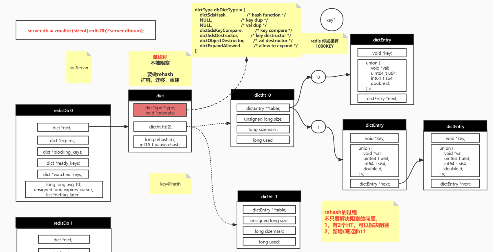
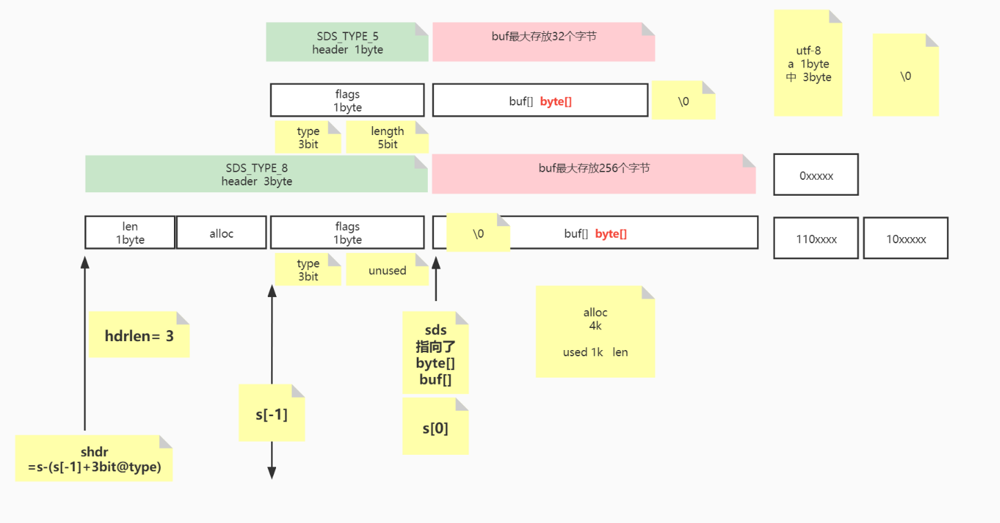
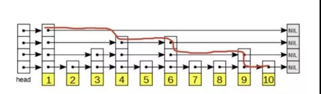

## Redis 源码解析

## 1、Redis 入口 ：

​	1.redis启动入口，server.c中main方法：

```C
int main(){
    // 1.初始化server的配置，加载redis.conf配置
    initServerConfig();
    // 2.初始化ACL用户权限
    ACLInit(); 
    // 3.初始化server，建立socket连接，绑定回调函数等
    initServer();
    // 4.初始化线程，创建后台线程和IO线程
    InitServerLast();
    // 5.调用mian线程
    aeMain(server.el);
    return 1;
}
```

2. ae.c 中aeMain()函数：

```C
// 主线程一直进行循环，处理事件
void aeMain(aeEventLoop *eventLoop) {
    eventLoop->stop = 0; // 设置停止状态
    while (!eventLoop->stop) { 
        aeProcessEvents(eventLoop, AE_ALL_EVENTS | AE_CALL_BEFORE_SLEEP | AE_CALL_AFTER_SLEEP);
    }
}
```

3. aeProcessEvents()函数:

```C
int aeProcessEvents(aeEventLoop *eventLoop, int flags){
	// 执行beforeSleep
    eventLoop->beforesleep(eventLoop);
    // 获取 epoll中，epoll_wait的事件
	int numevents = aeApiPoll(eventLoop, tvp);
     // 执行aftersleep
    eventLoop->aftersleep(eventLoop);
     for (j = 0; j < numevents; j++) {
         // 执行读事件
         // 执行写事件
     }
    // 触发timeEvents事件
    processTimeEvents(eventLoop);
}
```

beforesleep函数在main函数主进行设置

4. beforesleep函数：

主要有两个函数：

1.handleClientsWithPendingReadsUsingThreads()；

2.handleClientsWithPendingWritesUsingThreads() ;

```C
void beforeSleep(struct aeEventLoop *eventLoop) {
	
    /* We should handle pending reads clients ASAP after event loop. */
    handleClientsWithPendingReadsUsingThreads();	// 1.事件循环中处理读clients待读事件

    /* Handle writes with pending output buffers. */
    handleClientsWithPendingWritesUsingThreads();	// 2.事件循环中处理写回到socket事件
}
```

handleClientsWithPendingReadsUsingThreads：

使用IO线程处理读事件:如果开启读多线程的话，默认是不开启的，如果有待读的事件，那么绑定到IOthread中，拿到IO thread线程的第一个线程，也就是main线程，执行命令，并绑定写handler。

handleClientsWithPendingWritesUsingThreads：

拿到待处理的write列表，跟io_threads进行绑定，改变状态，以便于其他IO线程可以执行绑定的write操作，主线程直接执行writeToClient(c,0);函数，将结果写回到客户端socket中。如果有IO线程，那么等待其他IO线程写回结束。

## 2、redis 单线程实现原理

1、redis IO模型：

redis.conf 配置文件：

```shell
# 默认不开启，如果开启默认配置IO数是 4 个，最大不能超过128（看源码可知）
# io-threads 是用多线程处理《写IO》主线程exec的结果
io-threads 4
# 默认不开启 do read多线程，《读》 IO
io-threads-do-reads no
# NOTE 1: This configuration directive cannot be changed at runtime via
# CONFIG SET. Aso this feature currently does not work when SSL is
# enabled.
#
# NOTE 2: If you want to test the Redis speedup using redis-benchmark, make
# sure you also run the benchmark itself in o-threads-do-reads nothreaded mode, using the
# --threads option to match the number of Redis threads, otherwise you'll not
# be able to notice the improvements.
# 最好使用redis-benchmark来测试redis速度，
redis-benchmark --threads 4
# <Usually threading reads doesn't help much.> (通常情况下开始多IO多线程并没有多大用，但是最好根据业务来)

```

2. redis 单线程执行原理图：

   第一次轮询：接收到客户端穿过来的数据，根据绑定的read事件，将client添加到pending_read列表中

   


## 3、redis数据如何在内存存储方式

### 3.0、redis数据内存存储原理:



### 3.1、initServer函数中，给server.db创建根据server.dbnum的数量

```C
// 分配redis数据库db内存
server.db = zmalloc(sizeof(redisDb)*server.dbnum);
```

### 3.2、相关结构体：

redisDb 结构体：

```C
typedef struct redisDb {
	// redis 正真的key-value存储
    dict *dict;                 /* The keyspace for this DB */
	// 存储已经超时过期的(k-v)
	dict *expires;              /* Timeout of keys with a timeout set */
    dict *blocking_keys;        /* Keys with clients waiting for data (BLPOP)*/
	dict *ready_keys;           /* Blocked keys that received a PUSH */
    dict *watched_keys;         /* WATCHED keys for MULTI/EXEC CAS */
    int id;                     /* Database ID */
	// 平均ttl时间
    long long avg_ttl;          /* Average TTL, just for stats */
	// 用来拿到过期的k-v
    unsigned long expires_cursor; /* Cursor of the active expire cycle. */
    list *defrag_later;         /* List of key names to attempt to defrag one by one, gradually. */
} redisDb;
```

dict结构体：

```C
typedef struct dict {
    dictType *type;
    void *privdata;
    dictht ht[2];		// 默认2个hash表,[0]用来存储数据，[1]用来rehash
    long rehashidx; /* rehashing not in progress if rehashidx == -1 */
    int16_t pauserehash; /* If >0 rehashing is paused (<0 indicates coding error) */
} dict;
```
dictType:
```C
/* Db->dict, keys are sds strings, vals are Redis objects. */
dictType dbDictType = {
    dictSdsHash,                /* hash function */
    NULL,                       /* key dup */
    NULL,                       /* val dup */
    dictSdsKeyCompare,          /* key compare */
    dictSdsDestructor,          /* key destructor */
    dictObjectDestructor,       /* val destructor */
    dictExpandAllowed           /* allow to expand */
};
```

dictht结构体：

hash表结构

```C
/* This is our hash table structure. Every dictionary has two of this as we
 * implement incremental rehashing, for the old to the new table. */
// 以上注释说明为什么默认要两个(dictht ht[2];)
typedef struct dictht {
    // k-v 存储地方，
    dictEntry **table; 			// 哈希表数组
    unsigned long size;			// 哈希表大小；在redis的实现中，size也是触发扩容的阈值
    unsigned long sizemask;		// 哈希表大小掩码，用于计算索引值；总是等于 size-1
    unsigned long used;			// 哈希表中保存的节点的数量
} dictht;
```

dictEntry结构体：

```C
typedef struct dictEntry {
    void *key;				// 键，是sds
    union {
        void *val;			// 值：redisObj
        uint64_t u64;
        int64_t s64;
        double d;
    } v;
    struct dictEntry *next;
} dictEntry;
// 类似一个链表，该链表节点保存的是(key - val)
```


hash表负载因子计算公式：

```C
// 负载因子 = 哈希表已保存节点数量 / 哈希表大小
load_factor = ht[0].used / ht[0].size
```

### 3.3、 Hash表执行扩容操作：

触发条件：

- 没有在执行 BGSAVE 命令或者 BGREWRITEAOF 命令， 并且哈希表的负载因子大于等于 1
- 正在执行 BGSAVE 命令或者 BGREWRITEAOF 命令， 并且哈希表的负载因子大于等于 5

```c
/* Using dictEnableResize() / dictDisableResize() we make possible to
 * enable/disable resizing of the hash table as needed. This is very important
 * for Redis, as we use copy-on-write and don't want to move too much memory
 * around when there is a child performing saving operations.
 *
 * Note that even when dict_can_resize is set to 0, not all resizes are
 * prevented: a hash table is still allowed to grow if the ratio between
 * the number of elements and the buckets > dict_force_resize_ratio. */
static int dict_can_resize = 1;
static unsigned int dict_force_resize_ratio = 5;
```

redis扩容大小：

在size >  4的情况下是size得2倍，否则就是4

```C
/* Our hash table capability is a power of two */
static unsigned long _dictNextPower(unsigned long size){
	// DICT_HT_INITIAL_SIZE = 4
  unsigned long i = DICT_HT_INITIAL_SIZE;

    if (size >= LONG_MAX) return LONG_MAX + 1LU;
    while(1) {
        if (i >= size)
            return i;
        i *= 2;
    }
}
```

扩容函数：

```c
/* Expand or create the hash table,
 * when malloc_failed is non-NULL, it'll avoid panic if malloc fails (in which case it'll be set to 1).
 * Returns DICT_OK if expand was performed, and DICT_ERR if skipped. */
int _dictExpand(dict *d, unsigned long size, int* malloc_failed)
{
    if (malloc_failed) *malloc_failed = 0;		// 说明内存不够，无法扩容，但是还得返回成功

    /* the size is invalid if it is smaller than the number of
     * elements already inside the hash table */
    if (dictIsRehashing(d) || d->ht[0].used > size)
        return DICT_ERR;

    dictht n; /* the new hash table */
    unsigned long realsize = _dictNextPower(size);

    /* Detect overflows */
    if (realsize < size || realsize * sizeof(dictEntry*) < realsize)
        return DICT_ERR;

    /* Rehashing to the same table size is not useful. */
    if (realsize == d->ht[0].size) return DICT_ERR;

    /* Allocate the new hash table and initialize all pointers to NULL */
	// 分配新的hash表，并初始化所有的节点为NULL
    n.size = realsize;
    n.sizemask = realsize-1;	// 掩码总是size -1 ，用来计算出值所在位置
    if (malloc_failed) {
        n.table = ztrycalloc(realsize*sizeof(dictEntry*));
        *malloc_failed = n.table == NULL;
        if (*malloc_failed)
            return DICT_ERR;
    } else
        n.table = zcalloc(realsize*sizeof(dictEntry*));

    n.used = 0;

    /* Is this the first initialization? If so it's not really a rehashing
     * we just set the first hash table so that it can accept keys. */
    if (d->ht[0].table == NULL) {	// 初始化ht[0]
        d->ht[0] = n;				// 将ht[0]给到d
        return DICT_OK;
    }

    /* Prepare a second hash table for incremental rehashing */
    d->ht[1] = n;					// 准备ht[1]，用来rehash
    d->rehashidx = 0;
    return DICT_OK;
}
```


### 3.4、Hash表执行缩容操作：

触发条件：

-  当哈希表的负载因子小于 0.1 时， 程序自动开始对哈希表执行收缩操作。

### 3.5、ReHash

```c
/* Performs N steps of incremental rehashing. Returns 1 if there are still
 * keys to move from the old to the new hash table, otherwise 0 is returned.
 *
 * Note that a rehashing step consists in moving a bucket (that may have more
 * than one key as we use chaining) from the old to the new hash table, however
 * since part of the hash table may be composed of empty spaces, it is not
 * guaranteed that this function will rehash even a single bucket, since it
 * will visit at max N*10 empty buckets in total, otherwise the amount of
 * work it does would be unbound and the function may block for a long time. */
int dictRehash(dict *d, int n) {
	// 注意：这个是每次只rehash得最大数量，也就是n*10
    int empty_visits = n*10; /* Max number of empty buckets to visit. */
    if (!dictIsRehashing(d)) return 0;			// 再次检查是否在rehash

    while(n-- && d->ht[0].used != 0) {
        dictEntry *de, *nextde;

        /* Note that rehashidx can't overflow as we are sure there are more
         * elements because ht[0].used != 0 */
        assert(d->ht[0].size > (unsigned long)d->rehashidx);
        while(d->ht[0].table[d->rehashidx] == NULL) {
            d->rehashidx++;
            if (--empty_visits == 0) return 1;
        }
        de = d->ht[0].table[d->rehashidx];		// 从ht[0]得hash表中拿到entry
        /* Move all the keys in this bucket from the old to the new hash HT */
        while(de) {
            uint64_t h;

            nextde = de->next;
            /* Get the index in the new hash table */
			// 拿到(de->key)在ht[1]哈希表中得位置
            h = dictHashKey(d, de->key) & d->ht[1].sizemask;	
			// 将ht[1]中h位置得值给到de得next，再将de放到原来得h位置上，
			de->next = d->ht[1].table[h];	
            d->ht[1].table[h] = de;			// 也就是每次将新得数据都放到h位置，如果h位置存在数据，那么就作为它得next
			// 更新0和1中used得值
            d->ht[0].used--;
            d->ht[1].used++;
            de = nextde;
        }
        d->ht[0].table[d->rehashidx] = NULL;	// 旧得0中rehashidx位置得数再经过上个while之后旧不存在了
        d->rehashidx++;							// 让rehashidx位置来到一下位置
    }

    /* Check if we already rehashed the whole table... */
    if (d->ht[0].used == 0) {			// 经过上个while有可能已经将ht[0]全部移到ht[1]上了
        zfree(d->ht[0].table);			// 释放ht[0]
        d->ht[0] = d->ht[1];			// 交换指针给ht[0]
        _dictReset(&d->ht[1]);			// 释放ht[1]
        d->rehashidx = -1;				// 状态恢复
        return 0;
    }

    /* More to rehash... */
    return 1;
}
```


## 4、redisObject

### 4.1、redisObject 结构体：

```C
typedef struct redisObject {
    unsigned type:4;		// 4bit代表类型
    unsigned encoding:4;	// 4bit代表编码格式
    unsigned lru:LRU_BITS; /* LRU time (relative to global lru_clock) or
                            * LFU data (least significant 8 bits frequency
                            * and most significant 16 bits access time). */
    int refcount;			// 8bit也即一个byte代表引用计数
    void *ptr;				// 实际数据引用指针
} robj;
```

### 4.2、redis编码类型：

```C
/* Objects encoding. Some kind of objects like Strings and Hashes can be
 * internally represented in multiple ways. The 'encoding' field of the object
 * is set to one of this fields for this object. */
#define OBJ_ENCODING_RAW 0     /* Raw representation */
#define OBJ_ENCODING_INT 1     /* Encoded as integer */
#define OBJ_ENCODING_HT 2      /* Encoded as hash table */
#define OBJ_ENCODING_ZIPMAP 3  /* Encoded as zipmap */
#define OBJ_ENCODING_LINKEDLIST 4 /* No longer used: old list encoding. */
#define OBJ_ENCODING_ZIPLIST 5 /* Encoded as ziplist */
#define OBJ_ENCODING_INTSET 6  /* Encoded as intset */
#define OBJ_ENCODING_SKIPLIST 7  /* Encoded as skiplist */
#define OBJ_ENCODING_EMBSTR 8  /* Embedded sds string encoding */
#define OBJ_ENCODING_QUICKLIST 9 /* Encoded as linked list of ziplists */
#define OBJ_ENCODING_STREAM 10 /* Encoded as a radix tree of listpacks */

// 11种数据编码结构
```

### 4.3、redis数据类型：

```C
/* The actual Redis Object */
#define OBJ_STRING 0    /* String object. */
#define OBJ_LIST 1      /* List object. */
#define OBJ_SET 2       /* Set object. */
#define OBJ_ZSET 3      /* Sorted set object. */
#define OBJ_HASH 4      /* Hash object. */

// 5种value数据类型
```

## 5、redis基础数据类型

### 5.1、变长符 sds

sds原理：

sds一共有5类型的长度来代表字符串string

```C
#define SDS_TYPE_5  0
#define SDS_TYPE_8  1
#define SDS_TYPE_16 2
#define SDS_TYPE_32 3
#define SDS_TYPE_64 4

/* Note: sdshdr5 is never used, we just access the flags byte directly.
 * However is here to document the layout of type 5 SDS strings. */
struct __attribute__ ((__packed__)) sdshdr5 {
    unsigned char flags; /* 3 lsb of type, and 5 msb of string length */
    char buf[];			// buf最多是 25=32个字节
};
struct __attribute__ ((__packed__)) sdshdr8 {
    uint8_t len; /* used */
    uint8_t alloc; /* excluding the header and null terminator */
    unsigned char flags; /* 3 lsb of type, 5 unused bits */
    char buf[];			// buf最多是 2^8=256个字节
};
struct __attribute__ ((__packed__)) sdshdr16 {
    uint16_t len; /* used */
    uint16_t alloc; /* excluding the header and null terminator */
    unsigned char flags; /* 3 lsb of type, 5 unused bits */
    char buf[];			// buf最多是 2^16个字节
};
struct __attribute__ ((__packed__)) sdshdr32 {
    uint32_t len; /* used */
    uint32_t alloc; /* excluding the header and null terminator */
    unsigned char flags; /* 3 lsb of type, 5 unused bits */
    char buf[];			// buf最多是 2^32个字节
};
struct __attribute__ ((__packed__)) sdshdr64 {
    uint64_t len; /* used */
    uint64_t alloc; /* excluding the header and null terminator */
    unsigned char flags; /* 3 lsb of type, 5 unused bits */
    char buf[];			// buf最多是 2^64个字节
};
```

原理图解：



**SDS (Simple Dynamic String)**：

- 预分配空间：扩容时会多分配冗余空间
  - 新长度 < 1MB：双倍扩容
  - 新长度 ≥ 1MB：每次多分配1MB
- 惰性空间释放：缩短字符串时不立即回收内存

```c
// sds.h
struct sdshdr {
    int len;     // 已使用长度
    int free;    // 剩余空间
    char buf[];  // 实际数据
};
```

SDS 各部分大小（64位系统为例）：

1. **RedisObject 大小**：16 字节

   （包含 type、encoding、lru、refcount、ptr 等）

2. **SDS Header（即 struct sdshdr8）**：3 字节

   （字段：len:1B + alloc:1B + flags:1B）

3. **字符串内容**：最长 **44 字节**

4. **\0 结尾**：1 字节


Redis 的 String 类型底层由 SDS（Simple Dynamic String）实现。


>  若值是可用 64 位有符号整数表示的整数，Redis 使用 int 编码直接存储，提高空间和处理效率。
>
> 若值是字符串且长度不超过 44 字节（Redis 5.0+），使用 embstr 编码，此时 RedisObject 和 SDS 分配在一块连续内存中，内存访问更高效。
>
> 超过 44 字节的字符串使用 raw 编码，此时 RedisObject 和 SDS 分开存储，适应更大的内容但开销略高。
>
> Redis 的编码方式是动态可变的，取决于具体的数据值和操作。

因此：当超过44字节，也就是sds最大分配64字节，那么使用raw编码，


### 5.2、skipList：跳跃表

跳跃表原理：



redis中定义：

```C
/* ZSETs use a specialized version of Skiplists */
typedef struct zskiplistNode {
    sds ele;
    double score;
    struct zskiplistNode *backward;
    struct zskiplistLevel {
        struct zskiplistNode *forward;
        unsigned long span;
    } level[];
} zskiplistNode;

typedef struct zskiplist {
    struct zskiplistNode *header, *tail;
    unsigned long length;
    int level;
} zskiplist;
```

ziplist基本函数：

```c
/* Insert a new node in the skiplist. Assumes the element does not already
 * exist (up to the caller to enforce that). The skiplist takes ownership
 * of the passed SDS string 'ele'. */
zskiplistNode *zslInsert(zskiplist *zsl, double score, sds ele) {
    zskiplistNode *update[ZSKIPLIST_MAXLEVEL], *x;
    unsigned int rank[ZSKIPLIST_MAXLEVEL];
    int i, level;

    serverAssert(!isnan(score));
    x = zsl->header;
    for (i = zsl->level-1; i >= 0; i--) {
        /* store rank that is crossed to reach the insert position */
        rank[i] = i == (zsl->level-1) ? 0 : rank[i+1];
        while (x->level[i].forward &&
                (x->level[i].forward->score < score ||
                    (x->level[i].forward->score == score &&
                    sdscmp(x->level[i].forward->ele,ele) < 0)))
        {
            rank[i] += x->level[i].span;
            x = x->level[i].forward;
        }
        update[i] = x;
    }
    /* we assume the element is not already inside, since we allow duplicated
     * scores, reinserting the same element should never happen since the
     * caller of zslInsert() should test in the hash table if the element is
     * already inside or not. */
    level = zslRandomLevel();
    if (level > zsl->level) {
        for (i = zsl->level; i < level; i++) {
            rank[i] = 0;
            update[i] = zsl->header;
            update[i]->level[i].span = zsl->length;
        }
        zsl->level = level;
    }
    x = zslCreateNode(level,score,ele);
    for (i = 0; i < level; i++) {
        x->level[i].forward = update[i]->level[i].forward;
        update[i]->level[i].forward = x;

        /* update span covered by update[i] as x is inserted here */
        x->level[i].span = update[i]->level[i].span - (rank[0] - rank[i]);
        update[i]->level[i].span = (rank[0] - rank[i]) + 1;
    }

    /* increment span for untouched levels */
    for (i = level; i < zsl->level; i++) {
        update[i]->level[i].span++;
    }

    x->backward = (update[0] == zsl->header) ? NULL : update[0];
    if (x->level[0].forward)
        x->level[0].forward->backward = x;
    else
        zsl->tail = x;
    zsl->length++;
    return x;
}
```

删除函数：

```c
/* Internal function used by zslDelete, zslDeleteRangeByScore and
 * zslDeleteRangeByRank. */
void zslDeleteNode(zskiplist *zsl, zskiplistNode *x, zskiplistNode **update) {
    int i;
    for (i = 0; i < zsl->level; i++) {
        if (update[i]->level[i].forward == x) {
            update[i]->level[i].span += x->level[i].span - 1;
            update[i]->level[i].forward = x->level[i].forward;
        } else {
            update[i]->level[i].span -= 1;
        }
    }
    if (x->level[0].forward) {
        x->level[0].forward->backward = x->backward;
    } else {
        zsl->tail = x->backward;
    }
    while(zsl->level > 1 && zsl->header->level[zsl->level-1].forward == NULL)
        zsl->level--;
    zsl->length--;
}

/* Delete an element with matching score/element from the skiplist.
 * The function returns 1 if the node was found and deleted, otherwise
 * 0 is returned.
 *
 * If 'node' is NULL the deleted node is freed by zslFreeNode(), otherwise
 * it is not freed (but just unlinked) and *node is set to the node pointer,
 * so that it is possible for the caller to reuse the node (including the
 * referenced SDS string at node->ele). */
int zslDelete(zskiplist *zsl, double score, sds ele, zskiplistNode **node) {
    zskiplistNode *update[ZSKIPLIST_MAXLEVEL], *x;
    int i;

    x = zsl->header;
    for (i = zsl->level-1; i >= 0; i--) {
        while (x->level[i].forward &&
                (x->level[i].forward->score < score ||
                    (x->level[i].forward->score == score &&
                     sdscmp(x->level[i].forward->ele,ele) < 0)))
        {
            x = x->level[i].forward;
        }
        update[i] = x;
    }
    /* We may have multiple elements with the same score, what we need
     * is to find the element with both the right score and object. */
    x = x->level[0].forward;
    if (x && score == x->score && sdscmp(x->ele,ele) == 0) {
        zslDeleteNode(zsl, x, update);
        if (!node)
            zslFreeNode(x);
        else
            *node = x;
        return 1;
    }
    return 0; /* not found */
}
```


### 5.3、链表

redis中使用双端链表 adlist.c和adlist.h

结构体：

```c
typedef struct list {
    listNode *head;
    listNode *tail;
    void *(*dup)(void *ptr);
    void (*free)(void *ptr);
    int (*match)(void *ptr, void *key);
    unsigned long len;
} list;
typedef struct listNode {
    struct listNode *prev;
    struct listNode *next;
    void *value;
} listNode;

// list的迭代器，用于遍历链表
typedef struct listIter {
    listNode *next;
    int direction;
} listIter;
```

基本函数：

```c

list *listInsertNode(list *list, listNode *old_node, void *value, int after) {
  	// 添加元素*value到*list中
}
list *listCreate(void){
	// 开辟list内存空间
}
/* Return the element at the specified zero-based index
 * where 0 is the head, 1 is the element next to head
 * and so on. Negative integers are used in order to count
 * from the tail, -1 is the last element, -2 the penultimate
 * and so on. If the index is out of range NULL is returned. */
listNode *listIndex(list *list, long index) {
    // 返回index位置的节点
}
```


### 5.4、字典

字典 dict.h和dict.c

相关结构体：

```C
typedef struct dictEntry {
    void *key;
    union {
        void *val;
        uint64_t u64;
        int64_t s64;
        double d;
    } v;
    struct dictEntry *next;
} dictEntry;

typedef struct dictType {
    uint64_t (*hashFunction)(const void *key);				// 哈希函数
    void *(*keyDup)(void *privdata, const void *key);		// keyDup
    void *(*valDup)(void *privdata, const void *obj);		// valDup
    int (*keyCompare)(void *privdata, const void *key1, const void *key2);
    void (*keyDestructor)(void *privdata, void *key);		// key类型
    void (*valDestructor)(void *privdata, void *obj);		// value类型
    int (*expandAllowed)(size_t moreMem, double usedRatio);	// 允许扩容
} dictType;

/* This is our hash table structure. Every dictionary has two of this as we
 * implement incremental rehashing, for the old to the new table. */
typedef struct dictht {
    dictEntry **table;			// 哈希表数组,用二级指针表示
    unsigned long size;			// 哈希表得大小(size也是触发扩容的阈值)
    unsigned long sizemask;		// 大小掩码，用于计算索引值
    unsigned long used;			// 哈希表中保存的节点的数量
} dictht;	

typedef struct dict {
    dictType *type;
    void *privdata;
    dictht ht[2];		// 默认2个hash表,[0]用来存储数据，[1]用来rehash
    long rehashidx; /* rehashing not in progress if rehashidx == -1 */	// 用来记录rehash得进度
    int16_t pauserehash; /* If >0 rehashing is paused (<0 indicates coding error) */
} dict;
```


## 6、redis内存编码结构：

### 6.1、ziplist：压缩表

#### 6.1.1、ziplist原理：


#### 6.1.2、ziplist结构：

zipList节点值entry：

```C
/* We use this function to receive information about a ziplist entry.
 * Note that this is not how the data is actually encoded, is just what we
 * get filled by a function in order to operate more easily. */
typedef struct zlentry {
    unsigned int prevrawlensize; /* Bytes used to encode the previous entry len*/
    unsigned int prevrawlen;     /* Previous entry len. */
    unsigned int lensize;        /* Bytes used to encode this entry type/len.
                                    For example strings have a 1, 2 or 5 bytes
                                    header. Integers always use a single byte.*/
    unsigned int len;            /* Bytes used to represent the actual entry.
                                    For strings this is just the string length
                                    while for integers it is 1, 2, 3, 4, 8 or
                                    0 (for 4 bit immediate) depending on the
                                    number range. */
    unsigned int headersize;     /* prevrawlensize + lensize. */
    unsigned char encoding;      /* Set to ZIP_STR_* or ZIP_INT_* depending on
                                    the entry encoding. However for 4 bits
                                    immediate integers this can assume a range
                                    of values and must be range-checked. */
    unsigned char *p;            /* Pointer to the very start of the entry, that
                                    is, this points to prev-entry-len field. */
} zlentry;
```

#### 6.1.2、ziplist基本函数：

1、创建ziplist函数：

```C
/* Create a new empty ziplist. */
unsigned char *ziplistNew(void) {
    unsigned int bytes = ZIPLIST_HEADER_SIZE+ZIPLIST_END_SIZE;
    unsigned char *zl = zmalloc(bytes);
    ZIPLIST_BYTES(zl) = intrev32ifbe(bytes);
    ZIPLIST_TAIL_OFFSET(zl) = intrev32ifbe(ZIPLIST_HEADER_SIZE);
    ZIPLIST_LENGTH(zl) = 0;
    zl[bytes-1] = ZIP_END;
    return zl;				// 返回的是ziplist的头指针
}
```

2、重要函数：

```C
/* Insert item at "p". */
// 在指针p后面添加数据
unsigned char *__ziplistInsert(unsigned char *zl, unsigned char *p, unsigned char *s, unsigned int slen) {
 	 // insert
}

/* Delete "num" entries, starting at "p". Returns pointer to the ziplist. */
unsigned char *__ziplistDelete(unsigned char *zl, unsigned char *p, unsigned int num) {
     // delete...
}

/* Replaces the entry at p. This is equivalent to a delete and an insert,
 * but avoids some overhead when replacing a value of the same size. */
unsigned char *ziplistReplace(unsigned char *zl, unsigned char *p, unsigned char *s, unsigned int slen) {
    // update...
}
/* Find pointer to the entry equal to the specified entry. Skip 'skip' entries
 * between every comparison. Returns NULL when the field could not be found. */
unsigned char *ziplistFind(unsigned char *zl, unsigned char *p, unsigned char *vstr, unsigned int vlen, unsigned int skip) {
    // get...
}

/* Return length of ziplist. */
unsigned int ziplistLen(unsigned char *zl) {
    // 返回ziplist的长度
}


/* Get entry pointed to by 'p' and store in either '*sstr' or 'sval' depending
 * on the encoding of the entry. '*sstr' is always set to NULL to be able
 * to find out whether the string pointer or the integer value was set.
 * Return 0 if 'p' points to the end of the ziplist, 1 otherwise. */
unsigned int ziplistGet(unsigned char *p, unsigned char **sstr, unsigned int *slen, long long *sval) {
	// 从*p代表的ziplist中get到第一个元素的值，如果值编码是int类型，那么savl带出，否则*sstr带出
}

/* Returns an offset to use for iterating with ziplistNext. When the given
 * index is negative, the list is traversed back to front. When the list
 * doesn't contain an element at the provided index, NULL is returned. */
unsigned char *ziplistIndex(unsigned char *zl, int index) {
    // 返回char指针，代表的是index位置上的值。如果index是负值，那么从尾部遍历查找，否则重头部
}
```

### 6.2、intset：整数集

## 7、redis数据类型

7.1、string：字符串

7.2、list：列表

7.3、set：集合

7.4、zset：有序集合

7.5、hash：散列

redis核心方法之aeProcessEvents

```c
/* Process every pending time event, then every pending file event
 * (that may be registered by time event callbacks just processed).
 * Without special flags the function sleeps until some file event
 * fires, or when the next time event occurs (if any).
 *
 * If flags is 0, the function does nothing and returns.
 * if flags has AE_ALL_EVENTS set, all the kind of events are processed.
 * if flags has AE_FILE_EVENTS set, file events are processed.
 * if flags has AE_TIME_EVENTS set, time events are processed.
 * if flags has AE_DONT_WAIT set the function returns ASAP until all
 * the events that's possible to process without to wait are processed.
 * if flags has AE_CALL_AFTER_SLEEP set, the aftersleep callback is called.
 * if flags has AE_CALL_BEFORE_SLEEP set, the beforesleep callback is called.
 *
 * The function returns the number of events processed. */
int aeProcessEvents(aeEventLoop *eventLoop, int flags)
{
    int processed = 0, numevents;

    /* Nothing to do? return ASAP */
    if (!(flags & AE_TIME_EVENTS) && !(flags & AE_FILE_EVENTS)) return 0;

    /* Note that we want to call select() even if there are no
     * file events to process as long as we want to process time
     * events, in order to sleep until the next time event is ready
     * to fire. */
    if (eventLoop->maxfd != -1 ||
        ((flags & AE_TIME_EVENTS) && !(flags & AE_DONT_WAIT))) {
        int j;
        struct timeval tv, *tvp;
        int64_t usUntilTimer = -1;

        if (flags & AE_TIME_EVENTS && !(flags & AE_DONT_WAIT))
            usUntilTimer = usUntilEarliestTimer(eventLoop);

        if (usUntilTimer >= 0) {
            tv.tv_sec = usUntilTimer / 1000000;
            tv.tv_usec = usUntilTimer % 1000000;
            tvp = &tv;
        } else {
            /* If we have to check for events but need to return
             * ASAP because of AE_DONT_WAIT we need to set the timeout
             * to zero */
            if (flags & AE_DONT_WAIT) {
                tv.tv_sec = tv.tv_usec = 0;
                tvp = &tv;
            } else {
                /* Otherwise we can block */
                tvp = NULL; /* wait forever */
            }
        }

        if (eventLoop->flags & AE_DONT_WAIT) {
            tv.tv_sec = tv.tv_usec = 0;
            tvp = &tv;
        }

        if (eventLoop->beforesleep != NULL && flags & AE_CALL_BEFORE_SLEEP)
            eventLoop->beforesleep(eventLoop);

        /* Call the multiplexing API, will return only on timeout or when
         * some event fires. */
         // 调用底层API获取事件数(如果是linux一般就是epoll多路复用器的事件)
        numevents = aeApiPoll(eventLoop, tvp);

        /* After sleep callback. */
        if (eventLoop->aftersleep != NULL && flags & AE_CALL_AFTER_SLEEP)
            eventLoop->aftersleep(eventLoop);
		// 根据事件集，执行
        for (j = 0; j < numevents; j++) {
            aeFileEvent *fe = &eventLoop->events[eventLoop->fired[j].fd];
            int mask = eventLoop->fired[j].mask;
            int fd = eventLoop->fired[j].fd; //拿到需要触发的fd
            int fired = 0; /* Number of events fired for current fd. */

            /* Normally we execute the readable event first, and the writable
             * event later. This is useful as sometimes we may be able
             * to serve the reply of a query immediately after processing the
             * query.
             *
             * However if AE_BARRIER is set in the mask, our application is
             * asking us to do the reverse: never fire the writable event
             * after the readable. In such a case, we invert the calls.
             * This is useful when, for instance, we want to do things
             * in the beforeSleep() hook, like fsyncing a file to disk,
             * before replying to a client. */
            // AE_BARRIER 壁垒状态，用来将文件同步到磁盘，在readable状态之后，不触发写事件，
            int invert = fe->mask & AE_BARRIER;

            /* Note the "fe->mask & mask & ..." code: maybe an already
             * processed event removed an element that fired and we still
             * didn't processed, so we check if the event is still valid.
             *
             * Fire the readable event if the call sequence is not inverted.
             *  
             *  */
            if (!invert && fe->mask & mask & AE_READABLE) {
                // 执行read IO 回调方法，在初始化的时候设置进去的函数(readQueryFromClient)
                fe->rfileProc(eventLoop,fd,fe->clientData,mask);
                fired++;
                fe = &eventLoop->events[fd]; /* Refresh in case of resize. */
            }

            /* Fire the writable event. */
            if (fe->mask & mask & AE_WRITABLE) {
                if (!fired || fe->wfileProc != fe->rfileProc) {
                    fe->wfileProc(eventLoop,fd,fe->clientData,mask);
                    fired++;
                }
            }

            /* If we have to invert the call, fire the readable event now
             * after the writable one. */
            if (invert) {
                fe = &eventLoop->events[fd]; /* Refresh in case of resize. */
                if ((fe->mask & mask & AE_READABLE) &&
                    (!fired || fe->wfileProc != fe->rfileProc))
                {
                    fe->rfileProc(eventLoop,fd,fe->clientData,mask);
                    fired++;
                }
            }

            processed++;
        }
    }
    /* Check time events */
    // 上面for循环处理得是epoll得IO事件，会将读到得数据放到buffer中，这里处理buffer得数据，最后将处理结果返回到客户端得操作。
    if (flags & AE_TIME_EVENTS)
        processed += processTimeEvents(eventLoop);

    return processed; /* return the number of processed file/time events */
}

```


redis执行eventLoop流程

1. 读到数据
2. 操作db
3. aof操作
4. 写客户端

## 8、redis定时任务

定时任务方法：serverCron，该方法默认是每秒执行

```c
/* This is our timer interrupt, called server.hz times per second.
 * Here is where we do a number of things that need to be done asynchronously.
 * For instance:
 *
 * - Active expired keys collection (it is also performed in a lazy way on	// 过期时间处理
 *   lookup).
 * - Software watchdog.														// 看门狗
 * - Update some statistic.													// 更新数据
 * - Incremental rehashing of the DBs hash tables.							// reHash
 * - Triggering BGSAVE / AOF rewrite, and handling of terminated children.	// AOF/触发BGSAVE
 * - Clients timeout of different kinds.									// 客户端超时
 * - Replication reconnection.												// 主从连接
 * - Many more...
 *
 * Everything directly called here will be called server.hz times per second,
 * so in order to throttle execution of things we want to do less frequently
 * a macro is used: run_with_period(milliseconds) { .... }
 */
// 每秒执行的定时任务
int serverCron(struct aeEventLoop *eventLoop, long long id, void *clientData) {
    int j;

    /* Software watchdog: deliver the SIGALRM that will reach the signal
     * handler if we don't return here fast enough. */
    if (server.watchdog_period) watchdogScheduleSignal(server.watchdog_period);

    /* Update the time cache. */
    updateCachedTime(1);

    server.hz = server.config_hz;
    /* Adapt the server.hz value to the number of configured clients. If we have
     * many clients, we want to call serverCron() with an higher frequency. */
    if (server.dynamic_hz) {
        while (listLength(server.clients) / server.hz >
               MAX_CLIENTS_PER_CLOCK_TICK)
        {
            server.hz *= 2;
            if (server.hz > CONFIG_MAX_HZ) {
                server.hz = CONFIG_MAX_HZ;
                break;
            }
        }
    }

    run_with_period(100) {
        long long stat_net_input_bytes, stat_net_output_bytes;
        atomicGet(server.stat_net_input_bytes, stat_net_input_bytes);
        atomicGet(server.stat_net_output_bytes, stat_net_output_bytes);

        trackInstantaneousMetric(STATS_METRIC_COMMAND,server.stat_numcommands);
        trackInstantaneousMetric(STATS_METRIC_NET_INPUT,
                stat_net_input_bytes);
        trackInstantaneousMetric(STATS_METRIC_NET_OUTPUT,
                stat_net_output_bytes);
    }

    /* We have just LRU_BITS bits per object for LRU information.
     * So we use an (eventually wrapping) LRU clock.
     *
     * Note that even if the counter wraps it's not a big problem,
     * everything will still work but some object will appear younger
     * to Redis. However for this to happen a given object should never be
     * touched for all the time needed to the counter to wrap, which is
     * not likely.
     *
     * Note that you can change the resolution altering the
     * LRU_CLOCK_RESOLUTION define. */
    unsigned int lruclock = getLRUClock();
    atomicSet(server.lruclock,lruclock);

    cronUpdateMemoryStats();

    /* We received a SIGTERM, shutting down here in a safe way, as it is
     * not ok doing so inside the signal handler. */
    if (server.shutdown_asap) {
        if (prepareForShutdown(SHUTDOWN_NOFLAGS) == C_OK) exit(0);
        serverLog(LL_WARNING,"SIGTERM received but errors trying to shut down the server, check the logs for more information");
        server.shutdown_asap = 0;
    }

    /* Show some info about non-empty databases */
    if (server.verbosity <= LL_VERBOSE) {
        run_with_period(5000) {
            for (j = 0; j < server.dbnum; j++) {
                long long size, used, vkeys;

                size = dictSlots(server.db[j].dict);
                used = dictSize(server.db[j].dict);
                vkeys = dictSize(server.db[j].expires);
                if (used || vkeys) {
                    serverLog(LL_VERBOSE,"DB %d: %lld keys (%lld volatile) in %lld slots HT.",j,used,vkeys,size);
                }
            }
        }
    }

    /* Show information about connected clients */
    if (!server.sentinel_mode) {
        run_with_period(5000) {
            serverLog(LL_DEBUG,
                "%lu clients connected (%lu replicas), %zu bytes in use",
                listLength(server.clients)-listLength(server.slaves),
                listLength(server.slaves),
                zmalloc_used_memory());
        }
    }

    /* We need to do a few operations on clients asynchronously. */
    clientsCron();

    /* Handle background operations on Redis databases. */
	// 后台进程操作数据，包括key过期，resize，和rehash
    databasesCron();

    /* Start a scheduled AOF rewrite if this was requested by the user while
     * a BGSAVE was in progress. */
    if (!hasActiveChildProcess() &&
        server.aof_rewrite_scheduled)
    {
        rewriteAppendOnlyFileBackground();	// 创建子进程进行数据的后台处理
    }

    /* Check if a background saving or AOF rewrite in progress terminated. */
    if (hasActiveChildProcess() || ldbPendingChildren())
    {
        run_with_period(1000) receiveChildInfo();
        checkChildrenDone();		// 子进程处理完毕之后的一些操作
    } else {
        /* If there is not a background saving/rewrite in progress check if
         * we have to save/rewrite now. */
        for (j = 0; j < server.saveparamslen; j++) {
            struct saveparam *sp = server.saveparams+j;

            /* Save if we reached the given amount of changes,
             * the given amount of seconds, and if the latest bgsave was
             * successful or if, in case of an error, at least
             * CONFIG_BGSAVE_RETRY_DELAY seconds already elapsed. */
            if (server.dirty >= sp->changes &&
                server.unixtime-server.lastsave > sp->seconds &&
                (server.unixtime-server.lastbgsave_try >
                 CONFIG_BGSAVE_RETRY_DELAY ||
                 server.lastbgsave_status == C_OK))
            {
                serverLog(LL_NOTICE,"%d changes in %d seconds. Saving...",
                    sp->changes, (int)sp->seconds);
                rdbSaveInfo rsi, *rsiptr;
                rsiptr = rdbPopulateSaveInfo(&rsi);
                rdbSaveBackground(server.rdb_filename,rsiptr);
                break;
            }
        }

        /* Trigger an AOF rewrite if needed. */
        if (server.aof_state == AOF_ON &&
            !hasActiveChildProcess() &&
            server.aof_rewrite_perc &&
            server.aof_current_size > server.aof_rewrite_min_size)
        {
            long long base = server.aof_rewrite_base_size ?
                server.aof_rewrite_base_size : 1;
            long long growth = (server.aof_current_size*100/base) - 100;
            if (growth >= server.aof_rewrite_perc) {
                serverLog(LL_NOTICE,"Starting automatic rewriting of AOF on %lld%% growth",growth);
                rewriteAppendOnlyFileBackground();
            }
        }
    }
    /* Just for the sake of defensive programming, to avoid forgeting to
     * call this function when need. */
    updateDictResizePolicy();


    /* AOF postponed flush: Try at every cron cycle if the slow fsync
     * completed. */
    if (server.aof_state == AOF_ON && server.aof_flush_postponed_start)
        flushAppendOnlyFile(0);

    /* AOF write errors: in this case we have a buffer to flush as well and
     * clear the AOF error in case of success to make the DB writable again,
     * however to try every second is enough in case of 'hz' is set to
     * a higher frequency. */
    run_with_period(1000) {
        if (server.aof_state == AOF_ON && server.aof_last_write_status == C_ERR)
            flushAppendOnlyFile(0);		// 刷盘
    }

    /* Clear the paused clients state if needed. */
    checkClientPauseTimeoutAndReturnIfPaused();

    /* Replication cron function -- used to reconnect to master,
     * detect transfer failures, start background RDB transfers and so forth. 
     * 
     * If Redis is trying to failover then run the replication cron faster so
     * progress on the handshake happens more quickly. */
    if (server.failover_state != NO_FAILOVER) {
        run_with_period(100) replicationCron();
    } else {
        run_with_period(1000) replicationCron();
    }

    /* Run the Redis Cluster cron. */
    run_with_period(100) {
        if (server.cluster_enabled) clusterCron();
    }

    /* Run the Sentinel timer if we are in sentinel mode. */
    if (server.sentinel_mode) sentinelTimer();

    /* Cleanup expired MIGRATE cached sockets. */
    run_with_period(1000) {
        migrateCloseTimedoutSockets();
    }

    /* Stop the I/O threads if we don't have enough pending work. */
    stopThreadedIOIfNeeded();

    /* Resize tracking keys table if needed. This is also done at every
     * command execution, but we want to be sure that if the last command
     * executed changes the value via CONFIG SET, the server will perform
     * the operation even if completely idle. */
    if (server.tracking_clients) trackingLimitUsedSlots();

    /* Start a scheduled BGSAVE if the corresponding flag is set. This is
     * useful when we are forced to postpone a BGSAVE because an AOF
     * rewrite is in progress.
     *
     * Note: this code must be after the replicationCron() call above so
     * make sure when refactoring this file to keep this order. This is useful
     * because we want to give priority to RDB savings for replication. */
    if (!hasActiveChildProcess() &&
        server.rdb_bgsave_scheduled &&
        (server.unixtime-server.lastbgsave_try > CONFIG_BGSAVE_RETRY_DELAY ||
         server.lastbgsave_status == C_OK))
    {
        rdbSaveInfo rsi, *rsiptr;
        rsiptr = rdbPopulateSaveInfo(&rsi);
        if (rdbSaveBackground(server.rdb_filename,rsiptr) == C_OK)
            server.rdb_bgsave_scheduled = 0;
    }

    /* Fire the cron loop modules event. */
    RedisModuleCronLoopV1 ei = {REDISMODULE_CRON_LOOP_VERSION,server.hz};
    moduleFireServerEvent(REDISMODULE_EVENT_CRON_LOOP,c
                          0,
                          &ei);

    server.cronloops++;
    return 1000/server.hz;
}
```


> redis定时任务做了啥？
>
> 1. 客户端得处理
> 2. db过期key，resize，rehash
> 3. bgrdb，可以手动触发cmd命令得bgsave
> 4. bgrewriteaof，也可以手动触发，bgrewriteaof
> 5. 前台刷写aof

## 9、AOF

### 9.0、bgrewriteaof流程


### 9.1、redis之AOF调用流程：

1、**定时任务中执行调用**

2、**执行客户端cmd命令时记录命令操作（每秒执行/每操作）**

> 调用流程：
>
> 1. readQueryFromClient，方法
> 2. processInputBuffer，执行输出buffer中的命令
> 3. processCommandAndResetClient，执行命令，并重置client
> 4. processCommand(c)，执行，会调用execCommand，或者call
> 5.  call(c,CMD_CALL_FULL);redis 执行命令核心函数
> 6. propagate(c->cmd,c->db->id,c->argv,c->argc,propagate_flags)，执行aof操作
> 7. feedAppendOnlyFile(cmd,dbid,argv,argc); 添加命令到aof文件中
> 8. 调用aofRewriteBufferAppend方法将命令添加到aof_buff的尾部
> 9. aofChildWriteDiffData，主进程写数据给到child子进程监听的fds

3、**cmd命令直接调用，bgsave/bgrewriteaof命令**

### 9.2、定时任务serverCron

#### 9.2.1、rewriteAppendOnlyFileBackground

该方法是以上三个调用被执行执行的，其执行流程如下：

1. hasActiveChildProcess，检查已经有子进程再执行，如果有，那么直接返回err

2. aofCreatePipes创建pipe，用于主进程将aof增量数据给到子进程，让子进程去写aof

3. redisFork，创建pipe成功之后，开始fork用于aof的子进程

4. redisFork成功，如果返回0，代表是子进程，否则就是父进程。返回-1代表fork失败

   1. 如果0，执行子进程

      1. redisSetProcTitle，设置child子进程的执行名称
      2. 设置cpu亲密度，将进程运行在绑定的cpu上，防止cpu迁移带来的损耗，提高执行效率
      3. rewriteAppendOnlyFile，子进程执行aof的实际调用方法，后面继续研究
      4. sendChildInfoGeneric，子进程写成功，发送数据保存给父进程
      5. 写parent成功，子进程正常退出
      6. 子进程执行aof执行失败，子进程异常退出

   2. 如果1，执行父进程

      1. 检查子进程pid，为-1，异常状态，输出日志，关闭pipe

      2. 输出父进程执行aof日志，

      3. server.aof_selected_db = -1

         > 我们将appendseldb设置为-1，以便强制对feedAppendOnlyFile()的下一次调用发出一个SELECT命令，因此父进程积累的差异将被写入服务器。 aof_rewrite_buf将以SELECT语句开始，这样可以安全合并。 

      4. replicationScriptCacheFlush，复制脚本刷新缓存？

5. 最后执行成功，返回C_OK

```c
/* ----------------------------------------------------------------------------
 * AOF background rewrite
 * ------------------------------------------------------------------------- */

/* This is how rewriting of the append only file in background works:
 *
 * 1) The user calls BGREWRITEAOF
 * 2) Redis calls this function, that forks():
 *    2a) the child rewrite the append only file in a temp file.
 *    2b) the parent accumulates differences in server.aof_rewrite_buf.
 * 3) When the child finished '2a' exists.
 * 4) The parent will trap the exit code, if it's OK, will append the
 *    data accumulated into server.aof_rewrite_buf into the temp file, and
 *    finally will rename(2) the temp file in the actual file name.
 *    The the new file is reopened as the new append only file. Profit!
 */
 // 1.定时任务调用
 // 2.startAppendOnly处调用
 // 3.bgrewriteaofCommand处调用
int rewriteAppendOnlyFileBackground(void) {
    pid_t childpid;

    if (hasActiveChildProcess()) return C_ERR;
    if (aofCreatePipes() != C_OK) return C_ERR;
	// 如果是父进程，那么就拿到pid
	// 如果是子进程，那么返回0，用来确定当前进程是parent还是child
    if ((childpid = redisFork(CHILD_TYPE_AOF)) == 0) {		// 主进程，fork出子进程。父进程拿到子进程得pid
        char tmpfile[256];

        /* Child */	
        redisSetProcTitle("redis-aof-rewrite");						// 设置子进程的title
        redisSetCpuAffinity(server.aof_rewrite_cpulist);			// 设置cpu亲密度
        snprintf(tmpfile,256,"temp-rewriteaof-bg-%d.aof", (int) getpid());
        if (rewriteAppendOnlyFile(tmpfile) == C_OK) {
            sendChildCowInfo(CHILD_INFO_TYPE_AOF_COW_SIZE, "AOF rewrite");
            exitFromChild(0);	// 子进程发送！，parent返回！，此时结束请求，正确退出子进程
        } else {
            exitFromChild(1);
        }
    } else {
        /* Parent */
        if (childpid == -1) {
            serverLog(LL_WARNING,
                "Can't rewrite append only file in background: fork: %s",
                strerror(errno));
            aofClosePipes();
            return C_ERR;
        }
        serverLog(LL_NOTICE,
            "Background append only file rewriting started by pid %ld",(long) childpid);
        server.aof_rewrite_scheduled = 0;
        server.aof_rewrite_time_start = time(NULL);

        /* We set appendseldb to -1 in order to force the next call to the
         * feedAppendOnlyFile() to issue a SELECT command, so the differences
         * accumulated by the parent into server.aof_rewrite_buf will start
         * with a SELECT statement and it will be safe to merge. */
        server.aof_selected_db = -1;
        replicationScriptCacheFlush();
        return C_OK;
    }
    return C_OK; /* unreached */
}
```

#### 9.2.2、aofCreatePipes

补充：

> linux下pipe管道默认是65535个字节来传输数据，大概是64M大小。
>
> 在redis中，默认使用block块大小是AOF_RW_BUF_BLOCK_SIZE=10MB

aofCreatePipes调用流程：

1. pipe(fds)，pipe(fds+2)，pipe(fds+4)，将管道跟文件描述符绑定，
2. anetNonBlock，设置非阻塞状态
3. 创建aeEventLoop事件，将fds[2]代表从child读取ack的回调事件，绑定方法aofChildPipeReadable
4. 设置server全局的fds文件描述符，等待子进程执行的时候可以正确拿到fds
5. 如果这个方法的任意过程发送错误，那么就关闭fds，返回error

```c
/* Create the pipes used for parent - child process IPC during rewrite.
 * We have a data pipe used to send AOF incremental diffs to the child,
 * and two other pipes used by the children to signal it finished with
 * the rewrite so no more data should be written, and another for the
 * parent to acknowledge it understood this new condition. */
int aofCreatePipes(void) {
    int fds[6] = {-1, -1, -1, -1, -1, -1};
    int j;

    if (pipe(fds) == -1) goto error; /* parent -> children data. */
    if (pipe(fds+2) == -1) goto error; /* children -> parent ack. */
    if (pipe(fds+4) == -1) goto error; /* parent -> children ack. */
    /* Parent -> children data is non blocking. */
    if (anetNonBlock(NULL,fds[0]) != ANET_OK) goto error;
    if (anetNonBlock(NULL,fds[1]) != ANET_OK) goto error;
	// 给文件描述符fds[2](从child读取到ack的回调事件)上绑定，aofChildPipeReadable处理回调事件
    if (aeCreateFileEvent(server.el, fds[2], AE_READABLE, aofChildPipeReadable, NULL) == AE_ERR) goto error;

    server.aof_pipe_write_data_to_child = fds[1];
    server.aof_pipe_read_data_from_parent = fds[0];
    server.aof_pipe_write_ack_to_parent = fds[3];
    server.aof_pipe_read_ack_from_child = fds[2];
    server.aof_pipe_write_ack_to_child = fds[5];
    server.aof_pipe_read_ack_from_parent = fds[4];
    server.aof_stop_sending_diff = 0;
    return C_OK;

error:
    serverLog(LL_WARNING,"Error opening /setting AOF rewrite IPC pipes: %s",
        strerror(errno));
    for (j = 0; j < 6; j++) if(fds[j] != -1) close(fds[j]);
    return C_ERR;
}
```

#### 9.2.3、aofChildPipeReadable

该方法是绑定到fds[2]文件描述符上的回调事件,用于主进程接收child的停止发送diffs数据的通知,并发送同意停止发送数据的通知给子进程.

**方法含义:**当AOF重写的子进程发送一个 `!`表示，父进程需要停止给子进程发送buffer数据，父进程也发送`!`表示同意子进程的请求，子进程正常重新aof文件名，正常退出.

**调用流程:**

1. read，读数据从绑定的fds上,读取到byte上,如果读取到`!`,说明子进程需要退出
2. 输出给子进程停止发送diffs数据的日志
3. server.aof_stop_sending_diff = 1;设置状态,停止给child发送数据
4. write(server.aof_pipe_write_ack_to_child,"!",1) ,父进程回复child数据`!`,表示同意子进程的请求
5. aeDeleteFileEvent,删除全局的从child读取ack的事件.因此此时子进程要退出了,该事件已经不需要了

```c
/* ----------------------------------------------------------------------------
 * AOF rewrite pipes for IPC
 * -------------------------------------------------------------------------- */

/* This event handler is called when the AOF rewriting child sends us a
 * single '!' char to signal we should stop sending buffer diffs. The
 * parent sends a '!' as well to acknowledge. */
void aofChildPipeReadable(aeEventLoop *el, int fd, void *privdata, int mask) {
    char byte;
    UNUSED(el);
    UNUSED(privdata);
    UNUSED(mask);

	// 读取到fd上数据放到byte，! 说明是从child读到的
    if (read(fd,&byte,1) == 1 && byte == '!') {
        serverLog(LL_NOTICE,"AOF rewrite child asks to stop sending diffs.");
        server.aof_stop_sending_diff = 1;	// 设置状态为1，停止给child发送数据
        if (write(server.aof_pipe_write_ack_to_child,"!",1) != 1) {	// 回复child数据!
            /* If we can't send the ack, inform the user, but don't try again
             * since in the other side the children will use a timeout if the
             * kernel can't buffer our write, or, the children was
             * terminated. */
            serverLog(LL_WARNING,"Can't send ACK to AOF child: %s",
                strerror(errno));
        }
    }
    /* Remove the handler since this can be called only one time during a
     * rewrite. */
    aeDeleteFileEvent(server.el,server.aof_pipe_read_ack_from_child,AE_READABLE);
}
```

#### 9.2.4、redisFork(purpose)

方法作用:用于fork出purpose类型的子进程

方法执行流程:

1. 检查purpose状态,没有问题

2. openChildInfoPipe,打开child-parent的管道,用于发送信息从child到parent

3. childpid = fork(),系统调用,如果为0,说明是子进程

   1.  server.in_fork_child = purpose;  设置子进程类型
   2. setOOMScoreAdj
   3. setupChildSignalHandlers  设置
   4. closeChildUnusedResourceAfterFork , fork之后，子进程将继承父进程的资源，例如fd(socket或flock)等应该关闭子进程未使用的资源， 因此，如果父进程重启，它可以绑定/锁，尽管子进程可能还在运行  

4. 否则就是parent父进程

   1. 设置一些基本参数
   2. latencyAddSampleIfNeeded, 记录fork方法是否是具有延迟的操作
   3. childpid == -1. fork失败,关闭pipe
   4. 再次检查purpose状态, 没有问题,设置全局的基本属性

5. updateDictResizePolicy

   > 一旦某个后台进程终止，这个函数就会被调用，因为我们想要避免在有子进程时调整哈希表的大小，以便更好地进行写时复制(否则当调整大小发生时，会复制大量内存页面)。 这个函数的目标是更新dict.c的功能，根据我们有一个活动的fork子进程在运行的事实来调整哈希表的大小。  

6. moduleFireServerEvent

   > 每当我们想要触发一个可以被某些模块拦截的事件时，Redis内部就会调用这个函数。 指针'data'在需要时用来填充特定于事件的结构，以便将包含更多信息的结构返回给回调函数。  

```c
/* purpose is one of CHILD_TYPE_ types */
int redisFork(int purpose) {
    if (isMutuallyExclusiveChildType(purpose)) {
        if (hasActiveChildProcess())
            return -1;

        openChildInfoPipe();
    }

    int childpid;
    long long start = ustime();
    if ((childpid = fork()) == 0) {	// 系统调用 fork函数
        /* Child */
        server.in_fork_child = purpose;
        setOOMScoreAdj(CONFIG_OOM_BGCHILD);
        setupChildSignalHandlers();
        closeChildUnusedResourceAfterFork();
    } else {
        /* Parent */
        server.stat_total_forks++;
        server.stat_fork_time = ustime()-start;
        server.stat_fork_rate = (double) zmalloc_used_memory() * 1000000 / server.stat_fork_time / (1024*1024*1024); /* GB per second. */
        latencyAddSampleIfNeeded("fork",server.stat_fork_time/1000);
        if (childpid == -1) {	// -1说明fork失败。那么关闭pipe
            if (isMutuallyExclusiveChildType(purpose)) closeChildInfoPipe();
            return -1;
        }

        /* The child_pid and child_type are only for mutual exclusive children.
         * other child types should handle and store their pid's in dedicated variables.
         *
         * Today, we allows CHILD_TYPE_LDB to run in parallel with the other fork types:
         * - it isn't used for production, so it will not make the server be less efficient
         * - used for debugging, and we don't want to block it from running while other
         *   forks are running (like RDB and AOF) */
        if (isMutuallyExclusiveChildType(purpose)) {
            server.child_pid = childpid;
            server.child_type = purpose;
            server.stat_current_cow_bytes = 0;
            server.stat_current_cow_updated = 0;
            server.stat_current_save_keys_processed = 0;
            server.stat_module_progress = 0;
            server.stat_current_save_keys_total = dbTotalServerKeyCount();
        }

        updateDictResizePolicy();
        moduleFireServerEvent(REDISMODULE_EVENT_FORK_CHILD,
                              REDISMODULE_SUBEVENT_FORK_CHILD_BORN,
                              NULL);
    }
    return childpid;
}
```


#### 9.2.5、rewriteAppendOnlyFile-AOF核心方法

该方法是AOF的核心方法之一，子进程调用.

**作用：**将一系列完全重建数据集的命令写入 filename。是被rewriteaof和bgrewriteaof命令调用。

为了减少在重写日志中需要的命令数，redis在可能的情况下使用改变命令.入rpush,sadd和zadd. 但是在 最大命令AOF_REWRITE_ITEMS_PER_CMD时,每次使用单个命令插入

**执行流程：**

1. snprintf(tmpfile,256,"temp-rewriteaof-%d.aof", (int) getpid()); 设置最大256长度文件,并给临时文件命名.
2. fp = fopen(tmpfile,"w");打开临时具有写操作的文件
3. 打开fp失败,记录日志.直接返回
4. server.aof_child_diff = sdsempty().创建空的sds数据,用来记录需要写入的数据
5.   rioInitWithFile(&aof,fp);
6. server.aof_rewrite_incremental_fsync,检查是否 aof重写增量刷盘
   1. 如果需要，那么执行rioSetAutoSync。将需要写入tmpfile文件的bytes赋值，并写入
7. startSaving，触发持久化模块的结束事件
8. server.aof_use_rdb_preamble，是否开启 在aof重写时RDB的preamble
   1. 开启，那么执行rdbSaveRio，生成RDB格式的数据库存储，将其发送到指定的Redis I/O通道。如果成功返回C_OK，否则返回失败。部分或全部输出因为I/O错误而丢失。
   2. 未开启，执行rewriteAppendOnlyFileRio，写数据给到RIO中redis的特定IO中
9. fflush(fp) == EOF，将数据写入到fp代表的缓存中
10. fsync(fileno(fp))，将fp文件写入到磁盘上
11. 再次尝试有few times 来读取更多的数据从parent。
    1. 如果 1 秒内连续 20 次都没有新数据，就认为没有更多数据可读，跳出循环，进入后续的收尾流程。
    2. aeWait，使用该方法等待从父进程中读取数据
    3. aofReadDiffFromParent，读取差量数据从parent。并将数据放到全局属性server.aof_child_diff上
12. 此时子进程需要退出，发送`!`给父进程
13. anetNonBlock设置从parent读取ack为非阻塞
14. syncRead，从文件描述符中，读取到来自父进程发来的`!`，设置其超时时间为5s钟
15. 读到`!`,说明父进程同意子进程退出，那么开始写父进程同意自己退出的日志
16. aofReadDiffFromParent，此时可能父进程已经发送了一丢丢数据给子进程，那么需要继续写入全局子进程属性server.aof_child_diff上
17. 根据server.aof_child_diff计算读取到数据量，日志记录
18. 拿到需要写的数据bytes_to_write，
19. while写数据，因为一次可以写入8MB的数据，所以需要计算bytes_to_write的大小。
20. 直到bytes_to_write数据为0
21. 继续刷新数据到fp文件中，
22. 将fp文件进行刷盘操作
23. 关闭fp文件
24. 最后最后，重新命令临时文件tmpfile名字为rewriteAppendOnlyFile传入的文件名
25. 最终，日志记录sync添加aof执行完毕
26. stopSaving(1)，触发停止持久化模块的结束事件

```c
/* Write a sequence of commands able to fully rebuild the dataset into
 * "filename". Used both by REWRITEAOF and BGREWRITEAOF.
 *
 * In order to minimize the number of commands needed in the rewritten
 * log Redis uses variadic commands when possible, such as RPUSH, SADD
 * and ZADD. However at max AOF_REWRITE_ITEMS_PER_CMD items per time
 * are inserted using a single command. */
int rewriteAppendOnlyFile(char *filename) {
    rio aof;
    FILE *fp = NULL;
    char tmpfile[256];
    char byte;

    /* Note that we have to use a different temp name here compared to the
     * one used by rewriteAppendOnlyFileBackground() function. */
    snprintf(tmpfile,256,"temp-rewriteaof-%d.aof", (int) getpid());
    fp = fopen(tmpfile,"w");
    if (!fp) {
        serverLog(LL_WARNING, "Opening the temp file for AOF rewrite in rewriteAppendOnlyFile(): %s", strerror(errno));
        return C_ERR;
    }

    server.aof_child_diff = sdsempty();
    rioInitWithFile(&aof,fp);

    if (server.aof_rewrite_incremental_fsync)
        rioSetAutoSync(&aof,REDIS_AUTOSYNC_BYTES);

    startSaving(RDBFLAGS_AOF_PREAMBLE);

    if (server.aof_use_rdb_preamble) {
        int error;
        if (rdbSaveRio(&aof,&error,RDBFLAGS_AOF_PREAMBLE,NULL) == C_ERR) {
            errno = error;
            goto werr;
        }
    } else {
        if (rewriteAppendOnlyFileRio(&aof) == C_ERR) goto werr;
    }

    /* Do an initial slow fsync here while the parent is still sending
     * data, in order to make the next final fsync faster. */
    if (fflush(fp) == EOF) goto werr;
    if (fsync(fileno(fp)) == -1) goto werr;

    /* Read again a few times to get more data from the parent.
     * We can't read forever (the server may receive data from clients
     * faster than it is able to send data to the child), so we try to read
     * some more data in a loop as soon as there is a good chance more data
     * will come. If it looks like we are wasting time, we abort (this
     * happens after 20 ms without new data). */
    int nodata = 0;
    mstime_t start = mstime();
    while(mstime()-start < 1000 && nodata < 20) {
        if (aeWait(server.aof_pipe_read_data_from_parent, AE_READABLE, 1) <= 0)	// 等待从parent的fd中读取数据
        {
            nodata++;
            continue;
        }
        nodata = 0; /* Start counting from zero, we stop on N *contiguous*
                       timeouts. */
        aofReadDiffFromParent();
    }

    /* Ask the master to stop sending diffs. */
	// 写!数据给到parent
    if (write(server.aof_pipe_write_ack_to_parent,"!",1) != 1) goto werr;
    if (anetNonBlock(NULL,server.aof_pipe_read_ack_from_parent) != ANET_OK)
        goto werr;
    /* We read the ACK from the server using a 5 seconds timeout. Normally
     * it should reply ASAP, but just in case we lose its reply, we are sure
     * the child will eventually get terminated. */
     // 从parent读取 ! ,表明收到child发送的!，说明通信成功
    if (syncRead(server.aof_pipe_read_ack_from_parent,&byte,1,5000) != 1 ||
        byte != '!') goto werr;
	// 写日志，child不处理了
    serverLog(LL_NOTICE,"Parent agreed to stop sending diffs. Finalizing AOF...");

    /* Read the final diff if any. */
	// 读取剩余可能在parent的fd上堆积的数据
    aofReadDiffFromParent();

    /* Write the received diff to the file. */
    serverLog(LL_NOTICE,
        "Concatenating %.2f MB of AOF diff received from parent.",
        (double) sdslen(server.aof_child_diff) / (1024*1024));

    /* Now we write the entire AOF buffer we received from the parent
     * via the pipe during the life of this fork child.
     * once a second, we'll take a break and send updated COW info to the parent */
    size_t bytes_to_write = sdslen(server.aof_child_diff);
    const char *buf = server.aof_child_diff;
    long long cow_updated_time = mstime();
    long long key_count = dbTotalServerKeyCount();
    while (bytes_to_write) {
        /* We write the AOF buffer in chunk of 8MB so that we can check the time in between them */
        size_t chunk_size = bytes_to_write < (8<<20) ? bytes_to_write : (8<<20);

        if (rioWrite(&aof,buf,chunk_size) == 0)
            goto werr;

        bytes_to_write -= chunk_size;
        buf += chunk_size;

        /* Update COW info */
        long long now = mstime();
        if (now - cow_updated_time >= 1000) {
            sendChildInfo(CHILD_INFO_TYPE_CURRENT_INFO, key_count, "AOF rewrite");
            cow_updated_time = now;
        }
    }

    /* Make sure data will not remain on the OS's output buffers */
    if (fflush(fp)) goto werr;
    if (fsync(fileno(fp))) goto werr;
    if (fclose(fp)) { fp = NULL; goto werr; }
    fp = NULL;

    /* Use RENAME to make sure the DB file is changed atomically only
     * if the generate DB file is ok. */
    if (rename(tmpfile,filename) == -1) {
        serverLog(LL_WARNING,"Error moving temp append only file on the final destination: %s", strerror(errno));
        unlink(tmpfile);
        stopSaving(0);
        return C_ERR;
    }
    serverLog(LL_NOTICE,"SYNC append only file rewrite performed");
    stopSaving(1);
    return C_OK;

werr:
    serverLog(LL_WARNING,"Write error writing append only file on disk: %s", strerror(errno));
    if (fp) fclose(fp);
    unlink(tmpfile);
    stopSaving(0);
    return C_ERR;
}
```


### 9.3、readQueryFromClient

#### 9.3.1、feedAppendOnlyFile

作用：解析redis的cmd命令，并将其写入到全局的server.aof_buf上，然后调用aofRewriteBufferAppend方法，将aof的文件通过子进程刷写打aof上。

```c
void feedAppendOnlyFile(struct redisCommand *cmd, int dictid, robj **argv, int argc) {
    sds buf = sdsempty();
    /* The DB this command was targeting is not the same as the last command
     * we appended. To issue a SELECT command is needed. */
    if (dictid != server.aof_selected_db) {
        char seldb[64];

        snprintf(seldb,sizeof(seldb),"%d",dictid);
		// 默认给buf中开头添加select命令
        buf = sdscatprintf(buf,"*2\r\n$6\r\nSELECT\r\n$%lu\r\n%s\r\n",
            (unsigned long)strlen(seldb),seldb);
        server.aof_selected_db = dictid;
    }
	// 检查命令是否是具有expire cmd
    if (cmd->proc == expireCommand || cmd->proc == pexpireCommand ||
        cmd->proc == expireatCommand) {
        /* Translate EXPIRE/PEXPIRE/EXPIREAT into PEXPIREAT */
		// 将EXPIRE/PEXPIRE/EXPIREAT都转变成PEXPIREAT
        buf = catAppendOnlyExpireAtCommand(buf,cmd,argv[1],argv[2]);
    } else if (cmd->proc == setCommand && argc > 3) {	// 如果是set命令，那么必须argc长度大于3，不然是不合格的
    
        robj *pxarg = NULL;
        /* When SET is used with EX/PX argument setGenericCommand propagates them with PX millisecond argument.
         * So since the command arguments are re-written there, we can rely here on the index of PX being 3. */
        if (!strcasecmp(argv[3]->ptr, "px")) {
            pxarg = argv[4];
        }
        /* For AOF we convert SET key value relative time in milliseconds to SET key value absolute time in
         * millisecond. Whenever the condition is true it implies that original SET has been transformed
         * to SET PX with millisecond time argument so we do not need to worry about unit here.*/
        if (pxarg) {
            robj *millisecond = getDecodedObject(pxarg);
            long long when = strtoll(millisecond->ptr,NULL,10);
            when += mstime();

            decrRefCount(millisecond);

            robj *newargs[5];
            newargs[0] = argv[0];
            newargs[1] = argv[1];
            newargs[2] = argv[2];
            newargs[3] = shared.pxat;
            newargs[4] = createStringObjectFromLongLong(when);
            buf = catAppendOnlyGenericCommand(buf,5,newargs);
            decrRefCount(newargs[4]);
        } else {
            buf = catAppendOnlyGenericCommand(buf,argc,argv);
        }
    } else {
        /* All the other commands don't need translation or need the
         * same translation already operated in the command vector
         * for the replication itself. */
        buf = catAppendOnlyGenericCommand(buf,argc,argv);
    }
	// 以上操作都是获取到正确的cmd命令
	// 这里是将命令，添加到aof的buffer上，等待下面进程去写aof文件
	
    /* Append to the AOF buffer. This will be flushed on disk just before
     * of re-entering the event loop, so before the client will get a
     * positive reply about the operation performed. */
    if (server.aof_state == AOF_ON)
        server.aof_buf = sdscatlen(server.aof_buf,buf,sdslen(buf));

    /* If a background append only file rewriting is in progress we want to
     * accumulate the differences between the child DB and the current one
     * in a buffer, so that when the child process will do its work we
     * can append the differences to the new append only file. */
    if (server.child_type == CHILD_TYPE_AOF)
		// 如果是开启了child的aof进程，
        aofRewriteBufferAppend((unsigned char*)buf,sdslen(buf));

    sdsfree(buf);
}
```

#### 9.3.2、aofRewriteBufferAppend

调用流程：

1. listNode *ln = listLast(server.aof_rewrite_buf_blocks); 拿到全局的aofblock数据
2. ln存在，拿到block = value，否则为null
3. while(len)，遍历传过来的buf
4. block存在，尝试将buf添加到block上
5. len，如果len长度还有，那么block已经满了或为null的情况，此时需要创建新的block
6.   listAddNodeTail(server.aof_rewrite_buf_blocks,block); 将block添加的全局的aof_rewrite_buf的尾部
7. numblocks计算长度，写日志
8. !server.aof_stop_sending_diff && aeGetFileEvents(server.el,server.aof_pipe_write_data_to_child) == 0，必须sending_diff中有数据，并且可以write数据到child中，那么此时才创建aof写事件
9. aeCreateFileEvent(server.el, server.aof_pipe_write_data_to_child, AE_WRITABLE, aofChildWriteDiffData, NULL); 创建aof写数据到child事件

```c
/* Append data to the AOF rewrite buffer, allocating new blocks if needed. */
void aofRewriteBufferAppend(unsigned char *s, unsigned long len) {
    listNode *ln = listLast(server.aof_rewrite_buf_blocks);
    aofrwblock *block = ln ? ln->value : NULL;	// aofblock 默认10MB大小

    while(len) {
        /* If we already got at least an allocated block, try appending
         * at least some piece into it. */
        if (block) {
            unsigned long thislen = (block->free < len) ? block->free : len;
            if (thislen) {  /* The current block is not already full. */
                memcpy(block->buf+block->used, s, thislen);
                block->used += thislen;
                block->free -= thislen;
                s += thislen;
                len -= thislen;
            }
        }

        if (len) { /* First block to allocate, or need another block. */
            int numblocks;

            block = zmalloc(sizeof(*block));
            block->free = AOF_RW_BUF_BLOCK_SIZE;
            block->used = 0;
            listAddNodeTail(server.aof_rewrite_buf_blocks,block);

            /* Log every time we cross more 10 or 100 blocks, respectively
             * as a notice or warning. */
            numblocks = listLength(server.aof_rewrite_buf_blocks);
            if (((numblocks+1) % 10) == 0) {
                int level = ((numblocks+1) % 100) == 0 ? LL_WARNING :
                                                         LL_NOTICE;
                serverLog(level,"Background AOF buffer size: %lu MB",
                    aofRewriteBufferSize()/(1024*1024));
            }
        }
    }

    /* Install a file event to send data to the rewrite child if there is
     * not one already. */
    // 指的有数据了，才能注册read事件
    if (!server.aof_stop_sending_diff &&
        aeGetFileEvents(server.el,server.aof_pipe_write_data_to_child) == 0)
		{
		// 创建AOF写入事件，让子线程去异步写入到AOF文件
        aeCreateFileEvent(server.el, server.aof_pipe_write_data_to_child,
            AE_WRITABLE, aofChildWriteDiffData, NULL);
    }
}
```

#### 9.3.3、aofChildWriteDiffData

上面创建aof写事件绑定的回调函数，

作用：此函数是eventHandler，用来发送数据给子进程，做aof重写操作。发送我们AOF差异buffer，这样当子进程完成重写时，最终写入将会很小。

调用流程：

1. while(1)，死循环，直到写入buf完毕
2. ln = listFirst(server.aof_rewrite_buf_blocks);，从aof_rewirte_buf_blocks的头部拿到数据
3. block为null，或者server.aof_stop_sending_diff没有数据，那么删除事件，跳出循环
4. if (block->used > 0)  说明有需要写入到aof的文件的数据
5. write(server.aof_pipe_write_data_to_child,block->buf,block->used); 用pipe写数据给到子进程
6. if (nwritten <= 0) return; 没有数据了返回
7. block->used == 0，说明当前block的数据已经发送完毕了，那么从aof_rewirte_buf_blocks上删除

```c
/* Event handler used to send data to the child process doing the AOF
 * rewrite. We send pieces of our AOF differences buffer so that the final
 * write when the child finishes the rewrite will be small. */
 // 写入AOF文件数据得事件函数
void aofChildWriteDiffData(aeEventLoop *el, int fd, void *privdata, int mask) {
    listNode *ln;
    aofrwblock *block;
    ssize_t nwritten;
    UNUSED(el);
    UNUSED(fd);
    UNUSED(privdata);
    UNUSED(mask);

    while(1) {
        ln = listFirst(server.aof_rewrite_buf_blocks); // 从这个重写得块中，获取到第一个值
        block = ln ? ln->value : NULL;
        if (server.aof_stop_sending_diff || !block) {	// aof停止发送状态，或者block不存在，那么就返回
            aeDeleteFileEvent(server.el,server.aof_pipe_write_data_to_child,
                              AE_WRITABLE);
            return;
        }
        if (block->used > 0) {	// 说明有需要写入到AOF文件得数据
            nwritten = write(server.aof_pipe_write_data_to_child,	// 向child子进程写buf
                             block->buf,block->used);	// C write函数
            if (nwritten <= 0) return;
            memmove(block->buf,block->buf+nwritten,block->used-nwritten);	// 改变下文件已经写入得指针位置
			// 重置一下block中得used和free得值
            block->used -= nwritten;
            block->free += nwritten;
        }
        if (block->used == 0) listDelNode(server.aof_rewrite_buf_blocks,ln);	// block中used数据写完，那么删除节点ln
    }
}
```


### 9.4、bgsave/bgrewriteaof

#### 9.4.1、bgrewriteaofCommand方法，

bgrewriteaofCommand方法，最终也是调用rewriteAppendOnlyFileBackground方法。

```c
void bgrewriteaofCommand(client *c) {
    if (server.child_type == CHILD_TYPE_AOF) {
        addReplyError(c,"Background append only file rewriting already in progress");
    } else if (hasActiveChildProcess()) {  // 是否存在子进程
        server.aof_rewrite_scheduled = 1;
        addReplyStatus(c,"Background append only file rewriting scheduled");
    } else if (rewriteAppendOnlyFileBackground() == C_OK) {
        addReplyStatus(c,"Background append only file rewriting started");
    } else {
        addReplyError(c,"Can't execute an AOF background rewriting. "
                        "Please check the server logs for more information.");
    }
}
```


## 10、RDB

RDB过程是，将redis的数据save到磁盘上

```tex
save 900 1    # 900秒内有1次修改
save 300 10   # 300秒内有10次修改
save 60 10000 # 60秒内有10000次修改
```


### 10.0、原理：


### 10.0.1、流程

1. **准备阶段（主进程）**：
   - 检查是否有其他子进程运行（避免竞争）
   - 执行`fork()`创建子进程
   - 记录fork开始时间（用于统计）
2. **子进程工作**：
   - 创建临时RDB文件（名称如`temp-<pid>.rdb`）
   - 遍历所有数据库：
     - 写入魔数"REDIS"和版本号
     - 按数据类型（String/Hash/List等）序列化数据
     - 使用LZF算法压缩数据（可配置）
   - 写入结束标志和校验和
   - 调用`fsync()`强制刷盘
   - 重命名临时文件为正式RDB文件（默认`dump.rdb`）
3. **父进程处理**：
   - 接收子进程完成信号
   - 更新持久化相关统计信息：
     - `lastsave`：最后成功保存时间
     - `rdb_last_bgsave_status`：状态标记
   - 清理子进程资源

**注意：**

1. - **写时复制(Copy-On-Write)**：
     - fork出的子进程共享父进程内存空间
     - 只有被修改的页才会被复制
     - 最大限度减少内存开销
   - **数据一致性保证**：
     - 子进程看到fork时刻的数据快照
     - 主进程继续处理写请求
     - 新写入数据不会影响RDB内容
   - **文件处理**：
     - 先写临时文件，完成后原子替换
     - 避免损坏的RDB文件影响正常使用

### 10.1、bgsaveCommand

```c
/* BGSAVE [SCHEDULE] */
void bgsaveCommand(client *c) {
    int schedule = 0;

    /* The SCHEDULE option changes the behavior of BGSAVE when an AOF rewrite
     * is in progress. Instead of returning an error a BGSAVE gets scheduled. */
    if (c->argc > 1) {
        if (c->argc == 2 && !strcasecmp(c->argv[1]->ptr,"schedule")) {
            schedule = 1;
        } else {
            addReplyErrorObject(c,shared.syntaxerr);
            return;
        }
    }

    rdbSaveInfo rsi, *rsiptr;
    rsiptr = rdbPopulateSaveInfo(&rsi);
		// 检查是否已经存在子进程在rdb数据
    if (server.child_type == CHILD_TYPE_RDB) {
        addReplyError(c,"Background save already in progress");
    } else if (hasActiveChildProcess()) {
        if (schedule) {
            server.rdb_bgsave_scheduled = 1;
            addReplyStatus(c,"Background saving scheduled");
        } else {	// 存在子进程，并且不是rdb的，那么就提示报错，因为不能有多个子进程处理
            addReplyError(c,
            "Another child process is active (AOF?): can't BGSAVE right now. "
            "Use BGSAVE SCHEDULE in order to schedule a BGSAVE whenever "
            "possible.");
        }
      // 
    } else if (rdbSaveBackground(server.rdb_filename,rsiptr) == C_OK) {
        addReplyStatus(c,"Background saving started");
    } else {
        addReplyErrorObject(c,shared.err);
    }
}
```

### 10.2、rdbSaveBackground

```c
int rdbSaveBackground(char *filename, rdbSaveInfo *rsi) {
    pid_t childpid;

    if (hasActiveChildProcess()) return C_ERR;

    server.dirty_before_bgsave = server.dirty;
    server.lastbgsave_try = time(NULL);
	// 每次都fork出一个子进程，为什么，因为是后台进程，不影响主进程
    if ((childpid = redisFork(CHILD_TYPE_RDB)) == 0) {
        int retval;

        /* Child */
        redisSetProcTitle("redis-rdb-bgsave");
        redisSetCpuAffinity(server.bgsave_cpulist);
        retval = rdbSave(filename,rsi);	// 将数据写到磁盘上
        if (retval == C_OK) {
            sendChildCowInfo(CHILD_INFO_TYPE_RDB_COW_SIZE, "RDB");
        }
        exitFromChild((retval == C_OK) ? 0 : 1);	// 写完之后，子进程退出
    } else {
        /* Parent */
        if (childpid == -1) {
            server.lastbgsave_status = C_ERR;
            serverLog(LL_WARNING,"Can't save in background: fork: %s",
                strerror(errno));
            return C_ERR;
        }
        serverLog(LL_NOTICE,"Background saving started by pid %ld",(long) childpid);
        server.rdb_save_time_start = time(NULL);
        server.rdb_child_type = RDB_CHILD_TYPE_DISK;
        return C_OK;
    }
    return C_OK; /* unreached */
}
```

### 10.3、特殊情况说明

BGSAVE 和 BGREWRITEAOF 的互斥

| 当前活动 \ 新请求      | BGSAVE   | BGREWRITEAOF |
| :--------------------- | :------- | :----------- |
| **无后台进程**         | 立即执行 | 立即执行     |
| **BGSAVE运行中**       | 拒绝     | 延迟执行*    |
| **BGREWRITEAOF运行中** | 拒绝     | 拒绝         |

**注：**当 BGSAVE 运行时收到 BGREWRITEAOF 请求，会设置 `aof_rewrite_scheduled` 标志，在 BGSAVE 完成后自动触发 BGREWRITEAOF

1. **RDB和普通AOF追加**：
   - 可以同时进行（BGSAVE + AOF追加写入）
   - 因为普通AOF追加只是追加操作，不涉及重写
2. **SHUTDOWN时的特殊处理**：
   - 如果配置了`save`参数，shutdown时会尝试执行最后的RDB保存
   - 此时如果有未完成的AOF重写会被取消


## 11、主从复制

redis主从复制需要注意的几个点：

1. 弱一致性，是异步同步到slave的

2. 主从同步

3. 全量同步

   > 同步流程：
   >
   > 1、rdb-》file-》socket
   >
   > 2、"rdb"-》socket    父进程：子进程
   >
   > master：全量同步：使用的是父子进程

   全量同步原理：

   

4. 增量同步

   > 全量之后的同步，buf空间积累
   >
   > 断开之后重连：享受了buf
   >
   > slaves 与 master 进度是不同的
   >
   > buf *1 有一个，大小1MB，使用【环形】结构

主从复制原理图：


思考：1MB是不是有点小？

> 开启主从同步，此时异步 * 写频繁 =》 容易造成主节点挂了，那么从数据会不一致

max_memory 内存尽量小于 10G


redis write写过程：

1. 写数据给到对应的buf
2. 注册写事件
3. 等待eventLoop

### repl_state

server全局的状态位

```c
/* Slave replication state. Used in server.repl_state for slaves to remember
 * what to do next. */
typedef enum {
    REPL_STATE_NONE = 0,            /* No active replication */
    REPL_STATE_CONNECT,             /* Must connect to master */
    REPL_STATE_CONNECTING,          /* Connecting to master */
    /* --- Handshake states, must be ordered --- */
    REPL_STATE_RECEIVE_PING_REPLY,  /* Wait for PING reply */
    REPL_STATE_SEND_HANDSHAKE,      /* Send handshake sequance to master */
    REPL_STATE_RECEIVE_AUTH_REPLY,  /* Wait for AUTH reply */
    REPL_STATE_RECEIVE_PORT_REPLY,  /* Wait for REPLCONF reply */
    REPL_STATE_RECEIVE_IP_REPLY,    /* Wait for REPLCONF reply */
    REPL_STATE_RECEIVE_CAPA_REPLY,  /* Wait for REPLCONF reply */
    REPL_STATE_SEND_PSYNC,          /* Send PSYNC */
    REPL_STATE_RECEIVE_PSYNC_REPLY, /* Wait for PSYNC reply */
    /* --- End of handshake states --- */
    REPL_STATE_TRANSFER,        /* Receiving .rdb from master */
    REPL_STATE_CONNECTED,       /* Connected to master */
} repl_state;
```


### replicaofCommand


### slaveTryPartialResynchronization

sendCommand

### syncCommand

psync和sync命令最终调用得就是该方法

### masterTryPartialResynchronization


reply = sendCommand(conn,"PSYNC",psync_replid,psync_offset,NULL);


### replicationResurrectCachedMaster

1. 状态切换为
2. 设置

核心方法之：

### rdbSaveToSlavesSockets

执行流程：

1. 创建pipe管道
2. fork出子进程
3. 子进程，推送数据到pipe
4. 父进程-master，通过EventLoop 读取子进程的数据，发送给slave

### rdbSaveBackground

updateSlavesWaitingBgsave

sendBulkToSlave

rdb的发送用的 在 eventLoop中执行

结束rdb发送后

重置IO write的写函数为-> sendReplyToClient

为什么每次执行完一个过程，都会将handler为什么要切换？

## 12、redis集群

### 12.0、集群核心原理

**1. 数据分片（Sharding）**

- 哈希槽（Hash Slots）：Redis 集群将整个数据空间划分为 16384 个哈希槽（0-16383）。

- 槽位分配：每个节点负责处理一部分哈希槽，通过 CRC16(key) % 16384 计算 key 属于哪个槽位。

- 动态重分片：集群支持在线添加/删除节点，槽位可以重新分配。

**2. 节点角色**

- 主节点（Master）：负责处理读写请求，存储数据。

- 从节点（Slave/Replica）：复制主节点数据，提供读服务，主节点故障时自动升级为主节点。

**3. 一致性哈希**

- 使用 CRC16 算法计算 key 的哈希值，然后对 16384 取模确定槽位。

- 槽位到节点的映射关系存储在集群状态中，所有节点都维护这个映射表。

**4.集群通信协议**

- Gossip 协议：节点间通过 gossip 协议交换集群状态信息。

- 心跳检测：定期发送 ping/pong 消息检测节点存活状态。

- 故障检测：通过投票机制检测节点故障。

### 12.1、集群架构

1. 节点间通信

   ```text
   节点A ←→ 节点B ←→ 节点C
     ↓        ↓        ↓
   客户端   客户端    客户端
   ```

   

2. 数据路由

- 客户端连接任意节点，如果请求的 key 不在当前节点，会返回 MOVED 错误，告知客户端正确的节点。

- 客户端缓存槽位到节点的映射关系，减少重定向。

3. 故障转移

- 当主节点故障时，从节点通过投票机制选举新的主节点。

- 故障转移过程是自动的，无需人工干预。

### 12.2、集群命令

1. 集群管理命令

   ```bash
   # 创建集群
   redis-cli --cluster create 127.0.0.1:7000 127.0.0.1:7001 127.0.0.1:7002
   
   # 添加节点
   redis-cli --cluster add-node 127.0.0.1:7003 127.0.0.1:7000
   
   # 重新分片
   redis-cli --cluster reshard 127.0.0.1:7000
   ```

   

2. 集群状态查看

   ```bash
   # 查看集群信息
   redis-cli -p 7000 cluster info
   
   # 查看节点信息
   redis-cli -p 7000 cluster nodes
   
   # 查看槽位分配
   redis-cli -p 7000 cluster slots
   ```

   

### 12.3、集群特性

1. 优点

- 高可用性：主从复制 + 自动故障转移。

- 可扩展性：支持在线添加/删除节点。

- 数据一致性：强一致性保证。

2. 限制

- 不支持多键操作：如 MGET、MSET 等跨槽位的操作。

- 不支持事务：涉及多个槽位的操作无法保证原子性。

- Lua 脚本限制：脚本中的 key 必须在同一个槽位。

### 12.4、集群配置示例

1. 节点配置文件（redis.conf）

   ```conf
   port 7000
   cluster-enabled yes
   cluster-config-file nodes-7000.conf
   cluster-node-timeout 15000
   appendonly yes
   ```

   

2. 集群创建

   ```bash
   # 启动 6 个节点（3 主 3 从）
   redis-server redis-7000.conf
   redis-server redis-7001.conf
   # ... 其他节点
   
   # 创建集群
   redis-cli --cluster create \
     127.0.0.1:7000 127.0.0.1:7001 127.0.0.1:7002 \
     127.0.0.1:7003 127.0.0.1:7004 127.0.0.1:7005 \
     --cluster-replicas 1
   ```

   

### 12.5、总结

Redis 集群通过哈希槽分片、主从复制、自动故障转移等机制，实现了高可用、可扩展的分布式数据存储。核心原理是将数据空间划分为 16384 个槽位，通过一致性哈希算法将数据分散到多个节点上，并通过 gossip 协议维护集群状态。

### 12.6、源码分析


## 13、哨兵

### 13.1. 哨兵架构

哨兵是一个独立的进程，可以部署多个哨兵实例来监控同一个 Redis 集群。哨兵之间通过 gossip 协议进行通信，共同监控主从节点的状态。

架构图：

```
哨兵1 ←→ 哨兵2 ←→ 哨兵3

 ↓    ↓    ↓

主节点 ←→ 从节点1 ←→ 从节点2
```


### 13.2. 哨兵功能

1. 监控（Monitoring）：哨兵会定期检查主从节点是否按预期工作

2. 通知（Notification）：当被监控的节点出现问题时，哨兵可以通过 API 通知管理员或其他应用程序
3. 自动故障转移（Automatic failover）：当主节点不能正常工作时，哨兵会自动将一个从节点升级为新的主节点
4. 配置提供者（Configuration provider）：客户端连接 Redis 集群时，会先询问哨兵获取当前主节点的地址

### 13.3. 哨兵工作流程

3.1 主观下线（Subjective Down）

- 每个哨兵实例会定期向主从节点发送 PING 命令

- 如果在 down-after-milliseconds 时间内没有收到有效回复，哨兵会将该节点标记为"主观下线"

- 主观下线是单个哨兵的判断，不代表节点真的故障

3.2 客观下线（Objective Down）

- 当哨兵将一个主节点标记为主观下线后，会询问其他哨兵是否也认为该主节点下线

- 如果超过 quorum 数量的哨兵都认为主节点下线，则将该主节点标记为"客观下线"

- 客观下线是多个哨兵的共同判断，表示主节点确实故障

3.3 故障转移

1. 选举领头哨兵：当主节点被标记为客观下线后，哨兵们会选举一个领头哨兵来执行故障转移
2. 选择新主节点：领头哨兵会从从节点中选择一个作为新的主节点
3. 执行故障转移：

- 将选中的从节点升级为主节点

- 让其他从节点复制新的主节点

- 将旧的主节点设置为新主节点的从节点（当它重新上线时）

### 13.4. 哨兵配置示例

conf

```c
port 26379

sentinel monitor mymaster 127.0.0.1 6379 2

sentinel down-after-milliseconds mymaster 5000

sentinel failover-timeout mymaster 10000

sentinel parallel-syncs mymaster 1
```

配置说明：

- sentinel monitor mymaster 127.0.0.1 6379 2：监控名为 mymaster 的主节点，IP 为 127.0.0.1，端口为 6379，quorum 为 2

- sentinel down-after-milliseconds mymaster 5000：5 秒内没有回复则认为节点下线

- sentinel failover-timeout mymaster 10000：故障转移超时时间为 10 秒

- sentinel parallel-syncs mymaster 1：故障转移时，同时向新主节点同步的从节点数量为 1

### 13.5. 哨兵命令

```bash

# 启动哨兵

redis-sentinel sentinel.conf

# 查看哨兵信息

redis-cli -p 26379 sentinel master mymaster

redis-cli -p 26379 sentinel slaves mymaster

redis-cli -p 26379 sentinel sentinels mymaster

# 手动故障转移

redis-cli -p 26379 sentinel failover mymaster
```


### 13.6. 客户端连接

客户端连接 Redis 集群时，会先连接哨兵获取主节点信息：

```python
# Python 示例
import redis
from redis.sentinel import Sentinel

# 连接哨兵
sentinel = Sentinel([('localhost', 26379), ('localhost', 26380), ('localhost', 26381)])

# 获取主节点连接
master = sentinel.master_for('mymaster')

# 获取从节点连接
slave = sentinel.slave_for('mymaster')
```


### 13.7. 哨兵选举算法

哨兵使用 Raft 算法进行领头哨兵的选举：

1. 投票阶段：每个哨兵向其他哨兵请求投票

2. 选举阶段：获得多数票的哨兵成为领头哨兵

3. 任期：每个领头哨兵有一个任期，任期结束后重新选举

### 13.8. 哨兵优缺点

优点：

- 自动故障转移，无需人工干预

- 配置简单，易于部署

- 支持多个哨兵实例，提高可靠性

缺点：

- 故障转移期间可能有短暂的服务中断

- 需要额外的哨兵进程资源

- 配置相对复杂

**总结**

Redis 哨兵通过监控、通知、自动故障转移和配置提供等功能，实现了 Redis 主从集群的高可用。哨兵之间通过 gossip 协议通信，共同维护集群状态，确保在主节点故障时能够自动切换到从节点，保证服务的连续性。

## 14、内存分配

### 14.1、什么是内存？

内存就是一段空间，该空间就是一段组数。

### 14.2、什么是指针？

指针：就是你拿到的这个空间数组的某个位置的地址。

### 14.3、redis使用的内存分配算法

1. tcmalloc	-》 google
2. jemalloc
3. malloc -》 apple

### 14.4、redis内存分配原理：


### 14.5、redis内存分配函数：

#### 14.5.1、zmalloc

分配非零的内存数据，最小为一个long类型4字节数据

```c
/* Allocate memory or panic */
void *zmalloc(size_t size) {
    void *ptr = ztrymalloc_usable(size, NULL);
    if (!ptr) zmalloc_oom_handler(size);
    return ptr;
}
```

#### 14.5.2、ztrymalloc_usable

```c
/* Try allocating memory, and return NULL if failed.
 * '*usable' is set to the usable size if non NULL. */
void *ztrymalloc_usable(size_t size, size_t *usable) {
    ASSERT_NO_SIZE_OVERFLOW(size);
    void *ptr = malloc(MALLOC_MIN_SIZE(size)+PREFIX_SIZE);
	// PREFIX_SIZE 用来保存，当前分配的ptr的大小
	// size不代办实际使用了多少个字节，只代表当前分配的大小
    if (!ptr) return NULL;
#ifdef HAVE_MALLOC_SIZE
    size = zmalloc_size(ptr);
    update_zmalloc_stat_alloc(size);
    if (usable) *usable = size;
    return ptr;
#else
    *((size_t*)ptr) = size;	// size_t位置存放size大小
    update_zmalloc_stat_alloc(size+PREFIX_SIZE);
    if (usable) *usable = size;
    return (char*)ptr+PREFIX_SIZE;	// 这就是真正的对象指针
#endif
}

```

#### 14.5.3、zcalloc

```c
/* Allocate memory and zero it or panic */
void *zcalloc(size_t size) {
    void *ptr = ztrycalloc_usable(size, NULL);
    if (!ptr) zmalloc_oom_handler(size);
    return ptr;
}

/* Try allocating memory, and return NULL if failed. */
void *ztrycalloc(size_t size) {
    void *ptr = ztrycalloc_usable(size, NULL);
    return ptr;
}

/* Allocate memory or panic.
 * '*usable' is set to the usable size if non NULL. */
void *zcalloc_usable(size_t size, size_t *usable) {
    void *ptr = ztrycalloc_usable(size, usable);
    if (!ptr) zmalloc_oom_handler(size);
    return ptr;
}

/* Try reallocating memory, and return NULL if failed.
 * '*usable' is set to the usable size if non NULL. */
void *ztryrealloc_usable(void *ptr, size_t size, size_t *usable) {
    ASSERT_NO_SIZE_OVERFLOW(size);
#ifndef HAVE_MALLOC_SIZE
    void *realptr;
#endif
    size_t oldsize;
    void *newptr;

    /* not allocating anything, just redirect to free. */
    if (size == 0 && ptr != NULL) {
        zfree(ptr);
        if (usable) *usable = 0;
        return NULL;
    }
    /* Not freeing anything, just redirect to malloc. */
    if (ptr == NULL)
        return ztrymalloc_usable(size, usable);

#ifdef HAVE_MALLOC_SIZE
    oldsize = zmalloc_size(ptr);
    newptr = realloc(ptr,size);
    if (newptr == NULL) {
        if (usable) *usable = 0;
        return NULL;
    }

    update_zmalloc_stat_free(oldsize);
    size = zmalloc_size(newptr);
    update_zmalloc_stat_alloc(size);
    if (usable) *usable = size;
    return newptr;
#else
    realptr = (char*)ptr-PREFIX_SIZE;	// 拿到真是ptr指针
    oldsize = *((size_t*)realptr);		// 转成size_t,代表了旧的空间size
    newptr = realloc(realptr,size+PREFIX_SIZE);	// 新的size + PREFIX_SIZE
    if (newptr == NULL) {
        if (usable) *usable = 0;
        return NULL;
    }

    *((size_t*)newptr) = size;
    update_zmalloc_stat_free(oldsize);	// 更新释放旧的
    update_zmalloc_stat_alloc(size);	// 更新incr
    if (usable) *usable = size;
    return (char*)newptr+PREFIX_SIZE;	// 新的newptr + 偏移size，就是分配的真实指针
#endif
}
```

#### 14.5.4、zrealloc-重新分配

这里是已经分配的内存不够用了，那么尝试重新申请内存：

尝试重新分配内存：

```c
/* Reallocate memory and zero it or panic */
void *zrealloc(void *ptr, size_t size) {
    ptr = ztryrealloc_usable(ptr, size, NULL);			// 分配内存
    if (!ptr && size != 0) zmalloc_oom_handler(size);	// 分配内存失败，打印异常
    return ptr;
}

/* Try Reallocating memory, and return NULL if failed. */
void *ztryrealloc(void *ptr, size_t size) {
    ptr = ztryrealloc_usable(ptr, size, NULL);
    return ptr;
}
/* Try reallocating memory, and return NULL if failed.
 * '*usable' is set to the usable size if non NULL. */
void *ztryrealloc_usable(void *ptr, size_t size, size_t *usable) {
    ASSERT_NO_SIZE_OVERFLOW(size);
#ifndef HAVE_MALLOC_SIZE
    void *realptr;
#endif
    size_t oldsize;
    void *newptr;

    /* not allocating anything, just redirect to free. */
    if (size == 0 && ptr != NULL) {
        zfree(ptr);
        if (usable) *usable = 0;
        return NULL;
    }
    /* Not freeing anything, just redirect to malloc. */
    if (ptr == NULL)
        return ztrymalloc_usable(size, usable);

#ifdef HAVE_MALLOC_SIZE
    oldsize = zmalloc_size(ptr);
    newptr = realloc(ptr,size);
    if (newptr == NULL) {
        if (usable) *usable = 0;
        return NULL;
    }

    update_zmalloc_stat_free(oldsize);
    size = zmalloc_size(newptr);
    update_zmalloc_stat_alloc(size);
    if (usable) *usable = size;
    return newptr;
#else
    realptr = (char*)ptr-PREFIX_SIZE;	// 拿到真是ptr指针
    oldsize = *((size_t*)realptr);		// 转成size_t,代表了旧的空间size
    newptr = realloc(realptr,size+PREFIX_SIZE);	// 新的size + PREFIX_SIZE
    if (newptr == NULL) {
        if (usable) *usable = 0;
        return NULL;
    }

    *((size_t*)newptr) = size;
    update_zmalloc_stat_free(oldsize);	// 更新释放旧的
    update_zmalloc_stat_alloc(size);	// 更新incr
    if (usable) *usable = size;
    return (char*)newptr+PREFIX_SIZE;	// 新的newptr + 偏移size，就是分配的真实指针
#endif
}

```


## 15、阻塞：blocking

Redis 的 blocking 操作通过阻塞客户端连接来实现等待机制，主要用于消息队列、任务处理、发布订阅等场景。核心实现包括阻塞状态管理、超时处理、解除阻塞机制等。合理使用 blocking 操作可以实现高效的异步处理模式

block 阻塞是根据如下redisDb结构体中所定义得：

1.  dict *blocking_keys;
2. dict *ready_keys;
3. dict *watched_keys; 

```c
typedef struct redisDb {
	// redis 正真的key-value存储
    dict *dict;                 /* The keyspace for this DB */
	// 存储已经超时过期的(k-v)
	dict *expires;              /* Timeout of keys with a timeout set */
    dict *blocking_keys;        /* Keys with clients waiting for data (BLPOP)*/
	dict *ready_keys;           /* Blocked keys that received a PUSH */
    dict *watched_keys;         /* WATCHED keys for MULTI/EXEC CAS */
    int id;                     /* Database ID */
	// 平均ttl时间
    long long avg_ttl;          /* Average TTL, just for stats */
	// 用来拿到过期的k-v
    unsigned long expires_cursor; /* Cursor of the active expire cycle. */
    list *defrag_later;         /* List of key names to attempt to defrag one by one, gradually. */
} redisDb;
```


blocking状态

```c
/* Client block type (btype field in client structure)
 * if CLIENT_BLOCKED flag is set. */
#define BLOCKED_NONE 0    /* Not blocked, no CLIENT_BLOCKED flag set. */
#define BLOCKED_LIST 1    /* BLPOP & co. */
#define BLOCKED_WAIT 2    /* WAIT for synchronous replication. */
#define BLOCKED_MODULE 3  /* Blocked by a loadable module. */
#define BLOCKED_STREAM 4  /* XREAD. */
#define BLOCKED_ZSET 5    /* BZPOP et al. */
#define BLOCKED_PAUSE 6   /* Blocked by CLIENT PAUSE */		//阻塞释放
#define BLOCKED_NUM 7     /* Number of blocked states. */
```


### 15.1、blpopCommand

```c
/* BLPOP <key> [<key> ...] <timeout> */
void blpopCommand(client *c) {
    blockingPopGenericCommand(c,LIST_HEAD);
}
```

### 15.2、blockingPopGenericCommand

```c
void blockingPopGenericCommand(client *c, int where) {
    robj *o;
    mstime_t timeout;
    int j;

    if (getTimeoutFromObjectOrReply(c,c->argv[c->argc-1],&timeout,UNIT_SECONDS)
        != C_OK) return;

    for (j = 1; j < c->argc-1; j++) {
        o = lookupKeyWrite(c->db,c->argv[j]);
        if (o != NULL) {
            if (checkType(c,o,OBJ_LIST)) {
                return;
            } else {
                if (listTypeLength(o) != 0) {
                    /* Non empty list, this is like a normal [LR]POP. */
                    robj *value = listTypePop(o,where);
                    serverAssert(value != NULL);

                    addReplyArrayLen(c,2);
                    addReplyBulk(c,c->argv[j]);
                    addReplyBulk(c,value);
                    decrRefCount(value);
                    listElementsRemoved(c,c->argv[j],where,o,1);

                    /* Replicate it as an [LR]POP instead of B[LR]POP. */
                    rewriteClientCommandVector(c,2,
                        (where == LIST_HEAD) ? shared.lpop : shared.rpop,
                        c->argv[j]);
                    return;
                }
            }
        }
    }

    /* If we are not allowed to block the client, the only thing
     * we can do is treating it as a timeout (even with timeout 0). */
    if (c->flags & CLIENT_DENY_BLOCKING) {
        addReplyNullArray(c);
        return;
    }

    /* If the keys do not exist we must block */
    struct listPos pos = {where};
    blockForKeys(c,BLOCKED_LIST,c->argv + 1,c->argc - 2,timeout,NULL,&pos,NULL);
}
```


### 15.3、blockForKeys

作用：

> 为指定的key (list, zset或stream)设置客户端为阻塞模式，并指定超时时间。
>
> 参数'type'是BLOCKED_LIST, BLOCKED_ZSET或BLOCKED_STREAM，这取决于我们等待空键来唤醒客户端的操作类型。
>
>  客户端被阻塞为所有的'numkeys'键，如'keys'参数。 当我们阻塞流键时，我们还提供了一个stream结构数组:只有当ID大于或等于指定ID的条目被附加到流中时，客户端才会被解除阻塞。


```c
/* This is how the current blocking lists/sorted sets/streams work, we use
 * BLPOP as example, but the concept is the same for other list ops, sorted
 * sets and XREAD.
 * - If the user calls BLPOP and the key exists and contains a non empty list
 *   then LPOP is called instead. So BLPOP is semantically the same as LPOP
 *   if blocking is not required.
 * - If instead BLPOP is called and the key does not exists or the list is
 *   empty we need to block. In order to do so we remove the notification for
 *   new data to read in the client socket (so that we'll not serve new
 *   requests if the blocking request is not served). Also we put the client
 *   in a dictionary (db->blocking_keys) mapping keys to a list of clients
 *   blocking for this keys.
 * - If a PUSH operation against a key with blocked clients waiting is
 *   performed, we mark this key as "ready", and after the current command,
 *   MULTI/EXEC block, or script, is executed, we serve all the clients waiting
 *   for this list, from the one that blocked first, to the last, accordingly
 *   to the number of elements we have in the ready list.
 */

/* Set a client in blocking mode for the specified key (list, zset or stream),
 * with the specified timeout. The 'type' argument is BLOCKED_LIST,
 * BLOCKED_ZSET or BLOCKED_STREAM depending on the kind of operation we are
 * waiting for an empty key in order to awake the client. The client is blocked
 * for all the 'numkeys' keys as in the 'keys' argument. When we block for
 * stream keys, we also provide an array of streamID structures: clients will
 * be unblocked only when items with an ID greater or equal to the specified
 * one is appended to the stream. */
void blockForKeys(client *c, int btype, robj **keys, int numkeys, mstime_t timeout, robj *target, struct listPos *listpos, streamID *ids) {
    dictEntry *de;
    list *l;
    int j;

    c->bpop.timeout = timeout;
    c->bpop.target = target;

    if (listpos != NULL) c->bpop.listpos = *listpos;

    if (target != NULL) incrRefCount(target);

    for (j = 0; j < numkeys; j++) {
        /* Allocate our bkinfo structure, associated to each key the client
         * is blocked for. */
        bkinfo *bki = zmalloc(sizeof(*bki));
        if (btype == BLOCKED_STREAM)
            bki->stream_id = ids[j];

        /* If the key already exists in the dictionary ignore it. */
        if (dictAdd(c->bpop.keys,keys[j],bki) != DICT_OK) {
            zfree(bki);
            continue;
        }
        incrRefCount(keys[j]);

        /* And in the other "side", to map keys -> clients */
        de = dictFind(c->db->blocking_keys,keys[j]);
        if (de == NULL) {
            int retval;

            /* For every key we take a list of clients blocked for it */
            l = listCreate();
            retval = dictAdd(c->db->blocking_keys,keys[j],l);	// 添加到阻塞使用的dict上
            incrRefCount(keys[j]);
            serverAssertWithInfo(c,keys[j],retval == DICT_OK);
        } else {
            l = dictGetVal(de);
        }
        listAddNodeTail(l,c);
        bki->listnode = listLast(l);
    }
    blockClient(c,btype);
}
```

### 15.4、blockClient

作用：阻塞特定操作类型的客户端。 一旦设置了CLIENT_BLOCKED标志，客户端查询缓冲区将不再被处理，而是累积起来，并且当客户端被解除阻塞时将被处理  

```c
/* Block a client for the specific operation type. Once the CLIENT_BLOCKED
 * flag is set client query buffer is not longer processed, but accumulated,
 * and will be processed when the client is unblocked. */
void blockClient(client *c, int btype) {
    /* Master client should never be blocked unless pause or module */
    serverAssert(!(c->flags & CLIENT_MASTER &&
                   btype != BLOCKED_MODULE &&
                   btype != BLOCKED_PAUSE));

    c->flags |= CLIENT_BLOCKED;
    c->btype = btype;
    server.blocked_clients++;
    server.blocked_clients_by_type[btype]++;
    addClientToTimeoutTable(c);
    if (btype == BLOCKED_PAUSE) {
        listAddNodeTail(server.paused_clients, c);
        c->paused_list_node = listLast(server.paused_clients);
        /* Mark this client to execute its command */
        c->flags |= CLIENT_PENDING_COMMAND;
    }
}
```


### 15.5、pushCommand

```c
/* LPUSH <key> <element> [<element> ...] */
void lpushCommand(client *c) {
    pushGenericCommand(c,LIST_HEAD,0);
}

/* RPUSH <key> <element> [<element> ...] */
void rpushCommand(client *c) {
    pushGenericCommand(c,LIST_TAIL,0);
}

/* LPUSHX <key> <element> [<element> ...] */
void lpushxCommand(client *c) {
    pushGenericCommand(c,LIST_HEAD,1);
}

/* RPUSH <key> <element> [<element> ...] */
void rpushxCommand(client *c) {
    pushGenericCommand(c,LIST_TAIL,1);
}
```

### 15.6、pushGenericCommand

```c
/*-----------------------------------------------------------------------------
 * List Commands
 *----------------------------------------------------------------------------*/

/* Implements LPUSH/RPUSH/LPUSHX/RPUSHX. 
 * 'xx': push if key exists. */
void pushGenericCommand(client *c, int where, int xx) {
    int j;

    for (j = 2; j < c->argc; j++) {
        if (sdslen(c->argv[j]->ptr) > LIST_MAX_ITEM_SIZE) {
            addReplyError(c, "Element too large");
            return;
        }
    }

    robj *lobj = lookupKeyWrite(c->db, c->argv[1]);	// lookup一下当前的key，用于内存淘汰策略
    if (checkType(c,lobj,OBJ_LIST)) return;	// 检查类型
    if (!lobj) {
        if (xx) {
            addReply(c, shared.czero);
            return;
        }

        lobj = createQuicklistObject();		// 创建快表类型
        quicklistSetOptions(lobj->ptr, server.list_max_ziplist_size,
                            server.list_compress_depth);	// 设置快表得属性 fill = -2 默认
        dbAdd(c->db,c->argv[1],lobj);	// 添加到dict
    }

    for (j = 2; j < c->argc; j++) {
        listTypePush(lobj,c->argv[j],where);
        server.dirty++;
    }

    addReplyLongLong(c, listTypeLength(lobj));

    char *event = (where == LIST_HEAD) ? "lpush" : "rpush";
    signalModifiedKey(c,c->db,c->argv[1]);
    notifyKeyspaceEvent(NOTIFY_LIST,event,c->argv[1],c->db->id);
}
```


### 15.7、addReply 

```c
/* -----------------------------------------------------------------------------
 * Higher level functions to queue data on the client output buffer.
 * The following functions are the ones that commands implementations will call.
 * -------------------------------------------------------------------------- */

/* Add the object 'obj' string representation to the client output buffer. */
// 添加 obj 到 client得output buffer中
void addReply(client *c, robj *obj) {
    if (prepareClientToWrite(c) != C_OK) return;

    if (sdsEncodedObject(obj)) {
        if (_addReplyToBuffer(c,obj->ptr,sdslen(obj->ptr)) != C_OK)
            _addReplyProtoToList(c,obj->ptr,sdslen(obj->ptr));
    } else if (obj->encoding == OBJ_ENCODING_INT) {
        /* For integer encoded strings we just convert it into a string
         * using our optimized function, and attach the resulting string
         * to the output buffer. */
        char buf[32];
        size_t len = ll2string(buf,sizeof(buf),(long)obj->ptr);
        if (_addReplyToBuffer(c,buf,len) != C_OK)
            _addReplyProtoToList(c,buf,len);
    } else {
        serverPanic("Wrong obj->encoding in addReply()");
    }
}
```


### 15.8、dbAdd

```c
/* Add the key to the DB. It's up to the caller to increment the reference
 * counter of the value if needed.
 *
 * The program is aborted if the key already exists. */
void dbAdd(redisDb *db, robj *key, robj *val) {
    sds copy = sdsdup(key->ptr);					// 从key的ptr转成sds字符串
    int retval = dictAdd(db->dict, copy, val);		// 添加

    serverAssertWithInfo(NULL,key,retval == DICT_OK);
    signalKeyAsReady(db, key, val->type);
    if (server.cluster_enabled) slotToKeyAdd(key->ptr);
}
```

### 15.9、signalKeyAsReady

作用:

> 如果指定的键有客户端阻塞等待列表推送，这个函数将把键引用放入服务器的 ready_keys列表。
>
> 注意，db->ready_keys是一个哈希表，它允许我们避免在脚本或MULTI/EXEC上下文中多次推送时，将相同的键一次又一次地放在列表中。  

```c

/* If the specified key has clients blocked waiting for list pushes, this
 * function will put the key reference into the server.ready_keys list.
 * Note that db->ready_keys is a hash table that allows us to avoid putting
 * the same key again and again in the list in case of multiple pushes
 * made by a script or in the context of MULTI/EXEC.
 *
 * The list will be finally processed by handleClientsBlockedOnKeys() */
void signalKeyAsReady(redisDb *db, robj *key, int type) {
    readyList *rl;

    /* Quick returns. */
    int btype = getBlockedTypeByType(type);
    if (btype == BLOCKED_NONE) {
        /* The type can never block. */
        return;
    }
    if (!server.blocked_clients_by_type[btype] &&
        !server.blocked_clients_by_type[BLOCKED_MODULE]) {
        /* No clients block on this type. Note: Blocked modules are represented
         * by BLOCKED_MODULE, even if the intention is to wake up by normal
         * types (list, zset, stream), so we need to check that there are no
         * blocked modules before we do a quick return here. */
        return;
    }

    /* No clients blocking for this key? No need to queue it. */
    if (dictFind(db->blocking_keys,key) == NULL) return;

    /* Key was already signaled? No need to queue it again. */
    if (dictFind(db->ready_keys,key) != NULL) return;

    /* Ok, we need to queue this key into server.ready_keys. */
    rl = zmalloc(sizeof(*rl));
    rl->key = key;
    rl->db = db;
    incrRefCount(key);
    listAddNodeTail(server.ready_keys,rl);

    /* We also add the key in the db->ready_keys dictionary in order
     * to avoid adding it multiple times into a list with a simple O(1)
     * check. */
    incrRefCount(key);
    serverAssert(dictAdd(db->ready_keys,key,NULL) == DICT_OK);
}

```


### 15.10、signalModifiedKey

```c
/*-----------------------------------------------------------------------------
 * Hooks for key space changes.
 *
 * Every time a key in the database is modified the function
 * signalModifiedKey() is called.
 *
 * Every time a DB is flushed the function signalFlushDb() is called.
 *----------------------------------------------------------------------------*/

/* Note that the 'c' argument may be NULL if the key was modified out of
 * a context of a client. */
void signalModifiedKey(client *c, redisDb *db, robj *key) {
    touchWatchedKey(db,key);		// 检查key是否存在，存在标记为dirty
    trackingInvalidateKey(c,key);	// 检查是否是无效的key
}
```

### 15.11、touchWatchedKey

作用：检查一下啊当前的key是否在数据库中已经存在，如果存在了那么就将其flags标记为dirty。

```c
/* "Touch" a key, so that if this key is being WATCHed by some client the
 * next EXEC will fail. */
void touchWatchedKey(redisDb *db, robj *key) {
    list *clients;
    listIter li;
    listNode *ln;

    if (dictSize(db->watched_keys) == 0) return;
    clients = dictFetchValue(db->watched_keys, key);
    if (!clients) return;

    /* Mark all the clients watching this key as CLIENT_DIRTY_CAS */
    /* Check if we are already watching for this key */
    listRewind(clients,&li);
    while((ln = listNext(&li))) {
        client *c = listNodeValue(ln);

        c->flags |= CLIENT_DIRTY_CAS;	// 此时这个key被操作了，那么就将这个key设置为dirty
    }
}
```


### 15.12、notifyKeyspaceEvent

该函数，会最终调用pubsubPublishMessage用来发送给到监听它的客户端发送数据

```c
/* The API provided to the rest of the Redis core is a simple function:
 *
 * notifyKeyspaceEvent(char *event, robj *key, int dbid);
 *
 * 'event' is a C string representing the event name.
 * 'key' is a Redis object representing the key name.
 * 'dbid' is the database ID where the key lives.  */
void notifyKeyspaceEvent(int type, char *event, robj *key, int dbid) {
    sds chan;
    robj *chanobj, *eventobj;
    int len = -1;
    char buf[24];

    /* If any modules are interested in events, notify the module system now.
     * This bypasses the notifications configuration, but the module engine
     * will only call event subscribers if the event type matches the types
     * they are interested in. */
     moduleNotifyKeyspaceEvent(type, event, key, dbid);

    /* If notifications for this class of events are off, return ASAP. */
    if (!(server.notify_keyspace_events & type)) return;

    eventobj = createStringObject(event,strlen(event));

    /* __keyspace@<db>__:<key> <event> notifications. */
    if (server.notify_keyspace_events & NOTIFY_KEYSPACE) {
        chan = sdsnewlen("__keyspace@",11);
        len = ll2string(buf,sizeof(buf),dbid);
        chan = sdscatlen(chan, buf, len);
        chan = sdscatlen(chan, "__:", 3);
        chan = sdscatsds(chan, key->ptr);
        chanobj = createObject(OBJ_STRING, chan);
        pubsubPublishMessage(chanobj, eventobj);	// 发送通知消息给被监听的key
        decrRefCount(chanobj);
    }

    /* __keyevent@<db>__:<event> <key> notifications. */
    if (server.notify_keyspace_events & NOTIFY_KEYEVENT) {
        chan = sdsnewlen("__keyevent@",11);
        if (len == -1) len = ll2string(buf,sizeof(buf),dbid);
        chan = sdscatlen(chan, buf, len);
        chan = sdscatlen(chan, "__:", 3);
        chan = sdscatsds(chan, eventobj->ptr);
        chanobj = createObject(OBJ_STRING, chan);
        pubsubPublishMessage(chanobj, key);	// 发送通知消息给被监听的event
        decrRefCount(chanobj);
    }
    decrRefCount(eventobj);
}

```


以上是添加dict并设置block的状态,等待下次执行过来的时候调用

processCommand

call(c,CMD_CALL_FULL);

### 15.13、handleClientsBlockedOnKeys

作用:

> 该函数执行MULTI/EXEC、Lua脚本、或者在客户端执行终命令之后,它的每一个命令都会被Redis调用. 通过一个阻塞命令来处理在阻塞列表、stream流和排序集合的客户端 
>
> 通过某些写操作 接收到至少一个新元素的至少有一个客户端将会把所有键都累积到服务器ready_keys列表。这个函数将运行这个列表,并相应的为客户端提供服务. 需要注意的是,这个函数会被返回迭代,作为服务BLMOVE的结果,我们可以有新的阻塞客户端来服务,因为BLMOVE的PUSH端
>
> 这个函数通常是公平的,也就是说,它将使用FIFO行为来为客户端提供服务. 然后这种公平在某些边缘情况下是违反, 也就是说 当我们有 客户端阻塞时, 在一个已排序的集合和一个列表中,对于相同的键(在客户端做这是确实是一件非常奇怪的事情), 因为不匹配的客户端(阻塞的类型与当前键类型不同)被移动到链表的另一边. 然后只要键开始只用于单一类型, 就像几乎任何redis程序做的, 这是这个函数具有公平性.

```c
/* This function should be called by Redis every time a single command,
 * a MULTI/EXEC block, or a Lua script, terminated its execution after
 * being called by a client. It handles serving clients blocked in
 * lists, streams, and sorted sets, via a blocking commands.
 *
 * All the keys with at least one client blocked that received at least
 * one new element via some write operation are accumulated into
 * the server.ready_keys list. This function will run the list and will
 * serve clients accordingly. Note that the function will iterate again and
 * again as a result of serving BLMOVE we can have new blocking clients
 * to serve because of the PUSH side of BLMOVE.
 *
 * This function is normally "fair", that is, it will server clients
 * using a FIFO behavior. However this fairness is violated in certain
 * edge cases, that is, when we have clients blocked at the same time
 * in a sorted set and in a list, for the same key (a very odd thing to
 * do client side, indeed!). Because mismatching clients (blocking for
 * a different type compared to the current key type) are moved in the
 * other side of the linked list. However as long as the key starts to
 * be used only for a single type, like virtually any Redis application will
 * do, the function is already fair. */
void handleClientsBlockedOnKeys(void) {
    while(listLength(server.ready_keys) != 0) {
        list *l;

        /* Point server.ready_keys to a fresh list and save the current one
         * locally. This way as we run the old list we are free to call
         * signalKeyAsReady() that may push new elements in server.ready_keys
         * when handling clients blocked into BLMOVE. */
        l = server.ready_keys;
        server.ready_keys = listCreate();

        while(listLength(l) != 0) {
            listNode *ln = listFirst(l);
            readyList *rl = ln->value;

            /* First of all remove this key from db->ready_keys so that
             * we can safely call signalKeyAsReady() against this key. */
            dictDelete(rl->db->ready_keys,rl->key);

            /* Even if we are not inside call(), increment the call depth
             * in order to make sure that keys are expired against a fixed
             * reference time, and not against the wallclock time. This
             * way we can lookup an object multiple times (BLMOVE does
             * that) without the risk of it being freed in the second
             * lookup, invalidating the first one.
             * See https://github.com/redis/redis/pull/6554. */
            server.fixed_time_expire++;
            updateCachedTime(0);

            /* Serve clients blocked on the key. */
            robj *o = lookupKeyWrite(rl->db,rl->key);

            if (o != NULL) {
                if (o->type == OBJ_LIST)
                    serveClientsBlockedOnListKey(o,rl);
                else if (o->type == OBJ_ZSET)
                    serveClientsBlockedOnSortedSetKey(o,rl);
                else if (o->type == OBJ_STREAM)
                    serveClientsBlockedOnStreamKey(o,rl);
                /* We want to serve clients blocked on module keys
                 * regardless of the object type: we don't know what the
                 * module is trying to accomplish right now. */
                serveClientsBlockedOnKeyByModule(rl);
            }
            server.fixed_time_expire--;

            /* Free this item. */
            decrRefCount(rl->key);
            zfree(rl);
            listDelNode(l,ln);
        }
        listRelease(l); /* We have the new list on place at this point. */
    }
}
```


### 15.14、serveClientsBlockedOnListKey

```c
/* Helper function for handleClientsBlockedOnKeys(). This function is called
 * when there may be clients blocked on a sorted set key, and there may be new
 * data to fetch (the key is ready). */
void serveClientsBlockedOnSortedSetKey(robj *o, readyList *rl) {
    /* We serve clients in the same order they blocked for
     * this key, from the first blocked to the last. */
    dictEntry *de = dictFind(rl->db->blocking_keys,rl->key);
    if (de) {
        list *clients = dictGetVal(de);
        int numclients = listLength(clients);
        unsigned long zcard = zsetLength(o);

        while(numclients-- && zcard) {
            listNode *clientnode = listFirst(clients);
            client *receiver = clientnode->value;

            if (receiver->btype != BLOCKED_ZSET) {
                /* Put at the tail, so that at the next call
                 * we'll not run into it again. */
                listRotateHeadToTail(clients);
                continue;
            }

            int where = (receiver->lastcmd &&
                         receiver->lastcmd->proc == bzpopminCommand)
                         ? ZSET_MIN : ZSET_MAX;
            monotime replyTimer;
            elapsedStart(&replyTimer);
            genericZpopCommand(receiver,&rl->key,1,where,1,NULL);
            updateStatsOnUnblock(receiver, 0, elapsedUs(replyTimer));
            unblockClient(receiver);
            zcard--;

            /* Replicate the command. */
            robj *argv[2];
            struct redisCommand *cmd = where == ZSET_MIN ?
                                       server.zpopminCommand :
                                       server.zpopmaxCommand;
            argv[0] = createStringObject(cmd->name,strlen(cmd->name));
            argv[1] = rl->key;
            incrRefCount(rl->key);
            propagate(cmd,receiver->db->id,
                      argv,2,PROPAGATE_AOF|PROPAGATE_REPL);
            decrRefCount(argv[0]);
            decrRefCount(argv[1]);
        }
    }
}
```


### 15.15、unblockClient

```c
/* Unblock a client calling the right function depending on the kind
 * of operation the client is blocking for. */
void unblockClient(client *c) {
    if (c->btype == BLOCKED_LIST ||
        c->btype == BLOCKED_ZSET ||
        c->btype == BLOCKED_STREAM) {
        unblockClientWaitingData(c);
    } else if (c->btype == BLOCKED_WAIT) {
        unblockClientWaitingReplicas(c);
    } else if (c->btype == BLOCKED_MODULE) {
        if (moduleClientIsBlockedOnKeys(c)) unblockClientWaitingData(c);
        unblockClientFromModule(c);
    } else if (c->btype == BLOCKED_PAUSE) {
        listDelNode(server.paused_clients,c->paused_list_node);
        c->paused_list_node = NULL;
    } else {
        serverPanic("Unknown btype in unblockClient().");
    }

    /* Reset the client for a new query since, for blocking commands
     * we do not do it immediately after the command returns (when the
     * client got blocked) in order to be still able to access the argument
     * vector from module callbacks and updateStatsOnUnblock. */
    if (c->btype != BLOCKED_PAUSE) {
        freeClientOriginalArgv(c);
        resetClient(c);
    }

    /* Clear the flags, and put the client in the unblocked list so that
     * we'll process new commands in its query buffer ASAP. */
    server.blocked_clients--;
    server.blocked_clients_by_type[c->btype]--;
    c->flags &= ~CLIENT_BLOCKED;
    c->btype = BLOCKED_NONE;
    removeClientFromTimeoutTable(c);
    queueClientForReprocessing(c);
}
```

### 15.16、总结:

客户端发送阻塞任务，redis后台是运行得，不会被阻塞住

## 16、publish-subscribe


```c
 
struct redisServer {
	/* Pubsub */
    dict *pubsub_channels;  /* Map channels to list of subscribed clients */
    dict *pubsub_patterns;  /* A dict of pubsub_patterns */
    int notify_keyspace_events; /* Events to propagate via Pub/Sub. This is an
    
   }
```

### 16.1、publish

#### 16.1.1、publishCommand

```c
/* PUBLISH <channel> <message> */
void publishCommand(client *c) {
    int receivers = pubsubPublishMessage(c->argv[1],c->argv[2]);
    if (server.cluster_enabled)
        clusterPropagatePublish(c->argv[1],c->argv[2]);
    else
        forceCommandPropagation(c,PROPAGATE_REPL);
    addReplyLongLong(c,receivers);
}
```

##### 16.1.2、pubsubPublishMessage

发布事件函数

```c
/* Publish a message */
int pubsubPublishMessage(robj *channel, robj *message) {
    int receivers = 0;
    dictEntry *de;
    dictIterator *di;
    listNode *ln;
    listIter li;

    /* Send to clients listening for that channel */
    de = dictFind(server.pubsub_channels,channel);	// 从channel找到key
    if (de) {					 // de存在
        list *list = dictGetVal(de);	// 找到list
        listNode *ln;
        listIter li;

        listRewind(list,&li);		// 反转，用于遍历
        while ((ln = listNext(&li)) != NULL) {
            client *c = ln->value;
            addReplyPubsubMessage(c,channel,message);	// 添加message给channel
            receivers++;
        }
    }
    /* Send to clients listening to matching channels */
	//  发送匹配订阅的数据到对应client
    di = dictGetIterator(server.pubsub_patterns);
    if (di) {
        channel = getDecodedObject(channel);
        while((de = dictNext(di)) != NULL) {
            robj *pattern = dictGetKey(de);
            list *clients = dictGetVal(de);
			// 匹配不到，跳过
            if (!stringmatchlen((char*)pattern->ptr,	
                                sdslen(pattern->ptr),
                                (char*)channel->ptr,
                                sdslen(channel->ptr),0)) continue;

            listRewind(clients,&li);
            while ((ln = listNext(&li)) != NULL) {
                client *c = listNodeValue(ln);
				// 匹配成功发送
                addReplyPubsubPatMessage(c,pattern,channel,message);
                receivers++;
            }
        }
        decrRefCount(channel);
        dictReleaseIterator(di);
    }
    return receivers;
}

```


##### 16.1.3、addReplyPubsubMessage

作用:

> 向客户端发送一个类型为“message”的pubsub消息。 通常'msg'是一个包含要作为消息发送的字符串的Redis对象。
>
> 然而，如果调用者将'msg'设置为NULL，它将能够通过使用addReply*() API家族发送一个特殊的消息(例如数组类型)  

```c
/*-----------------------------------------------------------------------------
 * Pubsub client replies API
 *----------------------------------------------------------------------------*/

/* Send a pubsub message of type "message" to the client.
 * Normally 'msg' is a Redis object containing the string to send as
 * message. However if the caller sets 'msg' as NULL, it will be able
 * to send a special message (for instance an Array type) by using the
 * addReply*() API family. */
void addReplyPubsubMessage(client *c, robj *channel, robj *msg) {
    if (c->resp == 2)
        addReply(c,shared.mbulkhdr[3]);
    else
        addReplyPushLen(c,3);
    addReply(c,shared.messagebulk);
    addReplyBulk(c,channel);
    if (msg) addReplyBulk(c,msg);
}
/* Add a Redis Object as a bulk reply */
void addReplyBulk(client *c, robj *obj) {
    addReplyBulkLen(c,obj);
    addReply(c,obj);
    addReply(c,shared.crlf);
}

/* -----------------------------------------------------------------------------
 * Higher level functions to queue data on the client output buffer.
 * The following functions are the ones that commands implementations will call.
 * -------------------------------------------------------------------------- */

/* Add the object 'obj' string representation to the client output buffer. */
// 添加 obj 到 client得output buffer中
// 在客户端输出缓冲区上对数据进行队列的高级函数。  
void addReply(client *c, robj *obj) {
    if (prepareClientToWrite(c) != C_OK) return;

    if (sdsEncodedObject(obj)) {
        if (_addReplyToBuffer(c,obj->ptr,sdslen(obj->ptr)) != C_OK)
            _addReplyProtoToList(c,obj->ptr,sdslen(obj->ptr));
    } else if (obj->encoding == OBJ_ENCODING_INT) {
        /* For integer encoded strings we just convert it into a string
         * using our optimized function, and attach the resulting string
         * to the output buffer. */
        char buf[32];
        size_t len = ll2string(buf,sizeof(buf),(long)obj->ptr);
        if (_addReplyToBuffer(c,buf,len) != C_OK)
            _addReplyProtoToList(c,buf,len);
    } else {
        serverPanic("Wrong obj->encoding in addReply()");
    }
}
```


### 16.2、subscribe-订阅

总结:

发布订阅中：使用命令 ，可以订阅某一个key，如果这个key有任何操作，都能立刻感知到这个事件。

如果是set key1 uuid ex 10 nx，如果这个key1过期，会使用回调通知的情况，让订阅了这个key的客户端立刻感知到。使用回调通知，要比循环调用检查这个key的性能会更好

#### 16.2.1、subscribeCommand

```c
/* SUBSCRIBE channel [channel ...] */
void subscribeCommand(client *c) {
    int j;
    if ((c->flags & CLIENT_DENY_BLOCKING) && !(c->flags & CLIENT_MULTI)) {
        /**
         * A client that has CLIENT_DENY_BLOCKING flag on
         * expect a reply per command and so can not execute subscribe.
         *
         * Notice that we have a special treatment for multi because of
         * backword compatibility
         */
        addReplyError(c, "SUBSCRIBE isn't allowed for a DENY BLOCKING client");
        return;
    }

    for (j = 1; j < c->argc; j++)
        pubsubSubscribeChannel(c,c->argv[j]);
    c->flags |= CLIENT_PUBSUB;	 
}
```

#### 16.2.2、pubsubSubscribeChannel

订阅当前channel,将需要订阅的channel添加到客户端哈希表中..添加成功,即订阅成功.

```c
/* Subscribe a client to a channel. Returns 1 if the operation succeeded, or
 * 0 if the client was already subscribed to that channel. */
int pubsubSubscribeChannel(client *c, robj *channel) {
    dictEntry *de;
    list *clients = NULL;
    int retval = 0;

    /* Add the channel to the client -> channels hash table */
    if (dictAdd(c->pubsub_channels,channel,NULL) == DICT_OK) {
        retval = 1;
        incrRefCount(channel);
        /* Add the client to the channel -> list of clients hash table */
        // 添加client到channel,对应客户端哈希表
        de = dictFind(server.pubsub_channels,channel);
        if (de == NULL) {
            clients = listCreate();
            dictAdd(server.pubsub_channels,channel,clients);
            incrRefCount(channel);
        } else {
            clients = dictGetVal(de);
        }
        listAddNodeTail(clients,c);
    }
    /* Notify the client */
    addReplyPubsubSubscribed(c,channel);
    return retval;
}
```


#### 16.2.3、addReplyPubsubSubscribed

订阅成功,发送消息给客户端

```c
/* Send the pubsub subscription notification to the client. */
void addReplyPubsubSubscribed(client *c, robj *channel) {
    if (c->resp == 2)
        addReply(c,shared.mbulkhdr[3]);
    else
        addReplyPushLen(c,3);
    addReply(c,shared.subscribebulk);
    addReplyBulk(c,channel);
    addReplyLongLong(c,clientSubscriptionsCount(c));
}
```


## 17、事务-transaction

redis 使用的懒事务（

原子（无回滚）

exec执行完（有可能报错，）：不执行。

本质，客户端要维护一个队列，

因为，

命令是排队执行的

且，使用flags来标记是否是需要事务执行的 mutli  开头，再命令，

通过*watch，来看下这个是否是被其他人修改过，如果修改了那么就比较为dirty，那么下次看到这个，exec就不执行

### 17.1、watchCommand

```c
void watchCommand(client *c) {
    int j;

    if (c->flags & CLIENT_MULTI) {
        addReplyError(c,"WATCH inside MULTI is not allowed");
        return;
    }
    for (j = 1; j < c->argc; j++)
        watchForKey(c,c->argv[j]);
    addReply(c,shared.ok);
}
```

### 17.2、watchForKey

对传进来的key，直接watch

```c
/* Watch for the specified key */
void watchForKey(client *c, robj *key) {
    list *clients = NULL;
    listIter li;
    listNode *ln;
    watchedKey *wk;

    /* Check if we are already watching for this key */
    listRewind(c->watched_keys,&li);
    while((ln = listNext(&li))) {
        wk = listNodeValue(ln);
        if (wk->db == c->db && equalStringObjects(key,wk->key))
            return; /* Key already watched */
    }
    /* This key is not already watched in this DB. Let's add it */
    clients = dictFetchValue(c->db->watched_keys,key);
    if (!clients) {
        clients = listCreate();
        dictAdd(c->db->watched_keys,key,clients);
        incrRefCount(key);
    }
    listAddNodeTail(clients,c);
    /* Add the new key to the list of keys watched by this client */
    wk = zmalloc(sizeof(*wk));
    wk->key = key;
    wk->db = c->db;
    incrRefCount(key);
    listAddNodeTail(c->watched_keys,wk);
}
```

### 17.3、multiCommand

**注意：**在任何一个key被操作的时候，都会至少检查三个过程

1. 发布订阅的key
2. 阻塞查询操作
3. touchWatchKey的操作

作用：主要是给这个client设置一个标记位，等待下次执行调用processCommand的时候，来处理multi

```c
void multiCommand(client *c) {
    if (c->flags & CLIENT_MULTI) {
        addReplyError(c,"MULTI calls can not be nested");
        return;
    }
    // 设置标记位
    c->flags |= CLIENT_MULTI;

    addReply(c,shared.ok);
}
```

processCommand 函数中处理multi命令的时候，调用queueMultiCommand函数，将命令放入到c->mstate这个结构体对应的multiCmd队列中，等待调用exce命令，执行multi指令，调用execCommand函数

### 17.4、execCommand

```c
void execCommand(client *c) {
    int j;
    robj **orig_argv;
    int orig_argc;
    struct redisCommand *orig_cmd;
    int was_master = server.masterhost == NULL;

    if (!(c->flags & CLIENT_MULTI)) {		// 不存咋 multi命令，回复客户端，并退出
        addReplyError(c,"EXEC without MULTI");
        return;
    }

    /* EXEC with expired watched key is disallowed*/
    if (isWatchedKeyExpired(c)) {		// 检查key是不是已经过期了
        c->flags |= (CLIENT_DIRTY_CAS);	// 如果过期，那么标记为dirty
    }

    /* Check if we need to abort the EXEC because:
     * 1) Some WATCHed key was touched.
     * 2) There was a previous error while queueing commands.
     * A failed EXEC in the first case returns a multi bulk nil object
     * (technically it is not an error but a special behavior), while
     * in the second an EXECABORT error is returned. */
    if (c->flags & (CLIENT_DIRTY_CAS | CLIENT_DIRTY_EXEC)) {	// 判断状态，
        if (c->flags & CLIENT_DIRTY_EXEC) {
            addReplyErrorObject(c, shared.execaborterr);
        } else {
            addReply(c, shared.nullarray[c->resp]);
        }

        discardTransaction(c);	// 状态异常，丢弃事务
        return;
    }

    uint64_t old_flags = c->flags;

    /* we do not want to allow blocking commands inside multi */
    c->flags |= CLIENT_DENY_BLOCKING;

    /* Exec all the queued commands */
    unwatchAllKeys(c); /* Unwatch ASAP otherwise we'll waste CPU cycles */

    server.in_exec = 1;

    orig_argv = c->argv;
    orig_argc = c->argc;
    orig_cmd = c->cmd;
    addReplyArrayLen(c,c->mstate.count);
    for (j = 0; j < c->mstate.count; j++) {
        c->argc = c->mstate.commands[j].argc;
        c->argv = c->mstate.commands[j].argv;
        c->cmd = c->mstate.commands[j].cmd;

        /* ACL permissions are also checked at the time of execution in case
         * they were changed after the commands were queued. */
        int acl_errpos;
        int acl_retval = ACLCheckAllPerm(c,&acl_errpos);
        if (acl_retval != ACL_OK) {
            char *reason;
            switch (acl_retval) {
            case ACL_DENIED_CMD:
                reason = "no permission to execute the command or subcommand";
                break;
            case ACL_DENIED_KEY:
                reason = "no permission to touch the specified keys";
                break;
            case ACL_DENIED_CHANNEL:
                reason = "no permission to access one of the channels used "
                         "as arguments";
                break;
            default:
                reason = "no permission";
                break;
            }
            addACLLogEntry(c,acl_retval,acl_errpos,NULL);
            addReplyErrorFormat(c,
                "-NOPERM ACLs rules changed between the moment the "
                "transaction was accumulated and the EXEC call. "
                "This command is no longer allowed for the "
                "following reason: %s", reason);
        } else {
			// 最终调用call函数，批量执行事务命令
            call(c,server.loading ? CMD_CALL_NONE : CMD_CALL_FULL);
            serverAssert((c->flags & CLIENT_BLOCKED) == 0);
        }

        /* Commands may alter argc/argv, restore mstate. */
        c->mstate.commands[j].argc = c->argc;
        c->mstate.commands[j].argv = c->argv;
        c->mstate.commands[j].cmd = c->cmd;
    }

    // restore old DENY_BLOCKING value
    if (!(old_flags & CLIENT_DENY_BLOCKING))
        c->flags &= ~CLIENT_DENY_BLOCKING;

    c->argv = orig_argv;
    c->argc = orig_argc;
    c->cmd = orig_cmd;
    discardTransaction(c);		// 恢复状态，unwatch所有的key

    /* Make sure the EXEC command will be propagated as well if MULTI
     * was already propagated. */
     // 是否需要将multi命令进行传播
    if (server.propagate_in_transaction) {
        int is_master = server.masterhost == NULL;
        server.dirty++;
        /* If inside the MULTI/EXEC block this instance was suddenly
         * switched from master to slave (using the SLAVEOF command), the
         * initial MULTI was propagated into the replication backlog, but the
         * rest was not. We need to make sure to at least terminate the
         * backlog with the final EXEC. */
        if (server.repl_backlog && was_master && !is_master) {
            char *execcmd = "*1\r\n$4\r\nEXEC\r\n";
			// 添加数据到backlog中，等待有事件去执行back_log的复制操作
            feedReplicationBacklog(execcmd,strlen(execcmd));
        }
        afterPropagateExec();
    }

    server.in_exec = 0;
}
```

### 17.5、redis核心函数之call

```c
/* Call() is the core of Redis execution of a command.
 *
 * The following flags can be passed:
 * CMD_CALL_NONE        No flags.
 * CMD_CALL_SLOWLOG     Check command speed and log in the slow log if needed.
 * CMD_CALL_STATS       Populate command stats.
 * CMD_CALL_PROPAGATE_AOF   Append command to AOF if it modified the dataset
 *                          or if the client flags are forcing propagation.
 * CMD_CALL_PROPAGATE_REPL  Send command to slaves if it modified the dataset
 *                          or if the client flags are forcing propagation.
 * CMD_CALL_PROPAGATE   Alias for PROPAGATE_AOF|PROPAGATE_REPL.
 * CMD_CALL_FULL        Alias for SLOWLOG|STATS|PROPAGATE.
 *
 * The exact propagation behavior depends on the client flags.
 * Specifically:
 *
 * 1. If the client flags CLIENT_FORCE_AOF or CLIENT_FORCE_REPL are set
 *    and assuming the corresponding CMD_CALL_PROPAGATE_AOF/REPL is set
 *    in the call flags, then the command is propagated even if the
 *    dataset was not affected by the command.
 * 2. If the client flags CLIENT_PREVENT_REPL_PROP or CLIENT_PREVENT_AOF_PROP
 *    are set, the propagation into AOF or to slaves is not performed even
 *    if the command modified the dataset.
 *
 * Note that regardless of the client flags, if CMD_CALL_PROPAGATE_AOF
 * or CMD_CALL_PROPAGATE_REPL are not set, then respectively AOF or
 * slaves propagation will never occur.
 *
 * Client flags are modified by the implementation of a given command
 * using the following API:
 *
 * forceCommandPropagation(client *c, int flags);
 * preventCommandPropagation(client *c);
 * preventCommandAOF(client *c);
 * preventCommandReplication(client *c);
 *
 */
 // redis 得核心调用方法
void call(client *c, int flags) {
    long long dirty;
    monotime call_timer;
    int client_old_flags = c->flags;
    struct redisCommand *real_cmd = c->cmd;	// 拿到真正得redis命令
    static long long prev_err_count;

    /* Initialization: clear the flags that must be set by the command on
     * demand, and initialize the array for additional commands propagation. */
    c->flags &= ~(CLIENT_FORCE_AOF|CLIENT_FORCE_REPL|CLIENT_PREVENT_PROP);	
    redisOpArray prev_also_propagate = server.also_propagate;
    redisOpArrayInit(&server.also_propagate);

    /* Call the command. */
    dirty = server.dirty;
    prev_err_count = server.stat_total_error_replies;

    /* Update cache time, in case we have nested calls we want to
     * update only on the first call*/
    if (server.fixed_time_expire++ == 0) {
        updateCachedTime(0);
    }

    elapsedStart(&call_timer);
    // 执行
    c->cmd->proc(c);
    const long duration = elapsedUs(call_timer);	// 获取命令执行得时间
    c->duration = duration;							// 更新到client中
    dirty = server.dirty-dirty;						// 看一下是否改变了DB位置，在proc之后
    if (dirty < 0) dirty = 0;

    /* Update failed command calls if required.
     * We leverage a static variable (prev_err_count) to retain
     * the counter across nested function calls and avoid logging
     * the same error twice. */
    if ((server.stat_total_error_replies - prev_err_count) > 0) {
        real_cmd->failed_calls++;
    }

    /* After executing command, we will close the client after writing entire
     * reply if it is set 'CLIENT_CLOSE_AFTER_COMMAND' flag. */
    if (c->flags & CLIENT_CLOSE_AFTER_COMMAND) {
        c->flags &= ~CLIENT_CLOSE_AFTER_COMMAND;
        c->flags |= CLIENT_CLOSE_AFTER_REPLY;
    }

    /* When EVAL is called loading the AOF we don't want commands called
     * from Lua to go into the slowlog or to populate statistics. */
    if (server.loading && c->flags & CLIENT_LUA)
        flags &= ~(CMD_CALL_SLOWLOG | CMD_CALL_STATS);

    /* If the caller is Lua, we want to force the EVAL caller to propagate
     * the script if the command flag or client flag are forcing the
     * propagation. */
    if (c->flags & CLIENT_LUA && server.lua_caller) {
        if (c->flags & CLIENT_FORCE_REPL)
            server.lua_caller->flags |= CLIENT_FORCE_REPL;
        if (c->flags & CLIENT_FORCE_AOF)
            server.lua_caller->flags |= CLIENT_FORCE_AOF;
    }

    /* Note: the code below uses the real command that was executed
     * c->cmd and c->lastcmd may be different, in case of MULTI-EXEC or
     * re-written commands such as EXPIRE, GEOADD, etc. */

    /* Record the latency this command induced on the main thread.
     * unless instructed by the caller not to log. (happens when processing
     * a MULTI-EXEC from inside an AOF). */
    if (flags & CMD_CALL_SLOWLOG) {			
        char *latency_event = (real_cmd->flags & CMD_FAST) ?
                               "fast-command" : "command";
        latencyAddSampleIfNeeded(latency_event,duration/1000);	//延迟记录，如果开启了延迟监控，并设置了阈值，当大于阈值时记录(latency_monitor_threshold)
    }

    /* Log the command into the Slow log if needed.
     * If the client is blocked we will handle slowlog when it is unblocked. */
    if ((flags & CMD_CALL_SLOWLOG) && !(c->flags & CLIENT_BLOCKED))
        slowlogPushCurrentCommand(c, real_cmd, duration);	// 记录慢日志

    /* Send the command to clients in MONITOR mode if applicable.
     * Administrative commands are considered too dangerous to be shown. */
    if (!(c->cmd->flags & (CMD_SKIP_MONITOR|CMD_ADMIN))) {
        robj **argv = c->original_argv ? c->original_argv : c->argv;
        int argc = c->original_argv ? c->original_argc : c->argc;
        replicationFeedMonitors(c,server.monitors,c->db->id,argv,argc);
    }

    /* Clear the original argv.
     * If the client is blocked we will handle slowlog when it is unblocked. */
    if (!(c->flags & CLIENT_BLOCKED))
        freeClientOriginalArgv(c);

    /* populate the per-command statistics that we show in INFO commandstats. */
    if (flags & CMD_CALL_STATS) {
        real_cmd->microseconds += duration;
        real_cmd->calls++;
    }

    /* Propagate the command into the AOF and replication link */
    // 传播：AOF，replication
    if (flags & CMD_CALL_PROPAGATE &&
        (c->flags & CLIENT_PREVENT_PROP) != CLIENT_PREVENT_PROP)
    {
        int propagate_flags = PROPAGATE_NONE;

        /* Check if the command operated changes in the data set. If so
         * set for replication / AOF propagation. */
        if (dirty) propagate_flags |= (PROPAGATE_AOF|PROPAGATE_REPL);

        /* If the client forced AOF / replication of the command, set
         * the flags regardless of the command effects on the data set. */
        if (c->flags & CLIENT_FORCE_REPL) propagate_flags |= PROPAGATE_REPL;
        if (c->flags & CLIENT_FORCE_AOF) propagate_flags |= PROPAGATE_AOF;

        /* However prevent AOF / replication propagation if the command
         * implementation called preventCommandPropagation() or similar,
         * or if we don't have the call() flags to do so. */
        if (c->flags & CLIENT_PREVENT_REPL_PROP ||
            !(flags & CMD_CALL_PROPAGATE_REPL))
                propagate_flags &= ~PROPAGATE_REPL;
        if (c->flags & CLIENT_PREVENT_AOF_PROP ||
            !(flags & CMD_CALL_PROPAGATE_AOF))
                propagate_flags &= ~PROPAGATE_AOF;

        /* Call propagate() only if at least one of AOF / replication
         * propagation is needed. Note that modules commands handle replication
         * in an explicit way, so we never replicate them automatically. */
        if (propagate_flags != PROPAGATE_NONE && !(c->cmd->flags & CMD_MODULE))
			// 实际执行代码
            propagate(c->cmd,c->db->id,c->argv,c->argc,propagate_flags);
    }

    /* Restore the old replication flags, since call() can be executed
     * recursively. */
    c->flags &= ~(CLIENT_FORCE_AOF|CLIENT_FORCE_REPL|CLIENT_PREVENT_PROP);
    c->flags |= client_old_flags &
        (CLIENT_FORCE_AOF|CLIENT_FORCE_REPL|CLIENT_PREVENT_PROP);

    /* Handle the alsoPropagate() API to handle commands that want to propagate
     * multiple separated commands. Note that alsoPropagate() is not affected
     * by CLIENT_PREVENT_PROP flag. */
    if (server.also_propagate.numops) {
        int j;
        redisOp *rop;

        if (flags & CMD_CALL_PROPAGATE) {
            int multi_emitted = 0;
            /* Wrap the commands in server.also_propagate array,
             * but don't wrap it if we are already in MULTI context,
             * in case the nested MULTI/EXEC.
             *
             * And if the array contains only one command, no need to
             * wrap it, since the single command is atomic. */
            if (server.also_propagate.numops > 1 &&
                !(c->cmd->flags & CMD_MODULE) &&
                !(c->flags & CLIENT_MULTI) &&
                !(flags & CMD_CALL_NOWRAP))
            {
                execCommandPropagateMulti(c->db->id);
                multi_emitted = 1;
            }

            for (j = 0; j < server.also_propagate.numops; j++) {
                rop = &server.also_propagate.ops[j];
                int target = rop->target;
                /* Whatever the command wish is, we honor the call() flags. */
                if (!(flags&CMD_CALL_PROPAGATE_AOF)) target &= ~PROPAGATE_AOF;
                if (!(flags&CMD_CALL_PROPAGATE_REPL)) target &= ~PROPAGATE_REPL;
                if (target)
                    propagate(rop->cmd,rop->dbid,rop->argv,rop->argc,target);
            }

            if (multi_emitted) {
                execCommandPropagateExec(c->db->id);
            }
        }
        redisOpArrayFree(&server.also_propagate);	// 额外得命令传播？
    }
    server.also_propagate = prev_also_propagate;

    /* Client pause takes effect after a transaction has finished. This needs
     * to be located after everything is propagated. */
    if (!server.in_exec && server.client_pause_in_transaction) {
        server.client_pause_in_transaction = 0;
    }

    /* If the client has keys tracking enabled for client side caching,
     * make sure to remember the keys it fetched via this command. */
    if (c->cmd->flags & CMD_READONLY) {
        client *caller = (c->flags & CLIENT_LUA && server.lua_caller) ?
                            server.lua_caller : c;
        if (caller->flags & CLIENT_TRACKING &&
            !(caller->flags & CLIENT_TRACKING_BCAST))
        {
            trackingRememberKeys(caller);
        }
    }

    server.fixed_time_expire--;
    server.stat_numcommands++;
    prev_err_count = server.stat_total_error_replies;

    /* Record peak memory after each command and before the eviction that runs
     * before the next command. */
    size_t zmalloc_used = zmalloc_used_memory();	// 记录每个命令之后和下一个命令之前运行的收回之前的峰值内存。
    if (zmalloc_used > server.stat_peak_memory)
        server.stat_peak_memory = zmalloc_used;
}
```


### 17.6、watch-dirty

先看下watch下，

还有看下是否dirty了，是否脏了，如果脏了，就取消watch。multi的exec不执行，不调用call

最后也是调用call函数

比如在，string.c 中，

1. setCommand
2. setGenericCommand
3. genericSetKey
4. signalModifiedKey

```c
void signalModifiedKey(client *c, redisDb *db, robj *key) {
    touchWatchedKey(db,key);
    trackingInvalidateKey(c,key);
}
```

```c
/* "Touch" a key, so that if this key is being WATCHed by some client the
 * next EXEC will fail. */
void touchWatchedKey(redisDb *db, robj *key) {
    list *clients;
    listIter li;
    listNode *ln;

    if (dictSize(db->watched_keys) == 0) return;
    clients = dictFetchValue(db->watched_keys, key);
    if (!clients) return;

    /* Mark all the clients watching this key as CLIENT_DIRTY_CAS */
    /* Check if we are already watching for this key */
    listRewind(clients,&li);
    while((ln = listNext(&li))) {
        client *c = listNodeValue(ln);

        c->flags |= CLIENT_DIRTY_CAS;	// 此时这个key被操作了，那么就将这个key设置为dirty
    }
}
```

### 17.7、总结

在cmd处理命令的时候，分别做对应的事件处理：

1. 发布订阅	 __key*
2. 阻塞        ready_keys
3. 处理事务，watched_keys

注意：redis 是单线程，对上面三个维度的操作，支撑起来了redis服务端不会被阻塞住，能够顺滑执行

## 18、Pipe 管道

### 18.1. 什么是 Redis 管道？

Redis 管道是一种客户端技术，允许客户端将多个命令打包发送给服务器，服务器按顺序执行这些命令，然后将所有结果一次性返回给客户端。

### 18.2. 管道的优势

- 减少网络往返：多个命令只需要一次网络往返

- 提高吞吐量：显著提高命令执行效率

- 降低延迟：减少网络延迟的影响

- 简化客户端代码：批量处理多个命令

### 18.3、管道工作原理

传统模式 vs 管道模式

#### 18.3.1 传统模式（无管道）

```
客户端 → 命令1 → 服务器
客户端 ← 响应1 ← 服务器
客户端 → 命令2 → 服务器
客户端 ← 响应2 ← 服务器
客户端 → 命令3 → 服务器
客户端 ← 响应3 ← 服务器
```

#### 18.3.2 管道模式

```
客户端 → [命令1, 命令2, 命令3] → 服务器
客户端 ← [响应1, 响应2, 响应3] ← 服务器
```


### 18.4. 管道执行流程

#### 18.4.1 客户端发送阶段

1. 客户端将多个命令缓存到缓冲区

1. 一次性发送所有命令到服务器

1. 等待服务器响应

#### 18.4.2 服务器处理阶段

1. 服务器按顺序接收所有命令

1. 按顺序执行每个命令

1. 将每个命令的结果缓存

1. 一次性返回所有结果

#### 18.4.3 客户端接收阶段

1. 客户端接收所有响应

1. 按顺序解析每个响应

1. 返回给应用程序

### 18.5、Redis 管道实现原理

#### 18.5.1. 客户端实现

   管道缓冲区实现：

```c
typedef struct redisContext {
    // ... 其他字段
    sds obuf;              /* 输出缓冲区 */
    redisReply *reply;     /* 当前回复 */
    struct {
        char *buf;
        size_t pos;
        size_t len;
        size_t max;
    } reader;              /* 读取器 */
} redisContext;
```

命令发送：

```c
// 将命令添加到输出缓冲区
int redisAppendCommand(redisContext *c, const char *format, ...) {
    va_list ap;
    int len;
    char *cmd;
    
    va_start(ap, format);
    len = redisvFormatCommand(&cmd, format, ap);
    va_end(ap);
    
    if (len == -1) {
        return REDIS_ERR;
    }
    
    if (redisBufferWrite(c, cmd, len) != REDIS_OK) {
        free(cmd);
        return REDIS_ERR;
    }
    
    free(cmd);
    return REDIS_OK;
}

// 写入缓冲区
int redisBufferWrite(redisContext *c, const char *buf, size_t len) {
    if (c->obuf == NULL) {
        c->obuf = sdsempty();
    }
    
    c->obuf = sdscatlen(c->obuf, buf, len);
    return REDIS_OK;
}
```

批量发送：

```c
// 发送缓冲区中的所有命令
int redisGetReply(redisContext *c, void **reply) {
    if (redisBufferRead(c) != REDIS_OK)
        return REDIS_ERR;
    
    return redisGetReplyFromReader(c, reply);
}

// 读取服务器响应
int redisBufferRead(redisContext *c) {
    char buf[1024*16];
    int nread;
    
    // 发送输出缓冲区中的数据
    if (sdslen(c->obuf) > 0) {
        nread = write(c->fd, c->obuf, sdslen(c->obuf));
        if (nread == -1) {
            return REDIS_ERR;
        }
        sdsrange(c->obuf, nread, -1);
    }
    
    // 读取服务器响应
    nread = read(c->fd, buf, sizeof(buf));
    if (nread == -1) {
        return REDIS_ERR;
    }
    
    if (c->reader.buf == NULL) {
        c->reader.buf = malloc(1024*16);
        c->reader.max = 1024*16;
    }
    
    // 扩展缓冲区
    if (c->reader.pos + nread > c->reader.max) {
        char *new_buf = realloc(c->reader.buf, c->reader.pos + nread);
        if (new_buf == NULL) {
            return REDIS_ERR;
        }
        c->reader.buf = new_buf;
        c->reader.max = c->reader.pos + nread;
    }
    
    memcpy(c->reader.buf + c->reader.pos, buf, nread);
    c->reader.len = c->reader.pos + nread;
    
    return REDIS_OK;
}
```


#### 18.5.2. 服务器端处理

命令接收：

```c
// 在 src/networking.c 中
void readQueryFromClient(connection *conn) {
    client *c = connGetPrivateData(conn);
    int nread, readlen;
    size_t qblen;
    
    // 读取客户端数据
    nread = connRead(c->conn, c->querybuf+qblen, readlen);
    if (nread == -1) {
        if (connGetState(conn) == CONN_STATE_CONNECTED) {
            return;
        } else {
            serverLog(LL_VERBOSE, "Error reading from client: %s",
                connGetLastError(c->conn));
            freeClientAsync(c);
            return;
        }
    } else if (nread == 0) {
        serverLog(LL_VERBOSE, "Client closed connection");
        freeClientAsync(c);
        return;
    }
    
    c->querybuf_peak = sdslen(c->querybuf);
    c->querybuf = sdsMakeRoomFor(c->querybuf, nread);
    sdsIncrLen(c->querybuf, nread);
    c->lastinteraction = server.unixtime;
    
    // 处理命令
    processInputBuffer(c);
}
```

命令处理:

```c
void processInputBuffer(client *c) {
    server.current_client = c;
    
    while(sdslen(c->querybuf)) {
        // 解析命令
        if (c->reqtype == 0) {
            if (c->querybuf[0] == '*') {
                c->reqtype = PROTO_REQ_MULTIBULK;
            } else {
                c->reqtype = PROTO_REQ_INLINE;
            }
        }
        
        if (c->reqtype == PROTO_REQ_INLINE) {
            if (processInlineBuffer(c) != C_OK) break;
        } else if (c->reqtype == PROTO_REQ_MULTIBULK) {
            if (processMultibulkBuffer(c) != C_OK) break;
        } else {
            serverPanic("Unknown request type");
        }
        
        // 执行命令
        if (c->argc == 0) {
            resetClient(c);
        } else {
            if (processCommand(c) == C_ERR) {
                break;
            }
        }
    }
    
    server.current_client = NULL;
}
```

响应发送:

```c
void addReply(client *c, robj *obj) {
    if (prepareClientToWrite(c) != C_OK) return;
    
    if (sdslen(c->buf) == 0 && listLength(c->reply) == 0 &&
        (c->flags & CLIENT_PENDING_WRITE) == 0)
    {
        c->sentlen = 0;
        c->flags |= CLIENT_PENDING_WRITE;
        listAddNodeHead(server.clients_pending_write,c);
    }
    
    if (obj->encoding == OBJ_ENCODING_RAW) {
        if (sdslen(c->buf) == 0) {
            c->buf = obj->ptr;
            c->bufpos = 0;
        } else {
            listAddNodeTail(c->reply,obj);
        }
    } else {
        listAddNodeTail(c->reply,obj);
    }
    incrRefCount(obj);
}
```

### 18.6. Redis 管道使用示例

### 18.6.1. 基本管道操作

使用 hiredis 库

```c
#include <hiredis/hiredis.h>

int main() {
    redisContext *c = redisConnect("127.0.0.1", 6379);
    if (c == NULL || c->err) {
        if (c) {
            printf("Error: %s\n", c->errstr);
            redisFree(c);
        } else {
            printf("Can't allocate redis context\n");
        }
        return 1;
    }
    
    // 发送多个命令
    redisAppendCommand(c, "SET key1 value1");
    redisAppendCommand(c, "SET key2 value2");
    redisAppendCommand(c, "GET key1");
    redisAppendCommand(c, "GET key2");
    
    // 获取所有响应
    redisReply *reply;
    redisGetReply(c, (void**)&reply);
    printf("SET key1: %s\n", reply->str);
    freeReplyObject(reply);
    
    redisGetReply(c, (void**)&reply);
    printf("SET key2: %s\n", reply->str);
    freeReplyObject(reply);
    
    redisGetReply(c, (void**)&reply);
    printf("GET key1: %s\n", reply->str);
    freeReplyObject(reply);
    
    redisGetReply(c, (void**)&reply);
    printf("GET key2: %s\n", reply->str);
    freeReplyObject(reply);
    
    redisFree(c);
    return 0;
}
```


### 18.6.2. 管道事务

管道 + 事务

```c
import redis

r = redis.Redis(host='localhost', port=6379, db=0)

# 创建事务管道
pipe = r.pipeline(transaction=True)

# 添加命令
pipe.multi()
pipe.set('key1', 'value1')
pipe.set('key2', 'value2')
pipe.incr('counter')
pipe.execute()

# 执行事务
results = pipe.execute()
print("Transaction results:", results)
```


### 18.6.3. 批量操作

 批量设置

```c
import redis

r = redis.Redis(host='localhost', port=6379, db=0)

# 批量设置多个键值对
pipe = r.pipeline()
for i in range(1000):
    pipe.set(f'key{i}', f'value{i}')

# 执行批量操作
pipe.execute()
print("Bulk SET completed")
```

批量获取

```c
import redis

r = redis.Redis(host='localhost', port=6379, db=0)

# 批量获取多个键
pipe = r.pipeline()
keys = ['key1', 'key2', 'key3', 'key4', 'key5']
for key in keys:
    pipe.get(key)

# 执行批量操作
results = pipe.execute()
for key, value in zip(keys, results):
    print(f"{key}: {value}")
```

### 18.6.4 管道性能优化

### 18.6.4.1. 管道大小优化

合适的管道大小

```c
import redis
import time

r = redis.Redis(host='localhost', port=6379, db=0)

# 测试不同管道大小的性能
def test_pipeline_performance(pipeline_size):
    start_time = time.time()
    
    pipe = r.pipeline()
    for i in range(10000):
        pipe.set(f'key{i}', f'value{i}')
        if (i + 1) % pipeline_size == 0:
            pipe.execute()
            pipe = r.pipeline()
    
    # 执行剩余的命令
    if pipe:
        pipe.execute()
    
    end_time = time.time()
    return end_time - start_time

# 测试不同管道大小
for size in [1, 10, 50, 100, 500, 1000]:
    time_taken = test_pipeline_performance(size)
    print(f"Pipeline size {size}: {time_taken:.4f} seconds")
```

最佳实践:

- 小管道（1-10）：适合低延迟场景

- 中等管道（50-100）：适合大多数场景

- 大管道（500-1000）：适合高吞吐量场景

### 18.6.4.2. 内存优化

 内存使用监控

```c
import redis
import psutil
import os

def monitor_memory_usage():
    process = psutil.Process(os.getpid())
    return process.memory_info().rss / 1024 / 1024  # MB

r = redis.Redis(host='localhost', port=6379, db=0)

# 监控管道操作的内存使用
print(f"Memory before: {monitor_memory_usage():.2f} MB")

pipe = r.pipeline()
for i in range(10000):
    pipe.set(f'key{i}', f'value{i}')

print(f"Memory after adding commands: {monitor_memory_usage():.2f} MB")

pipe.execute()

print(f"Memory after execution: {monitor_memory_usage():.2f} MB")
```

### 18.6.4. 错误处理

管道错误处理

```c
import redis

r = redis.Redis(host='localhost', port=6379, db=0)

try:
    pipe = r.pipeline()
    
    # 添加命令
    pipe.set('key1', 'value1')
    pipe.incr('key1')  # 错误：对字符串执行 INCR
    pipe.set('key2', 'value2')
    
    # 执行管道
    results = pipe.execute()
    print("Results:", results)
    
except redis.RedisError as e:
    print(f"Redis error: {e}")
except Exception as e:
    print(f"Unexpected error: {e}")
```

### 18.6.5、管道与其他技术的对比

1. 管道 vs 事务

| 特性     | 管道     | 事务       |
| :------- | :------- | :--------- |
| 原子性   | 无       | 有         |
| 性能     | 高       | 中等       |
| 错误处理 | 简单     | 复杂       |
| 使用场景 | 批量操作 | 数据一致性 |

2. 管道 vs 批量命令

| 特性       | 管道 | 批量命令 |
| :--------- | :--- | :------- |
| 灵活性     | 高   | 低       |
| 性能       | 高   | 高       |
| 支持的命令 | 所有 | 有限     |
| 实现复杂度 | 中等 | 低       |

3. 管道 vs 异步操作

| 特性     | 管道 | 异步操作 |
| :------- | :--- | :------- |
| 同步性   | 同步 | 异步     |
| 性能     | 高   | 高       |
| 复杂度   | 低   | 高       |
| 错误处理 | 简单 | 复杂     |

## 18.7. 管道最佳实践

### 18.7.1. 性能优化

#### 18.7.1.1 管道大小选择

```c
# 根据场景选择合适的管道大小
def get_optimal_pipeline_size(operation_type):
    if operation_type == "low_latency":
        return 10
    elif operation_type == "high_throughput":
        return 500
    else:
        return 100
```


#### 18.7.1.2 批量处理

```c
def batch_process_with_pipeline(items, batch_size=100):
    r = redis.Redis(host='localhost', port=6379, db=0)
    
    for i in range(0, len(items), batch_size):
        batch = items[i:i + batch_size]
        pipe = r.pipeline()
        
        for item in batch:
            pipe.set(f"item:{item['id']}", item['data'])
        
        pipe.execute()
```


### 18.7.2. 错误处理

#### 18.7.2.1 重试机制

```c
import redis
import time

def execute_pipeline_with_retry(r, commands, max_retries=3):
    for attempt in range(max_retries):
        try:
            pipe = r.pipeline()
            for cmd, *args in commands:
                getattr(pipe, cmd)(*args)
            return pipe.execute()
        except redis.ConnectionError:
            if attempt == max_retries - 1:
                raise
            time.sleep(0.1 * (2 ** attempt))  # 指数退避
```


### 18.7.3. 监控和调试

#### 18.7.3.1 性能监控

```c
import time
import redis

class PipelineMonitor:
    def __init__(self, redis_client):
        self.r = redis_client
        self.stats = {'total_commands': 0, 'total_time': 0}
    
    def execute_pipeline(self, commands):
        start_time = time.time()
        
        pipe = self.r.pipeline()
        for cmd, *args in commands:
            getattr(pipe, cmd)(*args)
        
        results = pipe.execute()
        
        end_time = time.time()
        self.stats['total_commands'] += len(commands)
        self.stats['total_time'] += (end_time - start_time)
        
        return results
    
    def get_stats(self):
        if self.stats['total_commands'] > 0:
            avg_time = self.stats['total_time'] / self.stats['total_commands']
            return {
                'total_commands': self.stats['total_commands'],
                'total_time': self.stats['total_time'],
                'avg_time_per_command': avg_time,
                'commands_per_second': self.stats['total_commands'] / self.stats['total_time']
            }
        return self.stats
```


**总结**

Redis 管道通过批量发送命令和响应，显著提高了 Redis 操作的性能。核心优势包括减少网络往返、提高吞吐量、降低延迟等。管道适用于批量操作、高吞吐量场景，但不提供原子性保证。通过合理选择管道大小、优化内存使用、实现错误处理，可以充分发挥管道的性能优势。

## lua脚本：atomic script

## redisson

## redlock：paxos，cap、raft

## 双写一致性

### 第一阶段 熟悉Redis基础数据结构

- 阅读Redis的数据结构部分，基本位于如下文件中：内存分配 zmalloc.c和zmalloc.h

- 动态字符串 sds.h和sds.c

- 双端链表 adlist.c和adlist.h

- 字典 dict.h和dict.c

- 跳跃表 server.h文件里面关于zskiplist结构和zskiplistNode结构，以及t_zset.c中所有zsl开头的函数，比如 zslCreate、zslInsert、zslDeleteNode等等。

- 基数统计 hyperloglog.c 中的 hllhdr 结构， 以及所有以 hll 开头的函数

###  第二阶段 熟悉Redis的内存编码结构

- 整数集合数据结构 intset.h和intset.c

- 压缩列表数据结构 ziplist.h和ziplist.c

### 第三阶段 熟悉Redis数据类型的实现
- 对象系统 object.c
- 字符串键 t_string.c
- 列表建 t_list.c
- 散列键 t_hash.c
- 集合键 t_set.c
- 有序集合键 t_zset.c中除 zsl 开头的函数之外的所有函数
- HyperLogLog键 hyperloglog.c中所有以pf开头的函数
### 第四阶段 熟悉Redis数据库的实现
- 数据库实现 redis.h文件中的redisDb结构，以及db.c文件
- 通知功能 notify.c
- RDB持久化 rdb.c
- AOF持久化 aof.c
-----------------

以及一些独立功能模块的实现
- 发布和订阅 redis.h文件的pubsubPattern结构，以及pubsub.c文件
- 事务 redis.h文件的multiState结构以及multiCmd结构，multi.c文件
### 第五阶段 熟悉客户端和服务器端的代码实现
- 事件处理模块 ae.c/ae_epoll.c/ae_evport.c/ae_kqueue.c/ae_select.c
- 网路链接库 anet.c和networking.c
- 服务器端 redis.c
- 客户端 redis-cli.c
- 这个时候可以阅读下面的独立功能模块的代码实现
- lua脚本 scripting.c
- 慢查询 slowlog.c
- 监视 monitor.c
### 第六阶段 熟悉Redis多机部分的代码实现
- 复制功能replication.c
- Redis Sentinel sentinel.c
- 集群 cluster.c
其他代码文件介绍关于测试方面的文件有：
- memtest.c 内存检测
- redis_benchmark.c 用于redis性能测试的实现。
- redis_check_aof.c 用于更新日志检查的实现。
- redis_check_dump.c 用于本地数据库检查的实现。
- testhelp.c 一个C风格的小型测试框架。
-----------------
一些工具类的文件如下：
- bitops.c GETBIT、SETBIT 等二进制位操作命令的实现
- debug.c 用于调试时使用
- endianconv.c 高低位转换，不同系统，高低位顺序不同
- help.h  辅助于命令的提示信息
- lzf_c.c 压缩算法系列
- lzf_d.c  压缩算法系列
- rand.c 用于产生随机数
- release.c 用于发布时使用
- sha1.c sha加密算法的实现
- util.c  通用工具方法
- crc64.c 循环冗余校验
- sort.c SORT命令的实现
-----------------
一些封装类的代码实现：
- bio.c background I/O的意思，开启后台线程用的
- latency.c 延迟类
- migrate.c 命令迁移类，包括命令的还原迁移等
- pqsort.c  排序算法类
- rio.c redis定义的一个I/O类
- syncio.c 用于同步Socket和文件I/O操作

整个Redis的源码分类大体上如上所述了，接下来就按照既定的几个阶段一一去分析Redis这款如此优秀的源代码吧！


```http
https://www.zhihu.com/question/28677076/answer/134193549
https://zhuanlan.zhihu.com/p/340082703
```