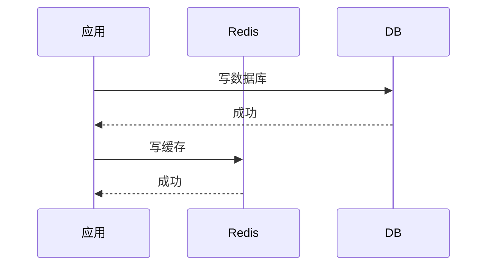
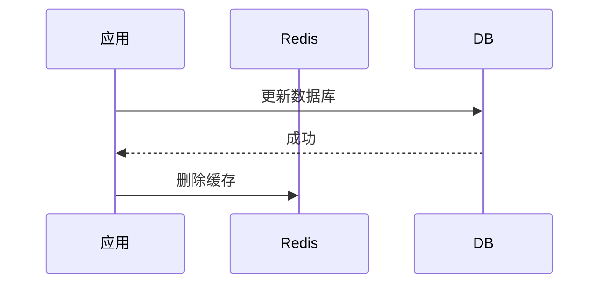
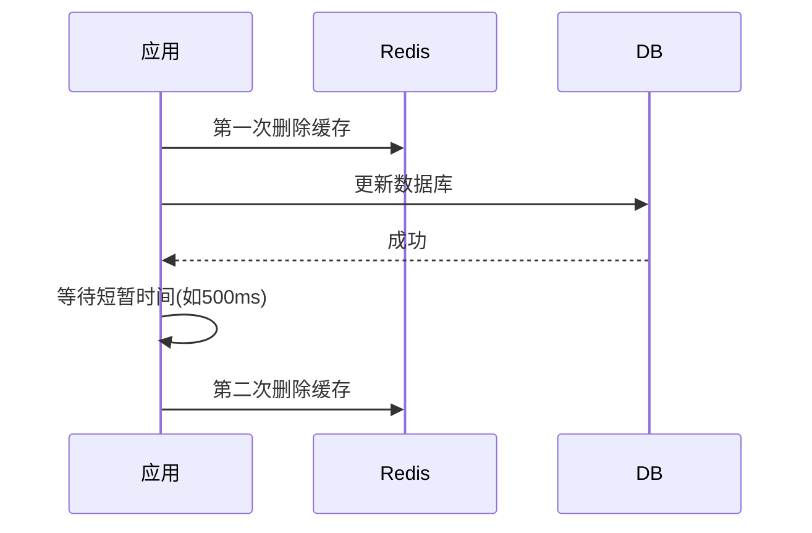
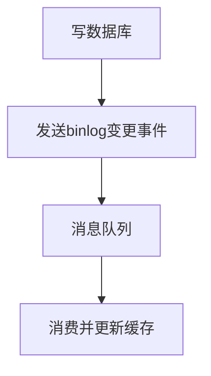

# Redis 双写一致性

双写一致性是指当系统同时使用Redis缓存和数据库时，如何保证两者数据一致性的问题。这是分布式系统中的一个经典挑战，特别是在高并发场景下尤为突出。

## 核心问题场景

```tex
[应用服务器] 
  ↓ 写请求
[Redis缓存] ←→ [数据库]
```


当数据需要同时写入缓存和数据库时，可能出现以下不一致情况：

1. **写顺序不一致**：先写缓存成功但数据库失败，或反之
2. **并发读写冲突**：读请求在更新过程中获取到旧数据
3. **异步延迟**：主从同步、缓存过期等机制导致暂时不一致

## 常见解决方案

### 1. 同步双写模式（最简单）




DBRedis应用DBRedis应用写数据库成功写缓存成功

**问题**：

- 非原子操作，第二步可能失败
- 高并发下仍可能产生竞态条件

### 2. 先更新数据库，再删除缓存（Cache-Aside）





DBRedis应用DBRedis应用更新数据库成功删除缓存

**优点**：

- 避免缓存永不过期问题
- 实现相对简单

**问题**：

- 删除缓存失败仍会不一致
- 读请求可能在删除前加载旧数据

### 3. 延时双删策略





DBRedis应用DBRedis应用第一次删除缓存更新数据库成功等待短暂时间(如500ms)第二次删除缓存

**优势**：

- 解决大部分并发导致的不一致
- 适应主从同步延迟场景

### 4. 基于消息队列的最终一致性





<svg role="graphics-document document" viewBox="0 0 215.5546875 382" class="flowchart mermaid-svg" xmlns="http://www.w3.org/2000/svg" width="100%" id="mermaid-svg-208" height="100%" style="max-width: 100%; transform-origin: 0px 0px; user-select: none; transform: translate(258.687px, 0px) scale(0.312003);"><g><marker orient="auto" markerHeight="8" markerWidth="8" markerUnits="userSpaceOnUse" refY="5" refX="5" viewBox="0 0 10 10" class="marker flowchart-v2" id="mermaid-svg-208_flowchart-v2-pointEnd"><path style="stroke-width: 1; stroke-dasharray: 1, 0;" class="arrowMarkerPath" d="M 0 0 L 10 5 L 0 10 z"></path></marker><marker orient="auto" markerHeight="8" markerWidth="8" markerUnits="userSpaceOnUse" refY="5" refX="4.5" viewBox="0 0 10 10" class="marker flowchart-v2" id="mermaid-svg-208_flowchart-v2-pointStart"><path style="stroke-width: 1; stroke-dasharray: 1, 0;" class="arrowMarkerPath" d="M 0 5 L 10 10 L 10 0 z"></path></marker><marker orient="auto" markerHeight="11" markerWidth="11" markerUnits="userSpaceOnUse" refY="5" refX="11" viewBox="0 0 10 10" class="marker flowchart-v2" id="mermaid-svg-208_flowchart-v2-circleEnd"><circle style="stroke-width: 1; stroke-dasharray: 1, 0;" class="arrowMarkerPath" r="5" cy="5" cx="5"></circle></marker><marker orient="auto" markerHeight="11" markerWidth="11" markerUnits="userSpaceOnUse" refY="5" refX="-1" viewBox="0 0 10 10" class="marker flowchart-v2" id="mermaid-svg-208_flowchart-v2-circleStart"><circle style="stroke-width: 1; stroke-dasharray: 1, 0;" class="arrowMarkerPath" r="5" cy="5" cx="5"></circle></marker><marker orient="auto" markerHeight="11" markerWidth="11" markerUnits="userSpaceOnUse" refY="5.2" refX="12" viewBox="0 0 11 11" class="marker cross flowchart-v2" id="mermaid-svg-208_flowchart-v2-crossEnd"><path style="stroke-width: 2; stroke-dasharray: 1, 0;" class="arrowMarkerPath" d="M 1,1 l 9,9 M 10,1 l -9,9"></path></marker><marker orient="auto" markerHeight="11" markerWidth="11" markerUnits="userSpaceOnUse" refY="5.2" refX="-1" viewBox="0 0 11 11" class="marker cross flowchart-v2" id="mermaid-svg-208_flowchart-v2-crossStart"><path style="stroke-width: 2; stroke-dasharray: 1, 0;" class="arrowMarkerPath" d="M 1,1 l 9,9 M 10,1 l -9,9"></path></marker><g class="root"><g class="clusters"></g><g class="edgePaths"><path marker-end="url(#mermaid-svg-208_flowchart-v2-pointEnd)" style="" class="edge-thickness-normal edge-pattern-solid edge-thickness-normal edge-pattern-solid flowchart-link" id="L_A_B_0" d="M107.777,62L107.777,66.167C107.777,70.333,107.777,78.667,107.777,86.333C107.777,94,107.777,101,107.777,104.5L107.777,108"></path><path marker-end="url(#mermaid-svg-208_flowchart-v2-pointEnd)" style="" class="edge-thickness-normal edge-pattern-solid edge-thickness-normal edge-pattern-solid flowchart-link" id="L_B_C_0" d="M107.777,166L107.777,170.167C107.777,174.333,107.777,182.667,107.777,190.333C107.777,198,107.777,205,107.777,208.5L107.777,212"></path><path marker-end="url(#mermaid-svg-208_flowchart-v2-pointEnd)" style="" class="edge-thickness-normal edge-pattern-solid edge-thickness-normal edge-pattern-solid flowchart-link" id="L_C_D_0" d="M107.777,270L107.777,274.167C107.777,278.333,107.777,286.667,107.777,294.333C107.777,302,107.777,309,107.777,312.5L107.777,316"></path></g><g class="edgeLabels"><g class="edgeLabel"><g transform="translate(0, 0)" class="label"><foreignObject height="0" width="0"><div class="labelBkg" xmlns="http://www.w3.org/1999/xhtml" style="background-color: rgba(232, 232, 232, 0.5); display: table-cell; white-space: nowrap; line-height: 1.5; max-width: 200px; text-align: center;"><span class="edgeLabel" style="fill: rgb(51, 51, 51); color: rgb(51, 51, 51); background-color: rgba(232, 232, 232, 0.8); text-align: center;"></span></div></foreignObject></g></g><g class="edgeLabel"><g transform="translate(0, 0)" class="label"><foreignObject height="0" width="0"><div class="labelBkg" xmlns="http://www.w3.org/1999/xhtml" style="background-color: rgba(232, 232, 232, 0.5); display: table-cell; white-space: nowrap; line-height: 1.5; max-width: 200px; text-align: center;"><span class="edgeLabel" style="fill: rgb(51, 51, 51); color: rgb(51, 51, 51); background-color: rgba(232, 232, 232, 0.8); text-align: center;"></span></div></foreignObject></g></g><g class="edgeLabel"><g transform="translate(0, 0)" class="label"><foreignObject height="0" width="0"><div class="labelBkg" xmlns="http://www.w3.org/1999/xhtml" style="background-color: rgba(232, 232, 232, 0.5); display: table-cell; white-space: nowrap; line-height: 1.5; max-width: 200px; text-align: center;"><span class="edgeLabel" style="fill: rgb(51, 51, 51); color: rgb(51, 51, 51); background-color: rgba(232, 232, 232, 0.8); text-align: center;"></span></div></foreignObject></g></g></g><g class="nodes"><g transform="translate(107.77734375, 35)" id="flowchart-A-0" class="node default"><rect height="54" width="124" y="-27" x="-62" style="" class="basic label-container"></rect><g transform="translate(-32, -12)" style="" class="label"><rect></rect><foreignObject height="24" width="64"><div xmlns="http://www.w3.org/1999/xhtml" style="display: table-cell; white-space: nowrap; line-height: 1.5; max-width: 200px; text-align: center;"><span class="nodeLabel" style="fill: rgb(51, 51, 51); color: rgb(51, 51, 51);"><p style="margin: 0px;">写数据库</p></span></div></foreignObject></g></g><g transform="translate(107.77734375, 139)" id="flowchart-B-1" class="node default"><rect height="54" width="199.5546875" y="-27" x="-99.77734375" style="" class="basic label-container"></rect><g transform="translate(-69.77734375, -12)" style="" class="label"><rect></rect><foreignObject height="24" width="139.5546875"><div xmlns="http://www.w3.org/1999/xhtml" style="display: table-cell; white-space: nowrap; line-height: 1.5; max-width: 200px; text-align: center;"><span class="nodeLabel" style="fill: rgb(51, 51, 51); color: rgb(51, 51, 51);"><p style="margin: 0px;">发送binlog变更事件</p></span></div></foreignObject></g></g><g transform="translate(107.77734375, 243)" id="flowchart-C-3" class="node default"><rect height="54" width="124" y="-27" x="-62" style="" class="basic label-container"></rect><g transform="translate(-32, -12)" style="" class="label"><rect></rect><foreignObject height="24" width="64"><div xmlns="http://www.w3.org/1999/xhtml" style="display: table-cell; white-space: nowrap; line-height: 1.5; max-width: 200px; text-align: center;"><span class="nodeLabel" style="fill: rgb(51, 51, 51); color: rgb(51, 51, 51);"><p style="margin: 0px;">消息队列</p></span></div></foreignObject></g></g><g transform="translate(107.77734375, 347)" id="flowchart-D-5" class="node default"><rect height="54" width="172" y="-27" x="-86" style="" class="basic label-container"></rect><g transform="translate(-56, -12)" style="" class="label"><rect></rect><foreignObject height="24" width="112"><div xmlns="http://www.w3.org/1999/xhtml" style="display: table-cell; white-space: nowrap; line-height: 1.5; max-width: 200px; text-align: center;"><span class="nodeLabel" style="fill: rgb(51, 51, 51); color: rgb(51, 51, 51);"><p style="margin: 0px;">消费并更新缓存</p></span></div></foreignObject></g></g></g></g></g></svg>

**实现方式**：

- 使用Canal监听MySQL binlog
- 或使用Redis Streams作为消息队列

## 高并发场景下的特殊问题

### 缓存击穿导致的不一致

**场景**：

1. 缓存失效瞬间
2. 大量请求同时读数据库并回写缓存
3. 可能写入不同版本数据

**解决方案**：

```java
// 伪代码：使用互斥锁
public Object getData(key) {
    data = redis.get(key);
    if (data == null) {
        if (lock.tryLock()) {  // 获取分布式锁
            try {
                data = db.get(key);  // 查数据库
                redis.set(key, data); // 写缓存
            } finally {
                lock.unlock();
            }
        } else {
            Thread.sleep(100); // 稍后重试
            return getData(key);
        }
    }
    return data;
}
```

## 一致性级别选择

| 级别         | 描述                     | 适用场景       |
| :----------- | :----------------------- | :------------- |
| **强一致**   | 每次读写都能获取最新数据 | 金融交易等     |
| **最终一致** | 允许短暂不一致，最终一致 | 大多数业务场景 |
| **弱一致**   | 不保证一致性             | 统计类数据     |

## 最佳实践建议

1. **合理设置过期时间**：

   ```
   # 即使更新失败，缓存最终也会过期
   SET key value EX 3600
   ```

2. **降级策略**：

   - 缓存更新失败时记录日志而非阻断流程
   - 可设置"最后一次更新时间"元数据

3. **监控措施**：

   ```
   # 监控缓存命中率
   redis-cli info stats | grep keyspace_misses
   redis-cli info stats | grep keyspace_hits
   ```

4. **版本控制**：

   ```
   // 使用数据版本号解决ABA问题
   set user:1000 {data:..., version: 2}
   ```

Redis双写一致性没有银弹解决方案，需要根据业务特点（对一致性的要求程度、并发量大小等）选择合适策略，通常需要在性能与一致性之间取得平衡。


# Redis 实现分布式锁

redis 实现分布式锁的原理？

1. redis 如何实现锁，锁的互相斥性怎么实现？
   1. 使用Lua脚本，因为需要先判断当前锁是不是我持有的，再去释放或者获取，是两个步骤因此需要Lua脚本。
   2. 如果使用Set Nx也是可以的，因为set NX 是一步操作，可以保证原子性。
2. 如果这个线程拿到锁，假如这个线程挂了，无法释放锁，因此加一个过期时间，避免不能释放锁。
3. 如果这个线程持有锁，但是还没到释放的时候，过期时间就到了，那么需要加入看**门狗机制**，来维持这个锁的时间。
4. 如果线程挂了，**看门狗**一直给当前线程续期，那么就一直释放不了锁。
   1. 将这个看门狗设置成**守护线程**，他的生命周期随着当前线程死亡而死亡。解决了一值加锁的问题。
5. 如何实现锁的可重入？
   1. 一个锁可以一直被加锁，多次加锁，
   2. redis 的hash ，每次重入一次就加一次，hset
6. redis重入锁机制，如果获取锁失败，那就让其自选等待，直到获取锁，
7. redis：如果线程没有获取到锁，那么就订阅一下，并且阻塞住，基于的是发布订阅，
8. redis获取锁的这个线程此时释放锁，那么再释放之后，发布订阅消息，那么订阅了这个key的值，其他人可以被唤醒拿锁
9. 并且需要设置超时时间，避免一直等待
10. 如果是主从架构，那么新的节点可能没有锁信息，那么可能有问题，那么是给所有的主节点加锁，
11. 那么是半数以上的加锁成功，那么就当成了加锁成功。避免有一个锁在一个主节点一直加不上问题。
12. 主从架构中，这种性不好，因此不会使用主从架构来加锁。

总结：

- 互斥：原子操作，set nx或者lua脚本
- 避免一直持有锁，那么就使用超时时间，
- 避免超过了超时时间我还想继续持有锁，那么使用看门狗机制，一直续时间
- 锁的线程挂了，但是看门狗还在，那么将看门狗设置为守护线程，随着当前线程的死亡而死亡。
- 如何重入：使用 hset。增加value的值
- 如何保证高可用，使用主从架构。就是红锁，但是红锁的要求较高，需要部署多太主节点，因此不推荐使用。