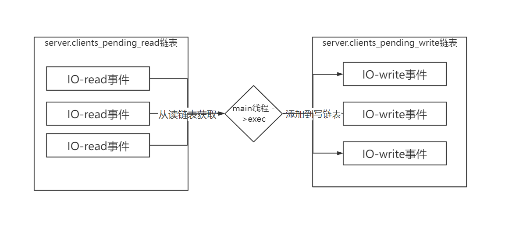

## Redis 源码解析

## 1、Redis 入口 ：

​	1.redis启动入口，server.c中main方法：

```C
int main(){
    // 1.初始化server的配置，加载redis.conf配置
    initServerConfig();
    // 2.初始化ACL用户权限
    ACLInit(); 
    // 3.初始化server，建立socket连接，绑定回调函数等
    initServer();
    // 4.初始化线程，创建后台线程和IO线程
    InitServerLast();
    // 5.调用mian线程
    aeMain(server.el);
    return 1;
}
```

2. ae.c 中aeMain()函数：

```C
// 主线程一直进行循环，处理事件
void aeMain(aeEventLoop *eventLoop) {
    eventLoop->stop = 0; // 设置停止状态
    while (!eventLoop->stop) { 
        aeProcessEvents(eventLoop, AE_ALL_EVENTS | AE_CALL_BEFORE_SLEEP | AE_CALL_AFTER_SLEEP);
    }
}
```

3. aeProcessEvents()函数:

```C
int aeProcessEvents(aeEventLoop *eventLoop, int flags){
	// 执行beforeSleep
    eventLoop->beforesleep(eventLoop);
    // 获取 epoll中，epoll_wait的事件
	int numevents = aeApiPoll(eventLoop, tvp);
     // 执行aftersleep
    eventLoop->aftersleep(eventLoop);
     for (j = 0; j < numevents; j++) {
         // 执行读事件
         // 执行写事件
     }
    // 触发timeEvents事件
    processTimeEvents(eventLoop);
}
```

beforesleep函数在main函数主进行设置

4. beforesleep函数：

主要有两个函数：

1.handleClientsWithPendingReadsUsingThreads()；

2.handleClientsWithPendingWritesUsingThreads() ;

```C
void beforeSleep(struct aeEventLoop *eventLoop) {
	
    /* We should handle pending reads clients ASAP after event loop. */
    handleClientsWithPendingReadsUsingThreads();	// 1.事件循环中处理读clients待读事件

    /* Handle writes with pending output buffers. */
    handleClientsWithPendingWritesUsingThreads();	// 2.事件循环中处理写回到socket事件
}
```

handleClientsWithPendingReadsUsingThreads：

使用IO线程处理读事件:如果开启读多线程的话，默认是不开启的，如果有待读的事件，那么绑定到IOthread中，拿到IO thread线程的第一个线程，也就是main线程，执行命令，并绑定写handler。

handleClientsWithPendingWritesUsingThreads：

拿到待处理的write列表，跟io_threads进行绑定，改变状态，以便于其他IO线程可以执行绑定的write操作，主线程直接执行writeToClient(c,0);函数，将结果写回到客户端socket中。如果有IO线程，那么等待其他IO线程写回结束。

## 2、redis 单线程实现原理

1、redis IO模型：

redis.conf 配置文件：

```shell
# 默认不开启，如果开启默认配置IO数是 4 个，最大不能超过128（看源码可知）
# io-threads 是用多线程处理《写IO》主线程exec的结果
io-threads 4
# 默认不开始 do read多线程，《读》 IO
io-threads-do-reads no
# NOTE 1: This configuration directive cannot be changed at runtime via
# CONFIG SET. Aso this feature currently does not work when SSL is
# enabled.
#
# NOTE 2: If you want to test the Redis speedup using redis-benchmark, make
# sure you also run the benchmark itself in o-threads-do-reads nothreaded mode, using the
# --threads option to match the number of Redis threads, otherwise you'll not
# be able to notice the improvements.
# 最好使用redis-benchmark来测试redis速度，
redis-benchmark --threads 4
# <Usually threading reads doesn't help much.> (通常情况下开始多IO多线程并没有多大用，但是最好根据业务来)

```

2. redis 单线程执行原理图：

   第一次轮询：接收到客户端穿过来的数据，根据绑定的read事件，将client添加到pending_read列表中

   



## 3、redis数据如何在内存存储方式

1、initServer函数中，给server.db创建根据server.dbnum的数量

```C
// 分配redis数据库db内存
server.db = zmalloc(sizeof(redisDb)*server.dbnum);
```

2、相关结构体：

redisDb 结构体：

```C
typedef struct redisDb {
	// redis 正真的key-value存储
    dict *dict;                 /* The keyspace for this DB */
	// 存储已经超时过期的(k-v)
	dict *expires;              /* Timeout of keys with a timeout set */
    dict *blocking_keys;        /* Keys with clients waiting for data (BLPOP)*/
	dict *ready_keys;           /* Blocked keys that received a PUSH */
    dict *watched_keys;         /* WATCHED keys for MULTI/EXEC CAS */
    int id;                     /* Database ID */
	// 平均ttl时间
    long long avg_ttl;          /* Average TTL, just for stats */
	// 用来拿到过期的k-v
    unsigned long expires_cursor; /* Cursor of the active expire cycle. */
    list *defrag_later;         /* List of key names to attempt to defrag one by one, gradually. */
} redisDb;
```

dict结构体：

```C
typedef struct dict {
    dictType *type;
    void *privdata;
    dictht ht[2];		// 默认2个hash表,[0]用来存储数据，[1]用来rehash
    long rehashidx; /* rehashing not in progress if rehashidx == -1 */
    int16_t pauserehash; /* If >0 rehashing is paused (<0 indicates coding error) */
} dict;
```
dictType:
```C
/* Db->dict, keys are sds strings, vals are Redis objects. */
dictType dbDictType = {
    dictSdsHash,                /* hash function */
    NULL,                       /* key dup */
    NULL,                       /* val dup */
    dictSdsKeyCompare,          /* key compare */
    dictSdsDestructor,          /* key destructor */
    dictObjectDestructor,       /* val destructor */
    dictExpandAllowed           /* allow to expand */
};
```

dictht结构体：

hash表结构

```C
/* This is our hash table structure. Every dictionary has two of this as we
 * implement incremental rehashing, for the old to the new table. */
// 以上注释说明为什么默认要两个(dictht ht[2];)
typedef struct dictht {
    // k-v 存储地方，
    dictEntry **table; 			// 哈希表数组
    unsigned long size;			// 哈希表大小；在redis的实现中，size也是触发扩容的阈值
    unsigned long sizemask;		// 哈希表大小掩码，用于计算索引值；总是等于 size-1
    unsigned long used;			// 哈希表中保存的节点的数量
} dictht;
```

dictEntry结构体：

```C
typedef struct dictEntry {
    void *key;				// 键，是sds
    union {
        void *val;			// 值：redisObj
        uint64_t u64;
        int64_t s64;
        double d;
    } v;
    struct dictEntry *next;
} dictEntry;
// 类似一个链表，该链表节点保存的是(key - val)
```


hash表负载因子计算公式：

```C
// 负载因子 = 哈希表已保存节点数量 / 哈希表大小
load_factor = ht[0].used / ht[0].size
```

3.3、 Hash表执行扩容操作：

触发条件：

- 没有在执行 BGSAVE 命令或者 BGREWRITEAOF 命令， 并且哈希表的负载因子大于等于 1
- 正在执行 BGSAVE 命令或者 BGREWRITEAOF 命令， 并且哈希表的负载因子大于等于 5

redis扩容大小：

在size >  4的情况下是size得2倍，否则就是4

```C
/* Our hash table capability is a power of two */
static unsigned long _dictNextPower(unsigned long size)
{
    unsigned long i = DICT_HT_INITIAL_SIZE;

    if (size >= LONG_MAX) return LONG_MAX + 1LU;
    while(1) {
        if (i >= size)
            return i;
        i *= 2;
    }
}
```


3.4、Hash表执行缩容操作：

触发条件：

-  当哈希表的负载因子小于 0.1 时， 程序自动开始对哈希表执行收缩操作。


## 3、redis 基础类型及内存管理

### 第一阶段 熟悉Redis基础数据结构
- 阅读Redis的数据结构部分，基本位于如下文件中：内存分配 zmalloc.c和zmalloc.h

- 动态字符串 sds.h和sds.c

- 双端链表 adlist.c和adlist.h

- 字典 dict.h和dict.c

- 跳跃表 server.h文件里面关于zskiplist结构和zskiplistNode结构，以及t_zset.c中所有zsl开头的函数，比如 zslCreate、zslInsert、zslDeleteNode等等。

- 基数统计 hyperloglog.c 中的 hllhdr 结构， 以及所有以 hll 开头的函数

###  第二阶段 熟悉Redis的内存编码结构

- 整数集合数据结构 intset.h和intset.c

- 压缩列表数据结构 ziplist.h和ziplist.c

### 第三阶段 熟悉Redis数据类型的实现
- 对象系统 object.c
- 字符串键 t_string.c
- 列表建 t_list.c
- 散列键 t_hash.c
- 集合键 t_set.c
- 有序集合键 t_zset.c中除 zsl 开头的函数之外的所有函数
- HyperLogLog键 hyperloglog.c中所有以pf开头的函数
### 第四阶段 熟悉Redis数据库的实现
- 数据库实现 redis.h文件中的redisDb结构，以及db.c文件
- 通知功能 notify.c
- RDB持久化 rdb.c
- AOF持久化 aof.c
-----------------

以及一些独立功能模块的实现
- 发布和订阅 redis.h文件的pubsubPattern结构，以及pubsub.c文件
- 事务 redis.h文件的multiState结构以及multiCmd结构，multi.c文件
### 第五阶段 熟悉客户端和服务器端的代码实现
- 事件处理模块 ae.c/ae_epoll.c/ae_evport.c/ae_kqueue.c/ae_select.c
- 网路链接库 anet.c和networking.c
- 服务器端 redis.c
- 客户端 redis-cli.c
- 这个时候可以阅读下面的独立功能模块的代码实现
- lua脚本 scripting.c
- 慢查询 slowlog.c
- 监视 monitor.c
### 第六阶段 熟悉Redis多机部分的代码实现
- 复制功能replication.c
- Redis Sentinel sentinel.c
- 集群 cluster.c
其他代码文件介绍关于测试方面的文件有：
- memtest.c 内存检测
- redis_benchmark.c 用于redis性能测试的实现。
- redis_check_aof.c 用于更新日志检查的实现。
- redis_check_dump.c 用于本地数据库检查的实现。
- testhelp.c 一个C风格的小型测试框架。
-----------------
一些工具类的文件如下：
- bitops.c GETBIT、SETBIT 等二进制位操作命令的实现
- debug.c 用于调试时使用
- endianconv.c 高低位转换，不同系统，高低位顺序不同
- help.h  辅助于命令的提示信息
- lzf_c.c 压缩算法系列
- lzf_d.c  压缩算法系列
- rand.c 用于产生随机数
- release.c 用于发布时使用
- sha1.c sha加密算法的实现
- util.c  通用工具方法
- crc64.c 循环冗余校验
- sort.c SORT命令的实现
-----------------
一些封装类的代码实现：
- bio.c background I/O的意思，开启后台线程用的
- latency.c 延迟类
- migrate.c 命令迁移类，包括命令的还原迁移等
- pqsort.c  排序算法类
- rio.c redis定义的一个I/O类
- syncio.c 用于同步Socket和文件I/O操作

整个Redis的源码分类大体上如上所述了，接下来就按照既定的几个阶段一一去分析Redis这款如此优秀的源代码吧！


```http
学习规划转载:https://www.zhihu.com/question/28677076/answer/134193549
```