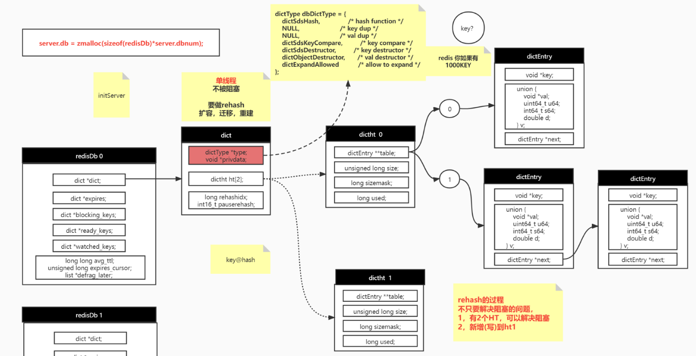
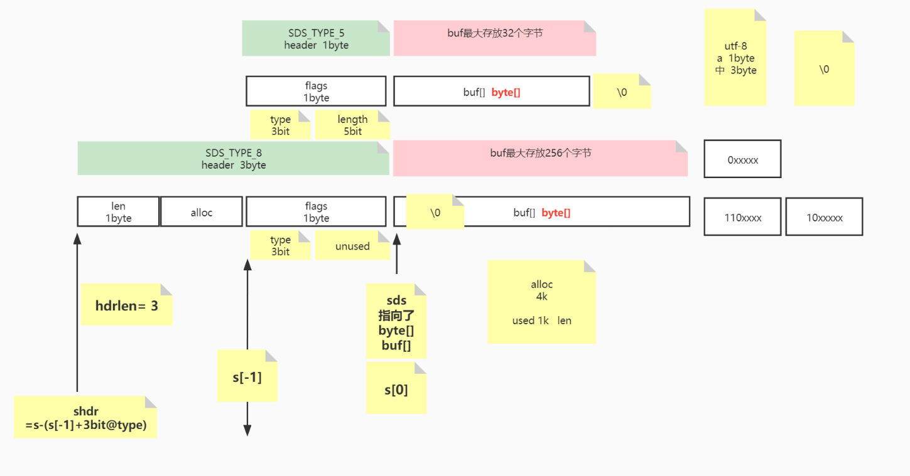
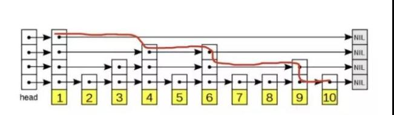

## Redis 源码解析

## 1、Redis 入口 ：

​	1.redis启动入口，server.c中main方法：

```C
int main(){
    // 1.初始化server的配置，加载redis.conf配置
    initServerConfig();
    // 2.初始化ACL用户权限
    ACLInit(); 
    // 3.初始化server，建立socket连接，绑定回调函数等
    initServer();
    // 4.初始化线程，创建后台线程和IO线程
    InitServerLast();
    // 5.调用mian线程
    aeMain(server.el);
    return 1;
}
```

2. ae.c 中aeMain()函数：

```C
// 主线程一直进行循环，处理事件
void aeMain(aeEventLoop *eventLoop) {
    eventLoop->stop = 0; // 设置停止状态
    while (!eventLoop->stop) { 
        aeProcessEvents(eventLoop, AE_ALL_EVENTS | AE_CALL_BEFORE_SLEEP | AE_CALL_AFTER_SLEEP);
    }
}
```

3. aeProcessEvents()函数:

```C
int aeProcessEvents(aeEventLoop *eventLoop, int flags){
	// 执行beforeSleep
    eventLoop->beforesleep(eventLoop);
    // 获取 epoll中，epoll_wait的事件
	int numevents = aeApiPoll(eventLoop, tvp);
     // 执行aftersleep
    eventLoop->aftersleep(eventLoop);
     for (j = 0; j < numevents; j++) {
         // 执行读事件
         // 执行写事件
     }
    // 触发timeEvents事件
    processTimeEvents(eventLoop);
}
```

beforesleep函数在main函数主进行设置

4. beforesleep函数：

主要有两个函数：

1.handleClientsWithPendingReadsUsingThreads()；

2.handleClientsWithPendingWritesUsingThreads() ;

```C
void beforeSleep(struct aeEventLoop *eventLoop) {
	
    /* We should handle pending reads clients ASAP after event loop. */
    handleClientsWithPendingReadsUsingThreads();	// 1.事件循环中处理读clients待读事件

    /* Handle writes with pending output buffers. */
    handleClientsWithPendingWritesUsingThreads();	// 2.事件循环中处理写回到socket事件
}
```

handleClientsWithPendingReadsUsingThreads：

使用IO线程处理读事件:如果开启读多线程的话，默认是不开启的，如果有待读的事件，那么绑定到IOthread中，拿到IO thread线程的第一个线程，也就是main线程，执行命令，并绑定写handler。

handleClientsWithPendingWritesUsingThreads：

拿到待处理的write列表，跟io_threads进行绑定，改变状态，以便于其他IO线程可以执行绑定的write操作，主线程直接执行writeToClient(c,0);函数，将结果写回到客户端socket中。如果有IO线程，那么等待其他IO线程写回结束。

## 2、redis 单线程实现原理

1、redis IO模型：

redis.conf 配置文件：

```shell
# 默认不开启，如果开启默认配置IO数是 4 个，最大不能超过128（看源码可知）
# io-threads 是用多线程处理《写IO》主线程exec的结果
io-threads 4
# 默认不开始 do read多线程，《读》 IO
io-threads-do-reads no
# NOTE 1: This configuration directive cannot be changed at runtime via
# CONFIG SET. Aso this feature currently does not work when SSL is
# enabled.
#
# NOTE 2: If you want to test the Redis speedup using redis-benchmark, make
# sure you also run the benchmark itself in o-threads-do-reads nothreaded mode, using the
# --threads option to match the number of Redis threads, otherwise you'll not
# be able to notice the improvements.
# 最好使用redis-benchmark来测试redis速度，
redis-benchmark --threads 4
# <Usually threading reads doesn't help much.> (通常情况下开始多IO多线程并没有多大用，但是最好根据业务来)

```

2. redis 单线程执行原理图：

   第一次轮询：接收到客户端穿过来的数据，根据绑定的read事件，将client添加到pending_read列表中

   


## 3、redis数据如何在内存存储方式

### 3.0、redis数据内存存储原理:



### 3.1、initServer函数中，给server.db创建根据server.dbnum的数量

```C
// 分配redis数据库db内存
server.db = zmalloc(sizeof(redisDb)*server.dbnum);
```

### 3.2、相关结构体：

redisDb 结构体：

```C
typedef struct redisDb {
	// redis 正真的key-value存储
    dict *dict;                 /* The keyspace for this DB */
	// 存储已经超时过期的(k-v)
	dict *expires;              /* Timeout of keys with a timeout set */
    dict *blocking_keys;        /* Keys with clients waiting for data (BLPOP)*/
	dict *ready_keys;           /* Blocked keys that received a PUSH */
    dict *watched_keys;         /* WATCHED keys for MULTI/EXEC CAS */
    int id;                     /* Database ID */
	// 平均ttl时间
    long long avg_ttl;          /* Average TTL, just for stats */
	// 用来拿到过期的k-v
    unsigned long expires_cursor; /* Cursor of the active expire cycle. */
    list *defrag_later;         /* List of key names to attempt to defrag one by one, gradually. */
} redisDb;
```

dict结构体：

```C
typedef struct dict {
    dictType *type;
    void *privdata;
    dictht ht[2];		// 默认2个hash表,[0]用来存储数据，[1]用来rehash
    long rehashidx; /* rehashing not in progress if rehashidx == -1 */
    int16_t pauserehash; /* If >0 rehashing is paused (<0 indicates coding error) */
} dict;
```
dictType:
```C
/* Db->dict, keys are sds strings, vals are Redis objects. */
dictType dbDictType = {
    dictSdsHash,                /* hash function */
    NULL,                       /* key dup */
    NULL,                       /* val dup */
    dictSdsKeyCompare,          /* key compare */
    dictSdsDestructor,          /* key destructor */
    dictObjectDestructor,       /* val destructor */
    dictExpandAllowed           /* allow to expand */
};
```

dictht结构体：

hash表结构

```C
/* This is our hash table structure. Every dictionary has two of this as we
 * implement incremental rehashing, for the old to the new table. */
// 以上注释说明为什么默认要两个(dictht ht[2];)
typedef struct dictht {
    // k-v 存储地方，
    dictEntry **table; 			// 哈希表数组
    unsigned long size;			// 哈希表大小；在redis的实现中，size也是触发扩容的阈值
    unsigned long sizemask;		// 哈希表大小掩码，用于计算索引值；总是等于 size-1
    unsigned long used;			// 哈希表中保存的节点的数量
} dictht;
```

dictEntry结构体：

```C
typedef struct dictEntry {
    void *key;				// 键，是sds
    union {
        void *val;			// 值：redisObj
        uint64_t u64;
        int64_t s64;
        double d;
    } v;
    struct dictEntry *next;
} dictEntry;
// 类似一个链表，该链表节点保存的是(key - val)
```


hash表负载因子计算公式：

```C
// 负载因子 = 哈希表已保存节点数量 / 哈希表大小
load_factor = ht[0].used / ht[0].size
```

### 3.3、 Hash表执行扩容操作：

触发条件：

- 没有在执行 BGSAVE 命令或者 BGREWRITEAOF 命令， 并且哈希表的负载因子大于等于 1
- 正在执行 BGSAVE 命令或者 BGREWRITEAOF 命令， 并且哈希表的负载因子大于等于 5

redis扩容大小：

在size >  4的情况下是size得2倍，否则就是4

```C
/* Our hash table capability is a power of two */
static unsigned long _dictNextPower(unsigned long size)
{
    unsigned long i = DICT_HT_INITIAL_SIZE;

    if (size >= LONG_MAX) return LONG_MAX + 1LU;
    while(1) {
        if (i >= size)
            return i;
        i *= 2;
    }
}
```


### 3.4、Hash表执行缩容操作：

触发条件：

-  当哈希表的负载因子小于 0.1 时， 程序自动开始对哈希表执行收缩操作。


## 4、redisObject

### 4.1、redisObject 结构体

```C
typedef struct redisObject {
    unsigned type:4;		// 4bit代表类型
    unsigned encoding:4;	// 4bit代表编码格式
    unsigned lru:LRU_BITS; /* LRU time (relative to global lru_clock) or
                            * LFU data (least significant 8 bits frequency
                            * and most significant 16 bits access time). */
    int refcount;			// 8bit也即一个byte代表引用计数
    void *ptr;				// 实际数据引用指针
} robj;
```

### 4.2、redis编码类型

```C
/* Objects encoding. Some kind of objects like Strings and Hashes can be
 * internally represented in multiple ways. The 'encoding' field of the object
 * is set to one of this fields for this object. */
#define OBJ_ENCODING_RAW 0     /* Raw representation */
#define OBJ_ENCODING_INT 1     /* Encoded as integer */
#define OBJ_ENCODING_HT 2      /* Encoded as hash table */
#define OBJ_ENCODING_ZIPMAP 3  /* Encoded as zipmap */
#define OBJ_ENCODING_LINKEDLIST 4 /* No longer used: old list encoding. */
#define OBJ_ENCODING_ZIPLIST 5 /* Encoded as ziplist */
#define OBJ_ENCODING_INTSET 6  /* Encoded as intset */
#define OBJ_ENCODING_SKIPLIST 7  /* Encoded as skiplist */
#define OBJ_ENCODING_EMBSTR 8  /* Embedded sds string encoding */
#define OBJ_ENCODING_QUICKLIST 9 /* Encoded as linked list of ziplists */
#define OBJ_ENCODING_STREAM 10 /* Encoded as a radix tree of listpacks */

// 11种数据编码结构
```

### 4.3、redis数据类型

```C
/* The actual Redis Object */
#define OBJ_STRING 0    /* String object. */
#define OBJ_LIST 1      /* List object. */
#define OBJ_SET 2       /* Set object. */
#define OBJ_ZSET 3      /* Sorted set object. */
#define OBJ_HASH 4      /* Hash object. */

// 5种value数据类型
```

## 5、redis基础数据类型

### 5.1、变长符 sds

sds原理：

sds一共有5类型的长度来代表字符串string

```C
#define SDS_TYPE_5  0
#define SDS_TYPE_8  1
#define SDS_TYPE_16 2
#define SDS_TYPE_32 3
#define SDS_TYPE_64 4

/* Note: sdshdr5 is never used, we just access the flags byte directly.
 * However is here to document the layout of type 5 SDS strings. */
struct __attribute__ ((__packed__)) sdshdr5 {
    unsigned char flags; /* 3 lsb of type, and 5 msb of string length */
    char buf[];			// buf最多是 25=32个字节
};
struct __attribute__ ((__packed__)) sdshdr8 {
    uint8_t len; /* used */
    uint8_t alloc; /* excluding the header and null terminator */
    unsigned char flags; /* 3 lsb of type, 5 unused bits */
    char buf[];			// buf最多是 2^8=256个字节
};
struct __attribute__ ((__packed__)) sdshdr16 {
    uint16_t len; /* used */
    uint16_t alloc; /* excluding the header and null terminator */
    unsigned char flags; /* 3 lsb of type, 5 unused bits */
    char buf[];			// buf最多是 2^16个字节
};
struct __attribute__ ((__packed__)) sdshdr32 {
    uint32_t len; /* used */
    uint32_t alloc; /* excluding the header and null terminator */
    unsigned char flags; /* 3 lsb of type, 5 unused bits */
    char buf[];			// buf最多是 2^32个字节
};
struct __attribute__ ((__packed__)) sdshdr64 {
    uint64_t len; /* used */
    uint64_t alloc; /* excluding the header and null terminator */
    unsigned char flags; /* 3 lsb of type, 5 unused bits */
    char buf[];			// buf最多是 2^64个字节
};
```

原理图解：




### 5.3、链表

redis中使用双端链表 adlist.c和adlist.h

结构体：

```c
typedef struct list {
    listNode *head;
    listNode *tail;
    void *(*dup)(void *ptr);
    void (*free)(void *ptr);
    int (*match)(void *ptr, void *key);
    unsigned long len;
} list;
typedef struct listNode {
    struct listNode *prev;
    struct listNode *next;
    void *value;
} listNode;

// list的迭代器，用于遍历链表
typedef struct listIter {
    listNode *next;
    int direction;
} listIter;
```

基本函数：

```c

list *listInsertNode(list *list, listNode *old_node, void *value, int after) {
  	// 添加元素*value到*list中
}
list *listCreate(void){
	// 开辟list内存空间
}
/* Return the element at the specified zero-based index
 * where 0 is the head, 1 is the element next to head
 * and so on. Negative integers are used in order to count
 * from the tail, -1 is the last element, -2 the penultimate
 * and so on. If the index is out of range NULL is returned. */
listNode *listIndex(list *list, long index) {
    // 返回index位置的节点
}
```


### 5.4、字典

字典 dict.h和dict.c

相关结构体：

```C
// 有关任何k-v数据类型的字典entry
typedef struct dictEntry {
    void *key;
    union {
        void *val;
        uint64_t u64;
        int64_t s64;
        double d;
    } v;
    struct dictEntry *next;
} dictEntry;
// 定义字典有关的函数
typedef struct dictType {
    uint64_t (*hashFunction)(const void *key);				// 哈希函数
    void *(*keyDup)(void *privdata, const void *key);		// keyDup
    void *(*valDup)(void *privdata, const void *obj);		// valDup
    int (*keyCompare)(void *privdata, const void *key1, const void *key2);
    void (*keyDestructor)(void *privdata, void *key);		// key类型
    void (*valDestructor)(void *privdata, void *obj);		// value类型
    int (*expandAllowed)(size_t moreMem, double usedRatio);	// 允许扩容
} dictType;

/* This is our hash table structure. Every dictionary has two of this as we
 * implement incremental rehashing, for the old to the new table. */
// redis hash table 结构体
typedef struct dictht {
    dictEntry **table;			// 哈希表数组,用二级指针表示
    unsigned long size;			// 哈希表得大小(size也是触发扩容的阈值)
    unsigned long sizemask;		// 大小掩码，用于计算索引值
    unsigned long used;			// 哈希表中保存的节点的数量
} dictht;	

// redis 字典类型
typedef struct dict {
    dictType *type;
    void *privdata;
    dictht ht[2];		// 默认2个hash表,[0]用来存储数据，[1]用来rehash
    long rehashidx; /* rehashing not in progress if rehashidx == -1 */	// 用来记录rehash得进度
    int16_t pauserehash; /* If >0 rehashing is paused (<0 indicates coding error) */
} dict;
```


## 6、redis内存编码结构

### 6.1、ziplist：压缩表

#### 6.1.1、ziplist原理


#### 6.1.2、ziplist结构

zipList节点值entry：

```C
/* We use this function to receive information about a ziplist entry.
 * Note that this is not how the data is actually encoded, is just what we
 * get filled by a function in order to operate more easily. */
typedef struct zlentry {
    unsigned int prevrawlensize; /* Bytes used to encode the previous entry len*/
    unsigned int prevrawlen;     /* Previous entry len. */
    unsigned int lensize;        /* Bytes used to encode this entry type/len.
                                    For example strings have a 1, 2 or 5 bytes
                                    header. Integers always use a single byte.*/
    unsigned int len;            /* Bytes used to represent the actual entry.
                                    For strings this is just the string length
                                    while for integers it is 1, 2, 3, 4, 8 or
                                    0 (for 4 bit immediate) depending on the
                                    number range. */
    unsigned int headersize;     /* prevrawlensize + lensize. */
    unsigned char encoding;      /* Set to ZIP_STR_* or ZIP_INT_* depending on
                                    the entry encoding. However for 4 bits
                                    immediate integers this can assume a range
                                    of values and must be range-checked. */
    unsigned char *p;            /* Pointer to the very start of the entry, that
                                    is, this points to prev-entry-len field. */
} zlentry;
```

#### 6.1.3、ziplist重要参数

```c
/* The ziplist is a specially encoded dually linked list that is designed
 * to be very memory efficient. It stores both strings and integer values,
 * where integers are encoded as actual integers instead of a series of
 * characters. It allows push and pop operations on either side of the list
 * in O(1) time. However, because every operation requires a reallocation of
 * the memory used by the ziplist, the actual complexity is related to the
 * amount of memory used by the ziplist.
 *
 * ----------------------------------------------------------------------------
 *
 * ZIPLIST OVERALL LAYOUT
 * ======================
 *
 * The general layout of the ziplist is as follows:
 *
 * <zlbytes> <zltail> <zllen> <entry> <entry> ... <entry> <zlend>
 *
 * NOTE: all fields are stored in little endian, if not specified otherwise.
 *
 * <uint32_t zlbytes> is an unsigned integer to hold the number of bytes that
 * the ziplist occupies, including the four bytes of the zlbytes field itself.
 * This value needs to be stored to be able to resize the entire structure
 * without the need to traverse it first.
 *
 * <uint32_t zltail> is the offset to the last entry in the list. This allows
 * a pop operation on the far side of the list without the need for full
 * traversal.
 *
 * <uint16_t zllen> is the number of entries. When there are more than
 * 2^16-2 entries, this value is set to 2^16-1 and we need to traverse the
 * entire list to know how many items it holds.
 *
 * <uint8_t zlend> is a special entry representing the end of the ziplist.
 * Is encoded as a single byte equal to 255. No other normal entry starts
 * with a byte set to the value of 255.
 *
 * ZIPLIST ENTRIES
 * ===============
 *
 * Every entry in the ziplist is prefixed by metadata that contains two pieces
 * of information. First, the length of the previous entry is stored to be
 * able to traverse the list from back to front. Second, the entry encoding is
 * provided. It represents the entry type, integer or string, and in the case
 * of strings it also represents the length of the string payload.
 * So a complete entry is stored like this:
 *
 * <prevlen> <encoding> <entry-data>
 *
 * Sometimes the encoding represents the entry itself, like for small integers
 * as we'll see later. In such a case the <entry-data> part is missing, and we
 * could have just:
 *
 * <prevlen> <encoding>
 *
 * The length of the previous entry, <prevlen>, is encoded in the following way:
 * If this length is smaller than 254 bytes, it will only consume a single
 * byte representing the length as an unsinged 8 bit integer. When the length
 * is greater than or equal to 254, it will consume 5 bytes. The first byte is
 * set to 254 (FE) to indicate a larger value is following. The remaining 4
 * bytes take the length of the previous entry as value.
 *
 * So practically an entry is encoded in the following way:
 *
 * <prevlen from 0 to 253> <encoding> <entry>
 *
 * Or alternatively if the previous entry length is greater than 253 bytes
 * the following encoding is used:
 *
 * 0xFE <4 bytes unsigned little endian prevlen> <encoding> <entry>
 *
 * The encoding field of the entry depends on the content of the
 * entry. When the entry is a string, the first 2 bits of the encoding first
 * byte will hold the type of encoding used to store the length of the string,
 * followed by the actual length of the string. When the entry is an integer
 * the first 2 bits are both set to 1. The following 2 bits are used to specify
 * what kind of integer will be stored after this header. An overview of the
 * different types and encodings is as follows. The first byte is always enough
 * to determine the kind of entry.
 *
 * |00pppppp| - 1 byte
 *      String value with length less than or equal to 63 bytes (6 bits).
 *      "pppppp" represents the unsigned 6 bit length.
 * |01pppppp|qqqqqqqq| - 2 bytes
 *      String value with length less than or equal to 16383 bytes (14 bits).
 *      IMPORTANT: The 14 bit number is stored in big endian.
 * |10000000|qqqqqqqq|rrrrrrrr|ssssssss|tttttttt| - 5 bytes
 *      String value with length greater than or equal to 16384 bytes.
 *      Only the 4 bytes following the first byte represents the length
 *      up to 2^32-1. The 6 lower bits of the first byte are not used and
 *      are set to zero.
 *      IMPORTANT: The 32 bit number is stored in big endian.
 * |11000000| - 3 bytes
 *      Integer encoded as int16_t (2 bytes).
 * |11010000| - 5 bytes
 *      Integer encoded as int32_t (4 bytes).
 * |11100000| - 9 bytes
 *      Integer encoded as int64_t (8 bytes).
 * |11110000| - 4 bytes
 *      Integer encoded as 24 bit signed (3 bytes).
 * |11111110| - 2 bytes
 *      Integer encoded as 8 bit signed (1 byte).
 * |1111xxxx| - (with xxxx between 0001 and 1101) immediate 4 bit integer.
 *      Unsigned integer from 0 to 12. The encoded value is actually from
 *      1 to 13 because 0000 and 1111 can not be used, so 1 should be
 *      subtracted from the encoded 4 bit value to obtain the right value.
 * |11111111| - End of ziplist special entry.
 *
 * Like for the ziplist header, all the integers are represented in little
 * endian byte order, even when this code is compiled in big endian systems.
 *
 * EXAMPLES OF ACTUAL ZIPLISTS
 * ===========================
 *
 * The following is a ziplist containing the two elements representing
 * the strings "2" and "5". It is composed of 15 bytes, that we visually
 * split into sections:
 *
 *  [0f 00 00 00] [0c 00 00 00] [02 00] [00 f3] [02 f6] [ff]
 *        |             |          |       |       |     |
 *     zlbytes        zltail    entries   "2"     "5"   end
 *
 * The first 4 bytes represent the number 15, that is the number of bytes
 * the whole ziplist is composed of. The second 4 bytes are the offset
 * at which the last ziplist entry is found, that is 12, in fact the
 * last entry, that is "5", is at offset 12 inside the ziplist.
 * The next 16 bit integer represents the number of elements inside the
 * ziplist, its value is 2 since there are just two elements inside.
 * Finally "00 f3" is the first entry representing the number 2. It is
 * composed of the previous entry length, which is zero because this is
 * our first entry, and the byte F3 which corresponds to the encoding
 * |1111xxxx| with xxxx between 0001 and 1101. We need to remove the "F"
 * higher order bits 1111, and subtract 1 from the "3", so the entry value
 * is "2". The next entry has a prevlen of 02, since the first entry is
 * composed of exactly two bytes. The entry itself, F6, is encoded exactly
 * like the first entry, and 6-1 = 5, so the value of the entry is 5.
 * Finally the special entry FF signals the end of the ziplist.
 *
 * Adding another element to the above string with the value "Hello World"
 * allows us to show how the ziplist encodes small strings. We'll just show
 * the hex dump of the entry itself. Imagine the bytes as following the
 * entry that stores "5" in the ziplist above:
 *
 * [02] [0b] [48 65 6c 6c 6f 20 57 6f 72 6c 64]
 *
 * The first byte, 02, is the length of the previous entry. The next
 * byte represents the encoding in the pattern |00pppppp| that means
 * that the entry is a string of length <pppppp>, so 0B means that
 * an 11 bytes string follows. From the third byte (48) to the last (64)
 * there are just the ASCII characters for "Hello World".
 */
/* Different encoding/length possibilities */
#define ZIP_STR_MASK 0xc0			// 1100 0000
#define ZIP_INT_MASK 0x30			// 0011 0000
									// str类型(char)
#define ZIP_STR_06B (0 << 6)		// 0000	0000
#define ZIP_STR_14B (1 << 6)		// 0100 0000
#define ZIP_STR_32B (2 << 6)		// 1000 0000
									// int类型						
#define ZIP_INT_16B (0xc0 | 0<<4)	// 1100 0000
#define ZIP_INT_32B (0xc0 | 1<<4)	// 1101 0000
#define ZIP_INT_64B (0xc0 | 2<<4)	// 1100 0000
#define ZIP_INT_24B (0xc0 | 3<<4)	// 1111 0000
```


#### 6.1.4、ziplist基本函数

1、创建ziplist函数

```C
/* Create a new empty ziplist. */
unsigned char *ziplistNew(void) {
    unsigned int bytes = ZIPLIST_HEADER_SIZE+ZIPLIST_END_SIZE;
    unsigned char *zl = zmalloc(bytes);
    ZIPLIST_BYTES(zl) = intrev32ifbe(bytes);
    ZIPLIST_TAIL_OFFSET(zl) = intrev32ifbe(ZIPLIST_HEADER_SIZE);
    ZIPLIST_LENGTH(zl) = 0;
    zl[bytes-1] = ZIP_END;
    return zl;				// 返回的是ziplist的头指针
}
```

2、重要函数

```C
/* Insert item at "p". */
// 在指针p后面添加数据
unsigned char *__ziplistInsert(unsigned char *zl, unsigned char *p, unsigned char *s, unsigned int slen) {
 	 // insert
}

/* Delete "num" entries, starting at "p". Returns pointer to the ziplist. */
unsigned char *__ziplistDelete(unsigned char *zl, unsigned char *p, unsigned int num) {
     // delete...
}

/* Replaces the entry at p. This is equivalent to a delete and an insert,
 * but avoids some overhead when replacing a value of the same size. */
unsigned char *ziplistReplace(unsigned char *zl, unsigned char *p, unsigned char *s, unsigned int slen) {
    // update...
}
/* Find pointer to the entry equal to the specified entry. Skip 'skip' entries
 * between every comparison. Returns NULL when the field could not be found. */
unsigned char *ziplistFind(unsigned char *zl, unsigned char *p, unsigned char *vstr, unsigned int vlen, unsigned int skip) {
    // get...
}

/* Return length of ziplist. */
unsigned int ziplistLen(unsigned char *zl) {
    // 返回ziplist的长度
}


/* Get entry pointed to by 'p' and store in either '*sstr' or 'sval' depending
 * on the encoding of the entry. '*sstr' is always set to NULL to be able
 * to find out whether the string pointer or the integer value was set.
 * Return 0 if 'p' points to the end of the ziplist, 1 otherwise. */
unsigned int ziplistGet(unsigned char *p, unsigned char **sstr, unsigned int *slen, long long *sval) {
	// 从*p代表的ziplist中get到第一个元素的值，如果值编码是int类型，那么savl带出，否则*sstr带出
}

/* Returns an offset to use for iterating with ziplistNext. When the given
 * index is negative, the list is traversed back to front. When the list
 * doesn't contain an element at the provided index, NULL is returned. */
unsigned char *ziplistIndex(unsigned char *zl, int index) {
    // 返回char指针，代表的是index位置上的值。如果index是负值，那么从尾部遍历查找，否则重头部
}
```

### 6.2、intset：整数集

#### 6.1.1、整数集结构体

```c
typedef struct intset {
    uint32_t encoding;	// 编码,int:32 或者 long:64
    uint32_t length;	// 长度
    int8_t contents[];	// 具体int集合
} intset;				// 整数集
```

#### 6.1.2、常用函数

```c
/* Create an empty intset. */
intset *intsetNew(void) {
    intset *is = zmalloc(sizeof(intset));
    is->encoding = intrev32ifbe(INTSET_ENC_INT16);
    is->length = 0;
    return is;
}
/* Set the value at pos, using the configured encoding. */
// 在指定位置pos上set值value
static void _intsetSet(intset *is, int pos, int64_t value) {
    uint32_t encoding = intrev32ifbe(is->encoding);

    if (encoding == INTSET_ENC_INT64) {		// 64long类型，需8bit
        ((int64_t*)is->contents)[pos] = value;
        memrev64ifbe(((int64_t*)is->contents)+pos);
    } else if (encoding == INTSET_ENC_INT32) {	// 32int类型，需4bit
        ((int32_t*)is->contents)[pos] = value;
        memrev32ifbe(((int32_t*)is->contents)+pos);
    } else {
        ((int16_t*)is->contents)[pos] = value;	// 否则就是2个bit的int16
        memrev16ifbe(((int16_t*)is->contents)+pos);
    }
}
```

### 6.3、quickList：快表

#### 6.3.1、快表结构体

```c
/* Node, quicklist, and Iterator are the only data structures used currently. */

/* quicklistNode is a 32 byte struct describing a ziplist for a quicklist.
 * We use bit fields keep the quicklistNode at 32 bytes.
 * count: 16 bits, max 65536 (max zl bytes is 65k, so max count actually < 32k).
 * encoding: 2 bits, RAW=1, LZF=2.
 * container: 2 bits, NONE=1, ZIPLIST=2.
 * recompress: 1 bit, bool, true if node is temporary decompressed for usage.
 * attempted_compress: 1 bit, boolean, used for verifying during testing.
 * extra: 10 bits, free for future use; pads out the remainder of 32 bits */
typedef struct quicklistNode {
    struct quicklistNode *prev;		// 每个节点中又有指向下一个node和上一个node得指针
    struct quicklistNode *next;
    unsigned char *zl;			// 快表得底层node节点使用得是ziplist压缩表
    unsigned int sz;             /* ziplist size in bytes */
    unsigned int count : 16;     /* count of items in ziplist */
    unsigned int encoding : 2;   /* RAW==1 or LZF==2 */
    unsigned int container : 2;  /* NONE==1 or ZIPLIST==2 */
    unsigned int recompress : 1; /* was this node previous compressed? */
    unsigned int attempted_compress : 1; /* node can't compress; too small */
    unsigned int extra : 10; /* more bits to steal for future usage */
} quicklistNode;
/* quicklist is a 40 byte struct (on 64-bit systems) describing a quicklist.
 * 'count' is the number of total entries.
 * 'len' is the number of quicklist nodes.
 * 'compress' is: 0 if compression disabled, otherwise it's the number
 *                of quicklistNodes to leave uncompressed at ends of quicklist.
 * 'fill' is the user-requested (or default) fill factor.
 * 'bookmakrs are an optional feature that is used by realloc this struct,
 *      so that they don't consume memory when not used. */
typedef struct quicklist {
    quicklistNode *head;		// 快表指向头和尾得节点指针
    quicklistNode *tail;
    unsigned long count;        /* total count of all entries in all ziplists */
    unsigned long len;          /* number of quicklistNodes */
    int fill : QL_FILL_BITS;              /* fill factor for individual nodes 当前节点是否能够继续添加的因子 */
    unsigned int compress : QL_COMP_BITS; /* depth of end nodes not to compress;0=off */
    unsigned int bookmark_count: QL_BM_BITS;
    quicklistBookmark bookmarks[];
} quicklist;
```

#### 6.3.2、快表重要参数

```c
/* Optimization levels for size-based filling.
 * Note that the largest possible limit is 16k, so even if each record takes
 * just one byte, it still won't overflow the 16 bit count field. */
// 
static const size_t optimization_level[] = {4096, 8192, 16384, 32768, 65536};

/* Maximum size in bytes of any multi-element ziplist.
 * Larger values will live in their own isolated ziplists.
 * This is used only if we're limited by record count. when we're limited by
 * size, the maximum limit is bigger, but still safe.
 * 8k is a recommended / default size limit */
#define SIZE_SAFETY_LIMIT 8192

/* Minimum ziplist size in bytes for attempting compression. */
#define MIN_COMPRESS_BYTES 48

/* Minimum size reduction in bytes to store compressed quicklistNode data.
 * This also prevents us from storing compression if the compression
 * resulted in a larger size than the original data. */
#define MIN_COMPRESS_IMPROVE 8
```

根据配置文件可知，fill 因子默认是-2，但是根据optimization_level和`  size_t offset = (-fill) - 1; `可知，fill取值范围(-1~-5)，代表node节点中ziplist的所存储的bytes大小范围在4096~65536之间。

#### 6.3.3、快表重要函数

```c
/* Add new entry to head node of quicklist.
 *
 * Returns 0 if used existing head.
 * Returns 1 if new head created. */
int quicklistPushHead(quicklist *quicklist, void *value, size_t sz) {
    quicklistNode *orig_head = quicklist->head;
    assert(sz < UINT32_MAX); /* TODO: add support for quicklist nodes that are sds encoded (not zipped) */
    if (likely(
            _quicklistNodeAllowInsert(quicklist->head, quicklist->fill, sz))) { // 为真允许在头节点插入
        quicklist->head->zl =
            ziplistPush(quicklist->head->zl, value, sz, ZIPLIST_HEAD);
        quicklistNodeUpdateSz(quicklist->head);
    } else {
		// node上ziplist得数超过了限制，那么创建新得node
        quicklistNode *node = quicklistCreateNode();
        node->zl = ziplistPush(ziplistNew(), value, sz, ZIPLIST_HEAD); // 将value放入到ziplist得头位置

        quicklistNodeUpdateSz(node);	// 计算node的size
        _quicklistInsertNodeBefore(quicklist, quicklist->head, node); // 将node放入快表中
    }
    quicklist->count++;				// 更新快表list中count
    quicklist->head->count++;		// 更新头节点中count，因为新增的node就是在头节点上
    return (orig_head != quicklist->head);
}

/* Insert a new entry before or after existing entry 'entry'.
 *
 * If after==1, the new value is inserted after 'entry', otherwise
 * the new value is inserted before 'entry'. */
REDIS_STATIC void _quicklistInsert(quicklist *quicklist, quicklistEntry *entry,
                                   void *value, const size_t sz, int after) {
    int full = 0, at_tail = 0, at_head = 0, full_next = 0, full_prev = 0;
    int fill = quicklist->fill;
    quicklistNode *node = entry->node;
    quicklistNode *new_node = NULL;
    assert(sz < UINT32_MAX); /* TODO: add support for quicklist nodes that are sds encoded (not zipped) */

    if (!node) {
        /* we have no reference node, so let's create only node in the list */
        D("No node given!");
        new_node = quicklistCreateNode();
        new_node->zl = ziplistPush(ziplistNew(), value, sz, ZIPLIST_HEAD);
        __quicklistInsertNode(quicklist, NULL, new_node, after);
        new_node->count++;
        quicklist->count++;
        return;
    }

    /* Populate accounting flags for easier boolean checks later */
    if (!_quicklistNodeAllowInsert(node, fill, sz)) {
        D("Current node is full with count %d with requested fill %lu",
          node->count, fill);
        full = 1;
    }

    if (after && (entry->offset == node->count)) {
        D("At Tail of current ziplist");
        at_tail = 1;
        if (!_quicklistNodeAllowInsert(node->next, fill, sz)) {
            D("Next node is full too.");
            full_next = 1;
        }
    }

    if (!after && (entry->offset == 0)) {
        D("At Head");
        at_head = 1;
        if (!_quicklistNodeAllowInsert(node->prev, fill, sz)) {
            D("Prev node is full too.");
            full_prev = 1;
        }
    }

    /* Now determine where and how to insert the new element */
    if (!full && after) {
        D("Not full, inserting after current position.");
        quicklistDecompressNodeForUse(node);
        unsigned char *next = ziplistNext(node->zl, entry->zi);	// 找到ziplist中zi位置的下一个entry
        if (next == NULL) {
            node->zl = ziplistPush(node->zl, value, sz, ZIPLIST_TAIL);	// next不存在直接push
        } else {
            node->zl = ziplistInsert(node->zl, next, value, sz);		// next存在那么insert
        }
		// 更新相关属性值
        node->count++;
        quicklistNodeUpdateSz(node);
        quicklistRecompressOnly(quicklist, node);
    } else if (!full && !after) {
        D("Not full, inserting before current position.");
        quicklistDecompressNodeForUse(node);
        node->zl = ziplistInsert(node->zl, entry->zi, value, sz);
        node->count++;
        quicklistNodeUpdateSz(node);
        quicklistRecompressOnly(quicklist, node);
    } else if (full && at_tail && node->next && !full_next && after) {
        /* If we are: at tail, next has free space, and inserting after:
         *   - insert entry at head of next node. */
        D("Full and tail, but next isn't full; inserting next node head");
        new_node = node->next;
        quicklistDecompressNodeForUse(new_node);
        new_node->zl = ziplistPush(new_node->zl, value, sz, ZIPLIST_HEAD);
        new_node->count++;
        quicklistNodeUpdateSz(new_node);
        quicklistRecompressOnly(quicklist, new_node);
    } else if (full && at_head && node->prev && !full_prev && !after) {
        /* If we are: at head, previous has free space, and inserting before:
         *   - insert entry at tail of previous node. */
        D("Full and head, but prev isn't full, inserting prev node tail");
        new_node = node->prev;
        quicklistDecompressNodeForUse(new_node);
        new_node->zl = ziplistPush(new_node->zl, value, sz, ZIPLIST_TAIL);
        new_node->count++;
        quicklistNodeUpdateSz(new_node);
        quicklistRecompressOnly(quicklist, new_node);
    } else if (full && ((at_tail && node->next && full_next && after) ||
                        (at_head && node->prev && full_prev && !after))) {
        /* If we are: full, and our prev/next is full, then:
         *   - create new node and attach to quicklist */
        D("\tprovisioning new node...");
        new_node = quicklistCreateNode();
        new_node->zl = ziplistPush(ziplistNew(), value, sz, ZIPLIST_HEAD);
        new_node->count++;
        quicklistNodeUpdateSz(new_node);
        __quicklistInsertNode(quicklist, node, new_node, after);
    } else if (full) {
        /* else, node is full we need to split it. */
        /* covers both after and !after cases */
        D("\tsplitting node...");
        quicklistDecompressNodeForUse(node);
        new_node = _quicklistSplitNode(node, entry->offset, after);
        new_node->zl = ziplistPush(new_node->zl, value, sz,
                                   after ? ZIPLIST_HEAD : ZIPLIST_TAIL);
        new_node->count++;
        quicklistNodeUpdateSz(new_node);
        __quicklistInsertNode(quicklist, node, new_node, after);
        _quicklistMergeNodes(quicklist, node);
    }

    quicklist->count++;
}
```

**quicklistNode是否允许添加函数：**

```c
/*
 * 当前方法返回1得情况：
 *  1. fill < 0,并且sz个数小于等于[offset]配置得bytes数(4096 ~ 65536)
 *  2. fill > 0,并且sz小于等于8192bytes个且count个ziplist的entry数小于fill
 */
REDIS_STATIC int _quicklistNodeAllowInsert(const quicklistNode *node,
                                           const int fill, const size_t sz) {
    if (unlikely(!node))
        return 0;

    int ziplist_overhead;
    /* size of previous offset */
    if (sz < 254)
        ziplist_overhead = 1;
    else
        ziplist_overhead = 5;

    /* size of forward offset */
    if (sz < 64)
        ziplist_overhead += 1;
    else if (likely(sz < 16384))
        ziplist_overhead += 2;
    else
        ziplist_overhead += 5;

    /* new_sz overestimates if 'sz' encodes to an integer type */
    unsigned int new_sz = node->sz + sz + ziplist_overhead;
    if (likely(_quicklistNodeSizeMeetsOptimizationRequirement(new_sz, fill)))
        return 1;
    /* when we return 1 above we know that the limit is a size limit (which is
     * safe, see comments next to optimization_level and SIZE_SAFETY_LIMIT) */
    else if (!sizeMeetsSafetyLimit(new_sz))
        return 0;
    else if ((int)node->count < fill)
        return 1;
    else
        return 0;
	
}
```

### 6.4、zipmap压缩map

#### 6.4.1、重要参数

```c
/* Memory layout of a zipmap, for the map "foo" => "bar", "hello" => "world":
 *
 * <zmlen><len>"foo"<len><free>"bar"<len>"hello"<len><free>"world"
 *
 * <zmlen> is 1 byte length that holds the current size of the zipmap.
 * When the zipmap length is greater than or equal to 254, this value
 * is not used and the zipmap needs to be traversed to find out the length.
 *
 * <len> is the length of the following string (key or value).
 * <len> lengths are encoded in a single value or in a 5 bytes value.
 * If the first byte value (as an unsigned 8 bit value) is between 0 and
 * 253, it's a single-byte length. If it is 254 then a four bytes unsigned
 * integer follows (in the host byte ordering). A value of 255 is used to
 * signal the end of the hash.
 *
 * <free> is the number of free unused bytes after the string, resulting
 * from modification of values associated to a key. For instance if "foo"
 * is set to "bar", and later "foo" will be set to "hi", it will have a
 * free byte to use if the value will enlarge again later, or even in
 * order to add a key/value pair if it fits.
 *
 * <free> is always an unsigned 8 bit number, because if after an
 * update operation there are more than a few free bytes, the zipmap will be
 * reallocated to make sure it is as small as possible.
 *
 * The most compact representation of the above two elements hash is actually:
 *
 * "\x02\x03foo\x03\x00bar\x05hello\x05\x00world\xff"
 *
 * Note that because keys and values are prefixed length "objects",
 * the lookup will take O(N) where N is the number of elements
 * in the zipmap and *not* the number of bytes needed to represent the zipmap.
 * This lowers the constant times considerably.
 */

/* The following defines the max value for the <free> field described in the
 * comments above, that is, the max number of trailing bytes in a value. */
#define ZIPMAP_VALUE_MAX_FREE 4

/* The following macro returns the number of bytes needed to encode the length
 * for the integer value _l, that is, 1 byte for lengths < ZIPMAP_BIGLEN and
 * 5 bytes for all the other lengths. */
#define ZIPMAP_LEN_BYTES(_l) (((_l) < ZIPMAP_BIGLEN) ? 1 : sizeof(unsigned int)+1)
```

#### 6.4.2、zipmap原理

#### 6.4.3、zipmap重要函数

```c
/* Create a new empty zipmap. */
unsigned char *zipmapNew(void) {
    unsigned char *zm = zmalloc(2);

    zm[0] = 0; /* Length */
    zm[1] = ZIPMAP_END;
    return zm;
}
/* Search a key and retrieve the pointer and len of the associated value.
 * If the key is found the function returns 1, otherwise 0. */
int zipmapGet(unsigned char *zm, unsigned char *key, unsigned int klen, unsigned char **value, unsigned int *vlen) {
    unsigned char *p;

    if ((p = zipmapLookupRaw(zm,key,klen,NULL)) == NULL) return 0;
    p += zipmapRawKeyLength(p);
    *vlen = zipmapDecodeLength(p);
    *value = p + ZIPMAP_LEN_BYTES(*vlen) + 1;
    return 1;
}
/* Set key to value, creating the key if it does not already exist.
 * If 'update' is not NULL, *update is set to 1 if the key was
 * already preset, otherwise to 0. */
unsigned char *zipmapSet(unsigned char *zm, unsigned char *key, unsigned int klen, unsigned char *val, unsigned int vlen, int *update) {
    unsigned int zmlen, offset;
    unsigned int freelen, reqlen = zipmapRequiredLength(klen,vlen);
    unsigned int empty, vempty;
    unsigned char *p;

    freelen = reqlen;
    if (update) *update = 0;
    p = zipmapLookupRaw(zm,key,klen,&zmlen);
    if (p == NULL) {
        /* Key not found: enlarge */
        zm = zipmapResize(zm, zmlen+reqlen);
        p = zm+zmlen-1;
        zmlen = zmlen+reqlen;

        /* Increase zipmap length (this is an insert) */
        if (zm[0] < ZIPMAP_BIGLEN) zm[0]++;
    } else {
        /* Key found. Is there enough space for the new value? */
        /* Compute the total length: */
        if (update) *update = 1;
        freelen = zipmapRawEntryLength(p);
        if (freelen < reqlen) {
            /* Store the offset of this key within the current zipmap, so
             * it can be resized. Then, move the tail backwards so this
             * pair fits at the current position. */
            offset = p-zm;
            zm = zipmapResize(zm, zmlen-freelen+reqlen);
            p = zm+offset;

            /* The +1 in the number of bytes to be moved is caused by the
             * end-of-zipmap byte. Note: the *original* zmlen is used. */
            memmove(p+reqlen, p+freelen, zmlen-(offset+freelen+1));
            zmlen = zmlen-freelen+reqlen;
            freelen = reqlen;
        }
    }

    /* We now have a suitable block where the key/value entry can
     * be written. If there is too much free space, move the tail
     * of the zipmap a few bytes to the front and shrink the zipmap,
     * as we want zipmaps to be very space efficient. */
    empty = freelen-reqlen;
    if (empty >= ZIPMAP_VALUE_MAX_FREE) {
        /* First, move the tail <empty> bytes to the front, then resize
         * the zipmap to be <empty> bytes smaller. */
        offset = p-zm;
        memmove(p+reqlen, p+freelen, zmlen-(offset+freelen+1));
        zmlen -= empty;
        zm = zipmapResize(zm, zmlen);
        p = zm+offset;
        vempty = 0;
    } else {
        vempty = empty;
    }

    /* Just write the key + value and we are done. */
    /* Key: */
    p += zipmapEncodeLength(p,klen);
    memcpy(p,key,klen);
    p += klen;
    /* Value: */
    p += zipmapEncodeLength(p,vlen);
    *p++ = vempty;
    memcpy(p,val,vlen);
    return zm;
}

/* Remove the specified key. If 'deleted' is not NULL the pointed integer is
 * set to 0 if the key was not found, to 1 if it was found and deleted. */
unsigned char *zipmapDel(unsigned char *zm, unsigned char *key, unsigned int klen, int *deleted) {
    unsigned int zmlen, freelen;
    unsigned char *p = zipmapLookupRaw(zm,key,klen,&zmlen);
    if (p) {
        freelen = zipmapRawEntryLength(p);
        memmove(p, p+freelen, zmlen-((p-zm)+freelen+1));
        zm = zipmapResize(zm, zmlen-freelen);

        /* Decrease zipmap length */
        if (zm[0] < ZIPMAP_BIGLEN) zm[0]--;

        if (deleted) *deleted = 1;
    } else {
        if (deleted) *deleted = 0;
    }
    return zm;
}


/* This function is used to iterate through all the zipmap elements.
 * In the first call the first argument is the pointer to the zipmap + 1.
 * In the next calls what zipmapNext returns is used as first argument.
 * Example:
 *
 * unsigned char *i = zipmapRewind(my_zipmap);
 * while((i = zipmapNext(i,&key,&klen,&value,&vlen)) != NULL) {
 *     printf("%d bytes key at $p\n", klen, key);
 *     printf("%d bytes value at $p\n", vlen, value);
 * }
 */
unsigned char *zipmapNext(unsigned char *zm, unsigned char **key, unsigned int *klen, unsigned char **value, unsigned int *vlen) {
    if (zm[0] == ZIPMAP_END) return NULL;
    if (key) {
        *key = zm;
        *klen = zipmapDecodeLength(zm);
        *key += ZIPMAP_LEN_BYTES(*klen);
    }
    zm += zipmapRawKeyLength(zm);
    if (value) {
        *value = zm+1;
        *vlen = zipmapDecodeLength(zm);
        *value += ZIPMAP_LEN_BYTES(*vlen);
    }
    zm += zipmapRawValueLength(zm);
    return zm;
}
```

### 6.5、skipList：跳跃表

跳跃表原理：



redis中定义：

```C
/* ZSETs use a specialized version of Skiplists */
typedef struct zskiplistNode {
    sds ele;
    double score;
    struct zskiplistNode *backward;
    struct zskiplistLevel {
        struct zskiplistNode *forward;
        unsigned long span;
    } level[];
} zskiplistNode;

typedef struct zskiplist {
    struct zskiplistNode *header, *tail;
    unsigned long length;
    int level;
} zskiplist;
```

ziplist基本函数：

```c
/* Insert a new node in the skiplist. Assumes the element does not already
 * exist (up to the caller to enforce that). The skiplist takes ownership
 * of the passed SDS string 'ele'. */
zskiplistNode *zslInsert(zskiplist *zsl, double score, sds ele) {
    zskiplistNode *update[ZSKIPLIST_MAXLEVEL], *x;
    unsigned int rank[ZSKIPLIST_MAXLEVEL];
    int i, level;

    serverAssert(!isnan(score));
    x = zsl->header;
    for (i = zsl->level-1; i >= 0; i--) {
        /* store rank that is crossed to reach the insert position */
        rank[i] = i == (zsl->level-1) ? 0 : rank[i+1];
        while (x->level[i].forward &&
                (x->level[i].forward->score < score ||
                    (x->level[i].forward->score == score &&
                    sdscmp(x->level[i].forward->ele,ele) < 0)))
        {
            rank[i] += x->level[i].span;
            x = x->level[i].forward;
        }
        update[i] = x;
    }
    /* we assume the element is not already inside, since we allow duplicated
     * scores, reinserting the same element should never happen since the
     * caller of zslInsert() should test in the hash table if the element is
     * already inside or not. */
    level = zslRandomLevel();
    if (level > zsl->level) {
        for (i = zsl->level; i < level; i++) {
            rank[i] = 0;
            update[i] = zsl->header;
            update[i]->level[i].span = zsl->length;
        }
        zsl->level = level;
    }
    x = zslCreateNode(level,score,ele);
    for (i = 0; i < level; i++) {
        x->level[i].forward = update[i]->level[i].forward;
        update[i]->level[i].forward = x;

        /* update span covered by update[i] as x is inserted here */
        x->level[i].span = update[i]->level[i].span - (rank[0] - rank[i]);
        update[i]->level[i].span = (rank[0] - rank[i]) + 1;
    }

    /* increment span for untouched levels */
    for (i = level; i < zsl->level; i++) {
        update[i]->level[i].span++;
    }

    x->backward = (update[0] == zsl->header) ? NULL : update[0];
    if (x->level[0].forward)
        x->level[0].forward->backward = x;
    else
        zsl->tail = x;
    zsl->length++;
    return x;
}
```

删除函数：

```c
/* Internal function used by zslDelete, zslDeleteRangeByScore and
 * zslDeleteRangeByRank. */
void zslDeleteNode(zskiplist *zsl, zskiplistNode *x, zskiplistNode **update) {
    int i;
    for (i = 0; i < zsl->level; i++) {
        if (update[i]->level[i].forward == x) {
            update[i]->level[i].span += x->level[i].span - 1;
            update[i]->level[i].forward = x->level[i].forward;
        } else {
            update[i]->level[i].span -= 1;
        }
    }
    if (x->level[0].forward) {
        x->level[0].forward->backward = x->backward;
    } else {
        zsl->tail = x->backward;
    }
    while(zsl->level > 1 && zsl->header->level[zsl->level-1].forward == NULL)
        zsl->level--;
    zsl->length--;
}

/* Delete an element with matching score/element from the skiplist.
 * The function returns 1 if the node was found and deleted, otherwise
 * 0 is returned.
 *
 * If 'node' is NULL the deleted node is freed by zslFreeNode(), otherwise
 * it is not freed (but just unlinked) and *node is set to the node pointer,
 * so that it is possible for the caller to reuse the node (including the
 * referenced SDS string at node->ele). */
int zslDelete(zskiplist *zsl, double score, sds ele, zskiplistNode **node) {
    zskiplistNode *update[ZSKIPLIST_MAXLEVEL], *x;
    int i;

    x = zsl->header;
    for (i = zsl->level-1; i >= 0; i--) {
        while (x->level[i].forward &&
                (x->level[i].forward->score < score ||
                    (x->level[i].forward->score == score &&
                     sdscmp(x->level[i].forward->ele,ele) < 0)))
        {
            x = x->level[i].forward;
        }
        update[i] = x;
    }
    /* We may have multiple elements with the same score, what we need
     * is to find the element with both the right score and object. */
    x = x->level[0].forward;
    if (x && score == x->score && sdscmp(x->ele,ele) == 0) {
        zslDeleteNode(zsl, x, update);
        if (!node)
            zslFreeNode(x);
        else
            *node = x;
        return 1;
    }
    return 0; /* not found */
}
```

### 6.6、emb_str和raw

### 6.7、hashTable：哈希表

```c
/* This is our hash table structure. Every dictionary has two of this as we
 * implement incremental rehashing, for the old to the new table. */
// redis hash table 结构体
typedef struct dictht {
    dictEntry **table;			// 哈希表数组,用二级指针表示
    unsigned long size;			// 哈希表得大小(size也是触发扩容的阈值)
    unsigned long sizemask;		// 大小掩码，用于计算索引值
    unsigned long used;			// 哈希表中保存的节点的数量
} dictht;

// 有关任何k-v数据类型的字典entry
typedef struct dictEntry {
    void *key;
    union {
        void *val;
        uint64_t u64;
        int64_t s64;
        double d;
    } v;
    struct dictEntry *next;
} dictEntry;
```

### 6.8、stream


## 7、redis数据类型

### 7.1、string：字符串

### 7.2、list：列表

### 7.3、set：集合

### 7.4、zset：有序集合

### 7.5、hash：散列

### 第一阶段 熟悉Redis基础数据结构
- 阅读Redis的数据结构部分，基本位于如下文件中：内存分配 zmalloc.c和zmalloc.h

- 动态字符串 sds.h和sds.c

- 双端链表 adlist.c和adlist.h

- 字典 dict.h和dict.c

- 跳跃表 server.h文件里面关于zskiplist结构和zskiplistNode结构，以及t_zset.c中所有zsl开头的函数，比如 zslCreate、zslInsert、zslDeleteNode等等。

- 基数统计 hyperloglog.c 中的 hllhdr 结构， 以及所有以 hll 开头的函数

###  第二阶段 熟悉Redis的内存编码结构

- 整数集合数据结构 intset.h和intset.c

- 压缩列表数据结构 ziplist.h和ziplist.c

### 第三阶段 熟悉Redis数据类型的实现
- 对象系统 object.c
- 字符串键 t_string.c
- 列表建 t_list.c
- 散列键 t_hash.c
- 集合键 t_set.c
- 有序集合键 t_zset.c中除 zsl 开头的函数之外的所有函数
- HyperLogLog键 hyperloglog.c中所有以pf开头的函数
### 第四阶段 熟悉Redis数据库的实现
- 数据库实现 redis.h文件中的redisDb结构，以及db.c文件
- 通知功能 notify.c
- RDB持久化 rdb.c
- AOF持久化 aof.c
-----------------

以及一些独立功能模块的实现
- 发布和订阅 redis.h文件的pubsubPattern结构，以及pubsub.c文件
- 事务 redis.h文件的multiState结构以及multiCmd结构，multi.c文件
### 第五阶段 熟悉客户端和服务器端的代码实现
- 事件处理模块 ae.c/ae_epoll.c/ae_evport.c/ae_kqueue.c/ae_select.c
- 网路链接库 anet.c和networking.c
- 服务器端 redis.c
- 客户端 redis-cli.c
- 这个时候可以阅读下面的独立功能模块的代码实现
- lua脚本 scripting.c
- 慢查询 slowlog.c
- 监视 monitor.c
### 第六阶段 熟悉Redis多机部分的代码实现
- 复制功能replication.c
- Redis Sentinel sentinel.c
- 集群 cluster.c
其他代码文件介绍关于测试方面的文件有：
- memtest.c 内存检测
- redis_benchmark.c 用于redis性能测试的实现。
- redis_check_aof.c 用于更新日志检查的实现。
- redis_check_dump.c 用于本地数据库检查的实现。
- testhelp.c 一个C风格的小型测试框架。
-----------------
一些工具类的文件如下：
- bitops.c GETBIT、SETBIT 等二进制位操作命令的实现
- debug.c 用于调试时使用
- endianconv.c 高低位转换，不同系统，高低位顺序不同
- help.h  辅助于命令的提示信息
- lzf_c.c 压缩算法系列
- lzf_d.c  压缩算法系列
- rand.c 用于产生随机数
- release.c 用于发布时使用
- sha1.c sha加密算法的实现
- util.c  通用工具方法
- crc64.c 循环冗余校验
- sort.c SORT命令的实现
-----------------
一些封装类的代码实现：
- bio.c background I/O的意思，开启后台线程用的
- latency.c 延迟类
- migrate.c 命令迁移类，包括命令的还原迁移等
- pqsort.c  排序算法类
- rio.c redis定义的一个I/O类
- syncio.c 用于同步Socket和文件I/O操作

整个Redis的源码分类大体上如上所述了，接下来就按照既定的几个阶段一一去分析Redis这款如此优秀的源代码吧！


```http
学习规划转载:https://www.zhihu.com/question/28677076/answer/134193549
```